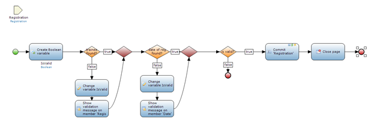
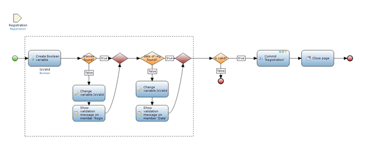
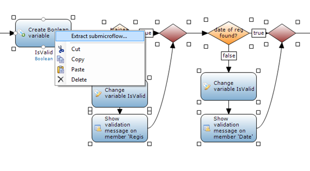
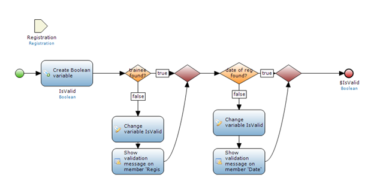

When you are building large microflows that span multiple functions, it is a good practice to break the large microflow down into more manageable parts, based on those functions. To better manage your logic, you can create sub microflows. 

## 1. Preparation

None.

## 2\. When to Use Sub Microflows

First example of using sub microflows is when you are doing a large data import. If you are creating a microflow that imports data into the system, there are usually different parts to the process. The first part can be data validation. An example of data validation is checking if values are empty. If the values are empty, then you might not want to import the data or we might want the application to throw an error.

Once the data is validated you import and map it into your Mendix domain model. This is a separate action within the data import. It is ideal to do all the validations at the beginning of the import microflow and all the mapping at the end.

You can break down the validation and mapping into sub microflows to manage the logic better. Furthermore, if you are need to reuse the validation during import at other steps in the application, you can reuse the sub microflow.

Second example of when you want to use sub microflows is when you are doing data validation when you save an object to the database. The following example with cover in detail how to use a sub microflow for validation.

There are other examples of when it will be useful to create sub microflows. The goal is to reuse them to condense your logic. Feel free to use sub microflows whenever you see the need for it.

## 3\. How to Use Sub Microflows 

The following microflow checks to see if a registration has a trainee assigned and a registration date. If the registration passes both of these checks the registration is committed to the database.

In this scenario it makes sense to create a sub microflow of the validation steps. If you create a sub microflow of the validation, it can be reused in other microflows where you need to validate a registration again.

1.  First step in extracting a sub microflow is to highlight the area you want to use as sub microflow. Select the area you want to capture, like in the image.
    
2.  Right click an item in the selection.
    
3. Select **Extract sub microflow...** and enter a name for the sub microflow
    

    The best practice is to identify sub microflows by their name. You can use the Sub_MicroflowDescriptionHere notation, or Subflow_MicroclowDescriptionHere or any other notation that you feel comfortable with. The key is to be consistent when you name your microflows. If you are consistent, it is easy for other team members to understand and find the microflows they need.
4. Click **OK** to create your first sub microflow.
    

5. Open the sub microflow by right clicking on the **Sub_RegistrationValidation** microflow and selecting **Go To microflow**.
    

The new sub microflow does the Registration validation. You can now reuse this sub microflow whenever you need to do a registration validation. 

## 4\. Troubleshooting Extractions of Sub Microflows 

If you get any errors, it usually means that you have not provided the right input or output parameters. Double check your parameters and make sure that they are configured properly. Furthermore, make sure you highlight the correct activities that you want to turn into a sub microflow.

## 5\. Conclusion

The extra sub microflow option is based on the Mendix reusability principle. You can reuse any sub microflows at other parts in the application. Furthermore, when you have very complex and large microflows, using sub microflows can help you break down and better manage your logic and business processes. 

## 6\. Related content

*   [Defining access rules using XPath](Defining+access+rules+using+XPath)
*   [Triggering Logic using Microflows](Triggering+Logic+using+Microflows)
*   [Creating a Custom Save Button](Creating+a+Custom+Save+Button)
*   [Extending Your Application with Custom Java](Extending+Your+Application+with+Custom+Java)
*   [Working With Lists in a Microflow](Working+With+Lists+in+a+Microflow)
*   [Microflows](/refguide5/Microflows)
