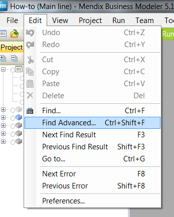
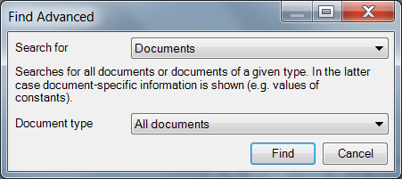
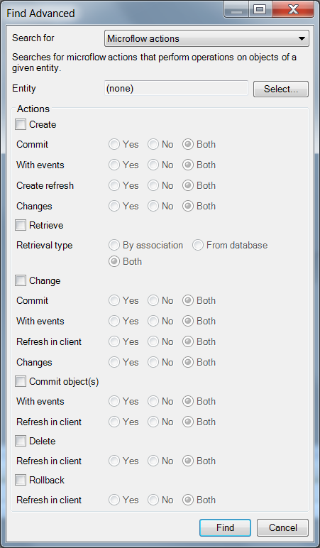
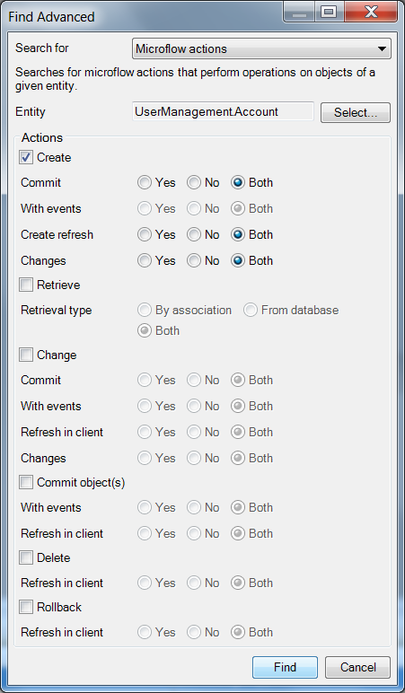
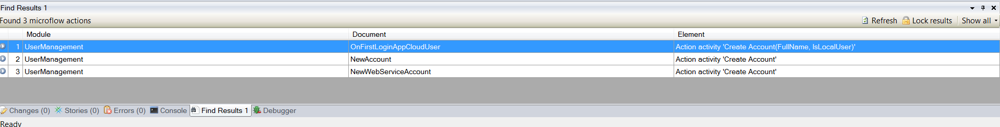

<table><thead><tr><th class="confluenceTh">Mendix Version</th><th class="confluenceTh">Create Date</th><th colspan="1" class="confluenceTh">Modified Date</th></tr></thead><tbody><tr><td class="confluenceTd">5.10</td><td class="confluenceTd">Nov 19, 2014 12:23</td><td colspan="1" class="confluenceTd">Oct 19, 2015 11:58</td></tr></tbody></table>

Mendix has comprehensive functionality to find changes made to several subjects in the application. This how-to will describe how to find changes made in objects based on a certain activity.

# Table of contents

## 1\. Find object activities

The following steps will explain how to find certain activities that are used in microflows, to objects.

1.  Click on 'Find Advanced' or press Ctrl+Shift+F
    
2.  This window will appear:
    
3.  At 'Search for' select 'Microflow actions' and the next window will appear:
    
4.  Select an entity on which the object activities have to be searched on and press find.
    In this example the Account entity is used with the create action.
    
5.  See the results of usages in the microflows in the bottom pane
    

## 2\. Related content

*   [Finding Object Activities](/howto50/Finding+Object+Activities)
*   [Finding Unused Items](/howto50/Finding+Unused+Items)
*   [Finding your way through a project](/howto50/Finding+your+way+through+a+project)
*   [Finding Object Activities](/tips/Finding+Object+Activities)
*   [Finding Unused Items](/tips/Finding+Unused+Items)
*   [Showing a Project in the Directory in Explorer](/howto50/Showing+a+Project+in+the+Directory+in+Explorer)
*   [Finding your way through a project](/tips/Finding+your+way+through+a+project)
*   [Querying over self-references](/tips/Querying+over+self-references)
*   [Showing a Project in the Directory in Explorer](/tips/Showing+a+Project+in+the+Directory+in+Explorer)
*   [Querying over self-references](/howto50/Querying+over+self-references)

