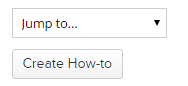
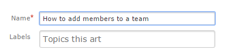
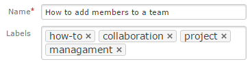
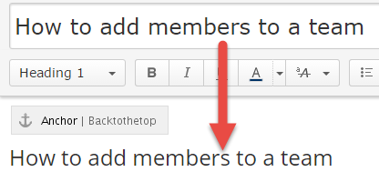
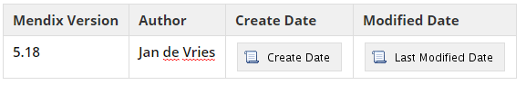
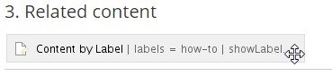
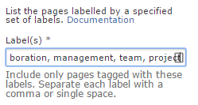
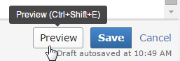
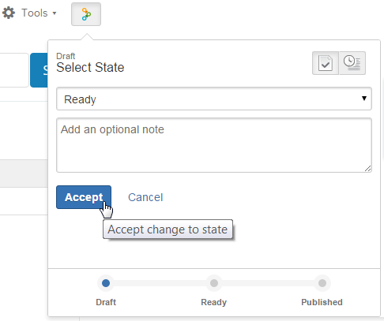

Follow these steps to create a new how-to.

1.  Click the **Create how-to** button to create a new how-to.
    
2.  Enter the **name** of the how-to:
    
3.  Add at least 1 **label: how-to**. Add more labels to make the how-to easy to find.
    
4.  Click **Create**.

    The page contains a template with several fixed elements used in a how-to. 
5.  Copy the page name to the document heading:
    
6.  Enter the **Mendix Version** this how-to is written on and works on. For example 5.18\. **Add the incremental version too, not just the main version!**
7.  Enter your name at the **Author** field.
    
8.  Write an **introduction,** explaining the scenario of the how-to, what users can expect to learn, and why this how-to will help them. 
9.  Sum up what people will know after completing the how-to.
10.  The next part is writing up the content, using the **.**

## **Labels
**

1.  Double click on the **Content by Label** macro.
    
    The how-to label is already added. 
2.  Add more labels so readers can find relevant related content.
    
3.  Click Preview to check what kind of related documents are found.
4.  Click **Save** to close the Content by Label window.
5.  **Check the whole how-to one more time!**
6.  Done? Click **Preview** to see if everything looks good.
    
7.  Really done? Click **Save**!

## **How-to is Ready**

1.  Click on the **Workflows** button in the top right and click **Accept**. This will mark the how-to as Ready and notify Jan de Vries that the how-to is ready to be checked.
    
    You can additional information in the note field.

2.  Jan will approve or reject the how-to, upon which you will receive an e-mail.
    If it is approved the how-to will be Published and publicly visible. If it is rejected it goes back to the Draft state and you can make adjustments. When it's ready for review click Accept again, and it will be reviewed again.

### Questions?

### Mail Jan de Vries @ jan.de.vries@mendix.com