<table><thead><tr><th class="confluenceTh">Mendix Version</th><th class="confluenceTh">Create Date</th><th colspan="1" class="confluenceTh">Modified Date</th></tr></thead><tbody><tr><td class="confluenceTd">5.14</td><td class="confluenceTd">Apr 07, 2015 02:45</td><td colspan="1" class="confluenceTd">Oct 19, 2015 11:50</td></tr></tbody></table>

Don't re-invent the wheel. Save time by importing modules others have already created, and exporting new modules for others to use. The App Store provides this functionality on a macro-level, but you can use the modeler's built-in import and export functions to share content between your own apps, import unofficial modules, and share entire projects.

This How-to covers the basics of how to import and export modeler objects: packages, modules, widgets, and module objects. Module objects include pages, microflows, image collections, event, document templates, constants, web services, layouts, menus, and loads more.

## Importing Objects



Be careful when importing objects, as you can overwrite your existing work. Pay attention to prompts and warnings along the way!



### Importing Entire Project Packages

Mendix project packages are stored as Mendix Package (.mpk) files.

1.  Click on the **File** menu in the modeler, and select **Import Project Package...**_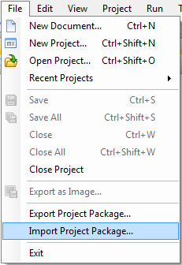_
2.  Select your Mendix Package file and click **Open**.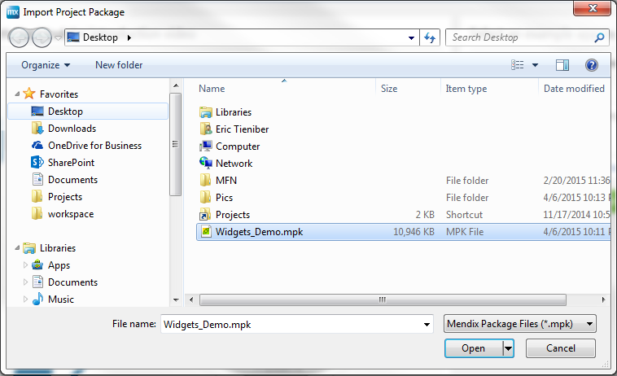

    A dialogue box will appear:
    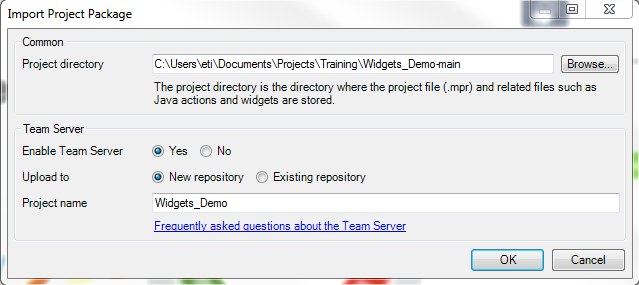

    Here, you have a few options:

    *   Determine the local folder where you would like to store your project. 
    *   Decide whether you want to use Mendix Team Server for this project. Unless you have a good reason _not_ to use Team Server, it is highly recommended that you leave this on.
    *   Decide whether to upload to a new repository (recommended) or to an existing repository.
    *   Finally, give your project a name. By default, it will be named as it was in the Mendix Package file.

3.  Click **OK**, and you project will load in the modeler.

### Importing Module Packages

Mendix module packages are stored as Mendix Package (.mpk) files.

1.  **Right click** on your project in the Project Explorer and select **Import Module Package...**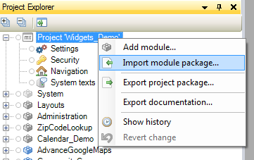
2.  Select your Mendix Package file and click **Open.**
     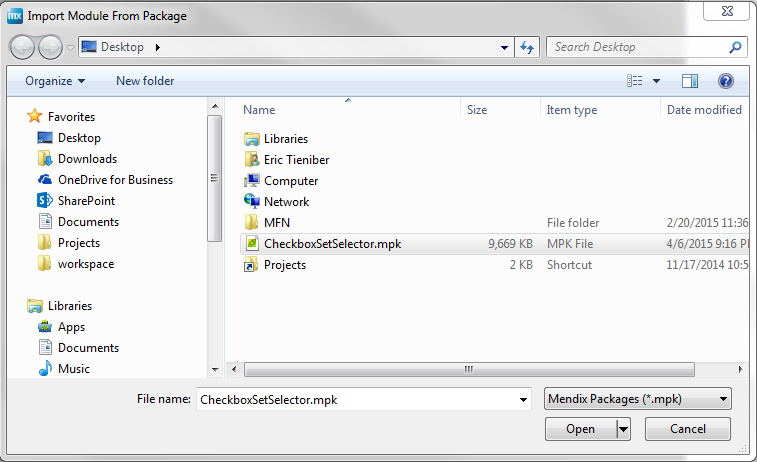

    A dialogue box will open.  

3.  Choose a name for your module and select whether to replace an existing module or create a new one.
    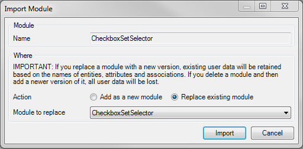 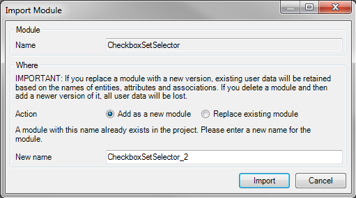

    


    If you replace a module with a new version, existing user data will be retained based on the names of entities, attributes, and associations. If you delete a module and then add a newer version of it, all user data will be lost.

    

4.  Click **Import.**
    You may see another dialogue box, informing you of any included module dependencies that will be overwritten in your project.
    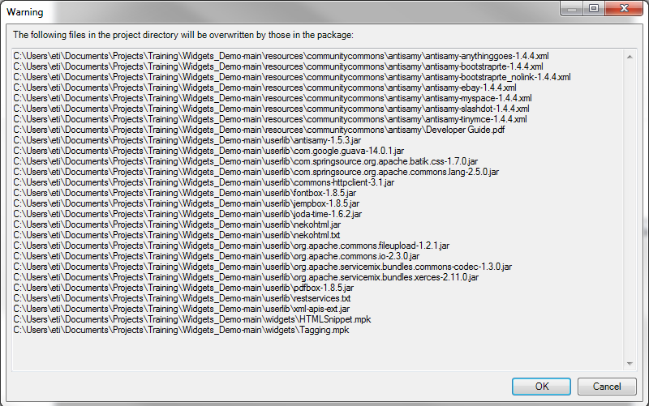
5.  Click **OK**. You will see your new or replaced module in the Project Explorer.
    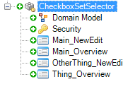
    You will also see your changes in the **Changes** section of the modeler. Here, I've replaced my existing module and as you can see, it was deleted in favor of the newly imported module.
    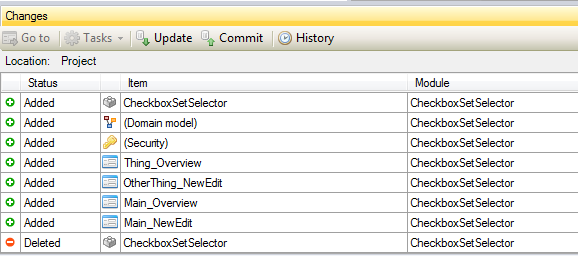

### Importing Module Objects

Mendix module object packages are stored as Mendix Package (.mpk) files. An object package can contain a page, microflow, image collection, event, document template, constant, web service, layout, menu, and more.

1.  **Right click** on a module in the Project Explorer and select **Import document package...**_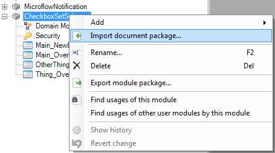
    _An Open File dialogue will appear.
2.  Select your Mendix Package file containing the object you want to import, and click **Open**.
3.  If an object with the same name already exists, you will see a dialogue box:
    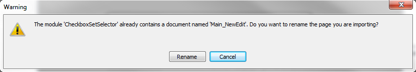
    At this point, you can either **Rename** the object or **Cancel.**
4.  Click **Rename,** and enter a new name for the object you are importing:
    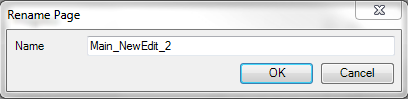
5.  Click OK to import the object into your module:
    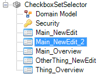

    


    You may need to update the new object's permissions, depending on where it was originally exported from. For consistency, be sure to check permissions on any objects imported.

    

### Importing Widgets

Mendix module packages are stored as Mendix Package (.mpk) files. However, you need to place the file in your project directory to import it.

1.  Click on the **Project** menu, and select **Show Project Directory in Explorer**:
    _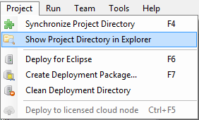
    _Your project directory will appear.
2.  Open the widgets folder and paste your **Mendix Package file** here.
    
3.  Open the **Project**menu and select **Synchronize Project Directory**to synchronize the changes in the project directory.
    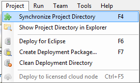

    


    You can also press **F4** to synchronize your project directory.

    

4.  Add your newly imported widget from the **Toolbox** or **Add Widget** context menu:
    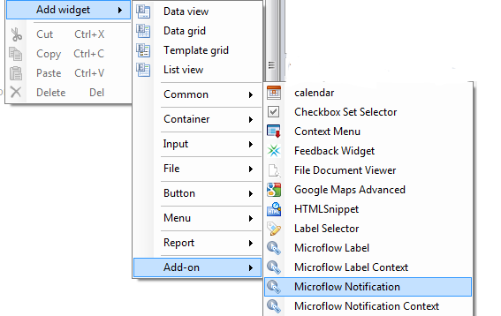

### Importing Content from the App Store

To learn more about importing content from the App Store, see [Adding App Store content to your app](Adding+App+Store+content+to+your+app).

## Exporting Objects

### Exporting Entire Project Packages

This part will go through the steps required to export projects.

1.  Click on the **File** menu in the modeler and select **Export Project Package...
    **_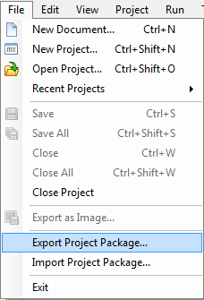
    _
2.  A dialog will appear that enables you to set the export location and, if required, select data to export.
    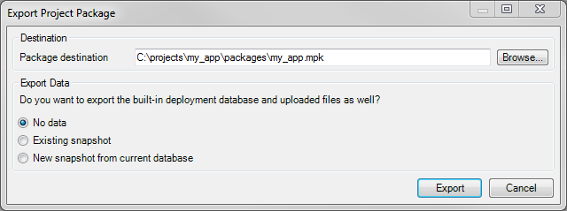
    The option 'Existing snapshot' will only be available when a data snapshot was created earlier using the menu option **Add snapshot of data** from the **Team** menu.
    It is also possible to include a new snapshot based on the current state of the local database. This option is only available after the project has been started at least once.
3.  Click **Export** to create the package.

### Exporting Modules

1.  **Right click** on a module in the Project Explorer, and select **Export module package...
    **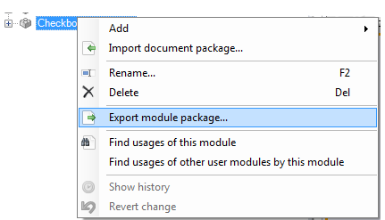
    If your module refers to other modules in the project (i.e., it is not self-contained), you will receive a dialogue box warning you about this.
2.  **Right click** on your module in the Project Explorer and select **Find usages of other user modules** to view the references.
    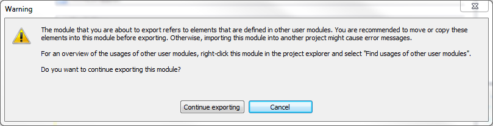
3.  Click **Continue exporting** and you will see another dialogue box:
    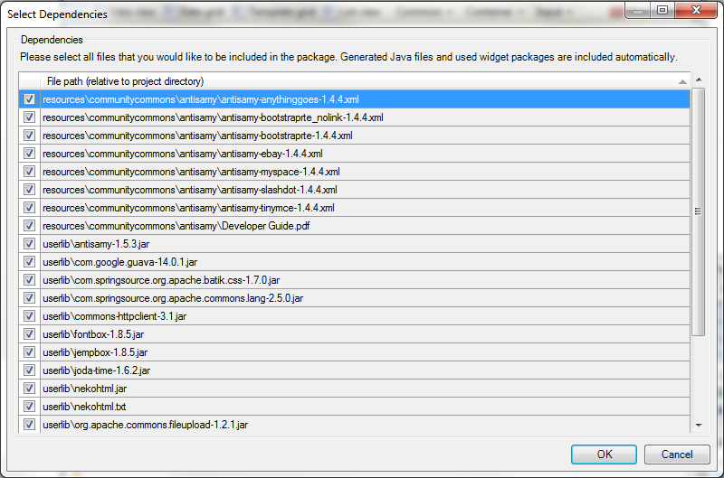
    Here you can select files you would like to include in your package. This list includes any files in your **userlib** or **resources**folders in your project directory. If you don't want to include these files, you can uncheck the boxes.

    


    To quickly uncheck all files, press _CTRL+a_ to select all of the items, then press the _Spacebar_ key to uncheck all objects.

    

### Exporting Widgets

Widgets are already available in the **widgets** folder in your project directory as .mpk files.

### Exporting Module Objects

Mendix module object packages are stored as Mendix Package (.mpk) files. An object package can contain a page, microflow, image collection, event, document template, constant, web service, layout, menu, and more.

1.  **Right click** on the document you want to export and select **Export document package...** 
    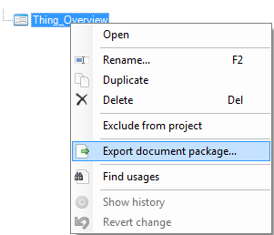
    A save dialogue box will open.
2.  Enter a **name** for your package and click **Save_._**

## Related content

*   [Expose a Web Service](Consuming+a+complex+web+service)
*   [Consume a Simple Web Service](Consuming+a+simple+Web+Service)
*   [Consume a Complex Web Service](Consuming+a+complex+web+service)
*   [Modules](/refguide5/Modules)
*   [Project](/refguide5/Project)
*   [Common Widgets](/refguide5/Common+Widgets)
