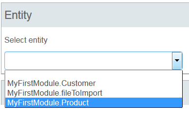
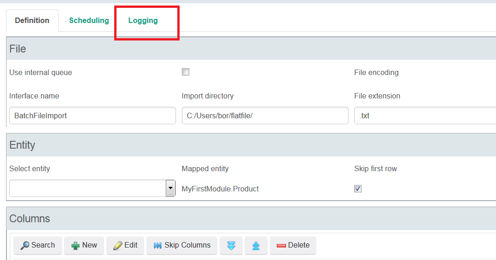
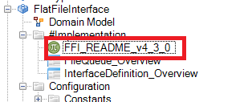
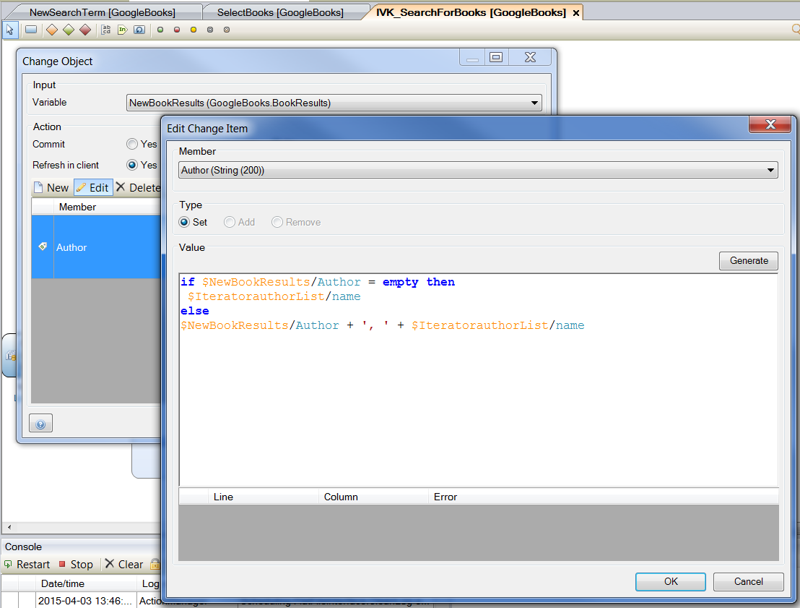

Mendix applications frequently need to communicate with existing systems.  Whether replacing an older platform entirely or leveraging an existing database to enhance your App, the ability to integrate with legacy systems is key to your success.  This article introduces a range of options that exist within the Mendix platform to integrate with legacy systems.

**After this how-to you will know:**

*   Potential options to integrate an existing system with a Mendix App
*   How to import data from a flat file or excel file using app store modules
*   How to integrate with a legacy system using REST

## Importing Legacy data using a Flat File

Consider the following situation: you have a legacy system with valuable data that needs to be translated into Mendix.  This system can produce a **flat or delimeted extract** of data .  In this chapter, you will learn how to use the **Flat & Delimited Import Module** to import this data directly into Mendix.  This process can be used for a one-time data transfer or a regular dump of data from one system to another thanks to the scheduling feature.  This approach is especially useful for **older data systems** that cannot accommodate more modern Web Service integrations.

Before you continue, make sure that you

*   **Have downloaded the Flat & Delimited File Importer App Store Module and all prerequisites**
*   **Know how to create Domain models** ([Creating a basic data layer](Creating+a+basic+data+layer)).
*   **Know how to create Overview and detail pages** ([Creating your first two overview and detail pages](Creating+your+first+two+overview+and+detail+pages)).
*   **Know how to create****Microflows** ().
*   **Save the sample data file to your computer for use in this exercize ([SampleFlatfile.txt](attachments/12878647/13402303.txt))**

1.  Create a **Mendix object** that matches the data you want to input.  For the example provided, this **entity** is a 'Product' has two **attributes**, Value 1 and Value 2.
    
2.  Now we must create the **Flat file Interface.** As per the instructions in the **Flat & Delimited Importer Module Release Notes,** add the page FlatFileInterface.InterfaceDefinition_Overview to your **Project Navigation**.
3.  Start the app and navigate to the Interface Definition Overview page.
4.  Select 'New' to create the Interface Definition
    
5.  Select the **Product Entity** from the dropdown. 

    


    If this dropdown is empty, then it is likely that **Model Reflection** has been synced yet.  If you do not know how to execute this, please see instructions [here](Importing+Excel+Documents#use-the-application-model-meta-data-in-the-client).

    

    

6.  Fill out the rest of the **Interface Definition** as follows.

    Some important notes about the settings here:

    *   The '**Import directory**' is the location where the flat files will be landing.  In this example, it has been set to C://flatfile.  Please select a directory for which you have read access.
    *   Text qualifier is set to 'None', meaning the data is encapsulated.  In this example that will be sufficient but take care to make sure all data is properly encapsulated and escaped if using more complex data sources
7.  Click 'Save' and the **Columns** section will be come visible.  Click '**New**' to add columns
8.  Add both columns for our **Product** entity.  Once complete it will look like this:
    
9.  To test the connection, hit 'Test Execution' on the **InterfaceDefinition_Overview** page
10.  Data in the sample file will now be imported into your application.  **Logs** for this operation are available in the **Logging** tab of the **InterfaceDefinition_NewEdit** page

    

11.  To schedule regular ingestion of a flat file, you can use the scheduling tab of the **InterfaceDefinition_NewEdit** page

    
    Scheduling your file for regular ingestion will allow you to ingest files dropped by your legacy system at a regular interval.  If the **existing system** receives data updates during the day and produces a **batch export** at night, then the Mendix app can ingest this file every evening as scheduled and the data will be ready for users the following morning. 

**Considerations for extending this:**

*   See the wide range of configurable settings <Here>
*   utilize the queuing function to enhance your imports <Link>
*   Documentation for this module is included in the app store release and can be accessed here:
    

**Importing Legacy Data using an Excel File**

If your legacy system produces data in an **Excel File** format, integration can be accomplished using the Excel Imported App Store Module. Detailed instructions on how to import data to Mendix with Excel can be found here: [Importing Excel Documents](Importing+Excel+Documents).

## Interacting with a legacy system using REST

If the legacy system has the ability to expose its data to web services, integration can be accomplished using the **Mendix REST module**.  This technique will allow your to preserve a **system of record** while accessing data only as you need it. 

Here are some situations in which to consider this technique.

*   **SAP** architecture with **RFC** calls exposing **JSON**
*   **CRM** systems or databases with a **web-service layer**

In this Chapter, you will learn how to retrieve data from a legacy system using REST and integrate the data into your application.

Before you continue, make sure that you

*   **Know how to download App Store Modules
    **
*   **Know how to create Domain models** ([Creating a basic data layer](Creating+a+basic+data+layer)).
*   **Know how to create Overview and detail pages** ([Creating your first two overview and detail pages](Creating+your+first+two+overview+and+detail+pages)).
*   **Know how to create** **Microflows and SubMicroflows** ().
*   **Understand the concepts behind REST and web Services** ([Consuming Your First REST Service](http://www.mendix.com/blog/consuming-first-rest-service/)[, Consume a complex web service](Consuming+a+complex+web+service))

    


    Creating an exposed REST service on top of your legacy system is beyond the scope of this tutorial.  For instructions on how to accomplish, please refer to configuration of your non-Mendix.

    

    For this tutorial, we will use the publicly available Google Books API.  Details can be found [here](https://developers.google.com/books/docs/v1/getting_started).  We will construct our example around this data model.  Each legacy system will have a different JSON structure based on internal data models.  This example will return a collection of books using a given author search parameter.  To use this API, users must collect an API key as outlined [here](https://developers.google.com/books/docs/v1/using?csw=1#APIKey). The response structure of this particular API looks as follows:

1.  The API we will use has the following JSON structure
2.  Construct the appropriate data model for this JSON.

    


    Every REST service will have a different, specific JSON structure. For details on how to build JSON data structures in Mendix see <here>

    

3.  Create a **Non-Persistable** search **Entity** called BookSearch that allows users to enter an author and title.  This should be linked to a second object based on
    
4.  Create a **Page** that contains a **Data View** that will allow users to enter search terms.  The data source for this **Data View** should be a new microflow that generates a new search object and returns it as below.
5.  Upon Completion, the **Page** should look as follows:

    Create a **Microflow button** and corresponding **Microflow** that will perform your search.  This microflow will use the REST GET java action included in the app store REST module. 
    
    The **Microflow activities** for this flow are:

    1.  Creates a new Response **Object**
    2.  Makes the REST call to the API using the following **Target**
        
    3.  Calls a **Sub-Microflow** that **retrieves** all the Items associated with the response.  Each Item then has all associated Volumes retrieved.
        
    4.  Iterate through the VolumeList and make a new BookResult object to display our search results.

        
    5.  Retrieve the author list **Over Association** for each volume 
    6.  Iterate through the list of Author names and use a **Change** activity to add the author name.  This is done to accommodate a situation 

        
6.  When a user logs into the application and enters a search term, results are successfully populated via the REST calls

The above example demonstrates how a Mendix Application can quickly integrate data systems using REST. This basic framework can be built upon to incorporate a wide range of activities.  Possible ways to extend this include

*   Adding additional Microflow processing logic to leverage data in Mendix
*   Using the **REST POST** actions to push values from Mendix
*   For further documentation and to see the git hub project for REST services, see [The Mendix REST github page](https://github.com/mendix/RestServices)
*   Updating Mendix application data from a different source.

## Related content

*   [Expose a Web Service](Consuming+a+complex+web+service)
*   [Consume a Simple Web Service](Consuming+a+simple+Web+Service)
*   [Consume a Complex Web Service](Consuming+a+complex+web+service)
*   [Extending Salesforce with Mendix, an Alternative to Force. com](https://www.mendix.com/blog/extending-salesforce-mendix-alternative-force-com/)
