<table><thead><tr><th class="confluenceTh">Mendix Version</th><th class="confluenceTh">Create Date</th><th colspan="1" class="confluenceTh">Modified Date</th></tr></thead><tbody><tr><td class="confluenceTd">5.21</td><td class="confluenceTd">Feb 04, 2015 16:47</td><td colspan="1" class="confluenceTd">Nov 17, 2015 15:39</td></tr></tbody></table>

In this how-to you will learn how to manage your application requirements in Mendix by creating and configuring sprints and stories. These components are often used in an agile development environment, where you and your team work in short development cycles from anywhere between 2 to 4 weeks. By adding your sprints to Mendix you will have a clear overview of your tasks and can easily view the status of your development cycle. You can also manage the progress of tasks and sprints from within the Mendix Modeler.

## 1\. Preparations

*   Have the Mendix Modeler 5 installed – [download here](https://appstore.home.mendix.com/link/modelers)

## 2\. Creating a new Project

1.  Go to [https://home.mendix.com](https://home.mendix.com/) and login. Create an account [here](https://developers.mendix.com/start-for-free/) if you don't have one yet.
2.  Click the **Create new App** button in the top left:
     
3.  Select a theme or sample app. I used Blue Wave for this how-to:
    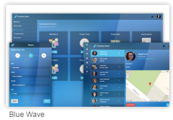
4.  Click USE THIS THEME >.
    
5.  Name it **Company Expenses Demo**.
6.  Click **Create App**.

    You will be taken to the project dashboard.

## 3\. Adding Sprints

The development of a new product, feature, or release usually has multiple sprints. In this exercise you will add a new sprint and look at the available options.

1.  Click **Capture** in the top menu:
    

    On the capture page you can add sprints, stories, planning, and documents that can be used in your project. The stories tab shows the existing stories and sprints.
    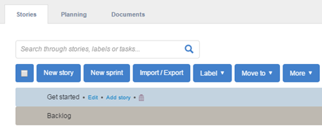

    There is one default sprint called _Get started_. It is automatically created when you create a new project. We’re going to start with a clean project, so let's delete the sprint.

2.  Select the **Get started** sprint and click the delete button ().
3.  Click **OK** to delete the sprint:
    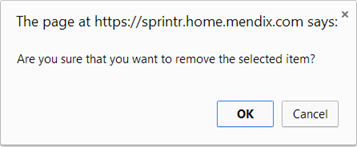
4.  Click the **New sprint** button in the **Stories** tab.

    You now have to choose what to create: a sprint, release, or something else. When you are working towards a release of your product you can add the release planning.

5.  Select **Sprint**.
6.  Enter a sprint name: **Sprint 1**.
7.  Leave the **This sprint comes after** field empty. If there are existing sprints you can place it before or after a selected sprint.
8.  Set the **Duration** to **2** (weeks).
    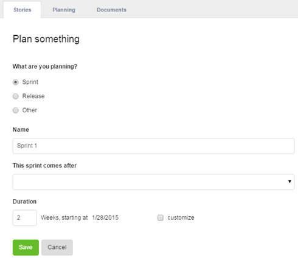

    


    The default duration of a sprint in Mendix is 2 weeks, starting the moment you create the sprint. Check customize to select a different start date.

    

9.  Click **Save**.

    The new sprint has been added to your stories overview.
    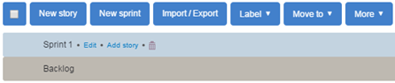

### 3.1 Adding Story Points

Every sprint contains a number of story points that describe a specific functionality that needs to be implement, built, or fixed.

1.  Select **Sprint 1**.
2.  Click **New story** ().
    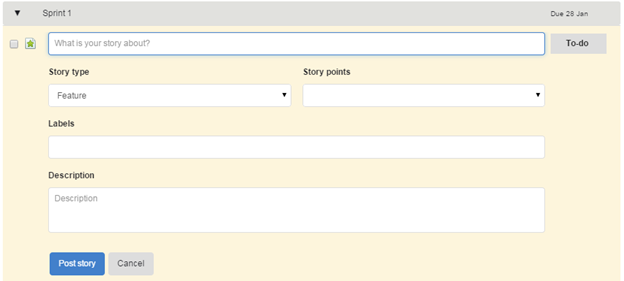 
3.  Enter the description: **As a user I want to be able to view my company expenses**.
4.  As **Story type** select **Feature**.
5.  Set **Story points** at **5 points**.
6.  Enter a new label named **User expenses** and hit **Enter**. This will add a new label that can be reused in other stories.
7.  Add the description: **Create an expenses overview page for company employees**.
8.  The finished story should look similar to this:
    
9.  Click **Post story**.
    

    You can also add Bug story points this way. Simply select Bug from the story type drop down. The icon in the top left will change accordingly ()
    

    The new story point is added to Sprint 1.
    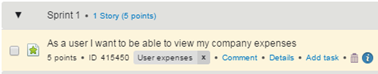

### 3.2 Adding Tasks to a Story

Stories are translated into tasks that need to be completed to finish the story.

1.  Select the story you created and click **Add task**.
    
2.  Enter: _Add a list view of an employee's expenses_.
3.  Click **Post task**.
    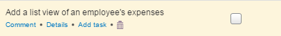 
    Ticking the checkbox on the right will mark the task as completed. You can also add sub tasks to tasks, allowing a nested structure of stories with tasks.

## 4\. Managing Stories in the Mendix Modeler

Besides being able to manage you sprints in the Project Dashboard, you can also view them in the Mendix Modeler.

1.  Go to the overview page of your project and click **Edit in Modeler**.
    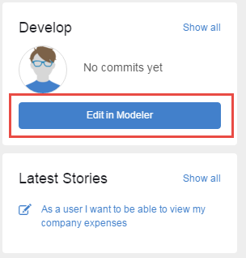

2.  Select a modeler version when asked.
3.  **Log in** to the modeler when asked.
4.  You will now see your sprints in the **Stories** tab at the bottom.
    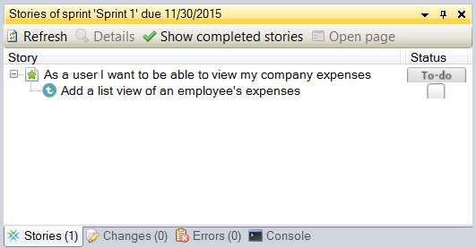
5.  Click on the **To-do** status for the first item.
    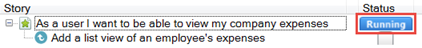
    The status has now changed to running.
6.  Go back to the project dashboard in your browser.
7.  Go to the **Capture** page.
8.  Expand the first sprint and check the status of the first entry:
    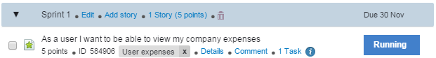

    It is now Running because you changed the status in the Mendix Modeler.

    


    If you change a status or update story points in the modeler or in the browser, they will automatically be synchronized and available everywhere.

    

## 5\. Importing Stories

Besides entering your stories manually you can also import them easily with an Excel upload.

1.  Download the example Excel **[here](attachments/9109796/17662036.xls)**.
2.  Click **Import/Export** on the Stories page.
3.  Select **Update stories from Excel**.
     
4.  Click **Browse** to select the example Excel file that contains your user stories.
5.  Click **Import**.
    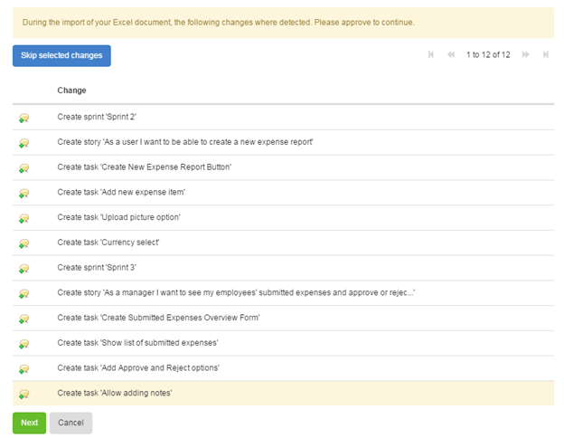
6.  Scroll to the bottom of the page and click **Next**.
    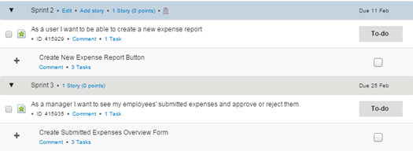
    The Stories tab will now list your imported content.

## 6\. Moving Stories

The story in Sprint 3 needs to be moved to Sprint 2 as the customer requires the app to be delivered sooner.

1.  Select the story you want to move.
2.  Select **Move to** from the menu and select **Sprint 2**.
    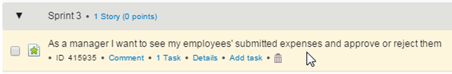 
    The story, including any tasks and sub tasks are moved to Sprint 2.
3.  Another way to move a story is to click and drag it to another sprint or to the Backlog.
    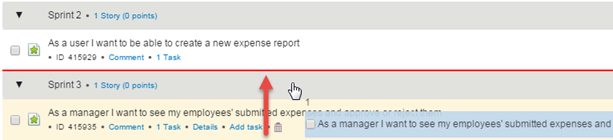 

## 7\. Exporting Stories

With Mendix it’s always possible to export your data, from your application but also the database. In this exercise you will export your sprints and stories.

1.  Go to **Capture** in your project.
2.  Go to **Stories > Import / Export**:
    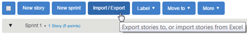
    There are three options to choose from, depending on which data you want to export.

3.  Select **Export all Stories to Excel**.
4.  Click **Export**.
    An overview of the export data will be shown.
5.  Click **Download** and save the Excel file on your computer.
6.  Open the file to see your exported data.

## 8\. Related content

*   [Managing your Application Requirements with Mendix](/howto50/Managing+your+Application+Requirements+with+Mendix)
*   [Starting your own repository](/howto50/Starting+your+own+repository)
*   [Contributing to a GitHub repository](/howto50/Contributing+to+a+GitHub+repository)
*   [Using Team Server - Version Control](/howto50/Using+Team+Server+-+Version+Control)
*   [Gathering user feedback](/howto50/Gathering+user+feedback)
*   [App Platform](/refguide5/App+Platform)
*   [Team Server](/refguide5/Team+Server)