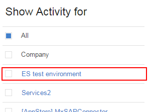
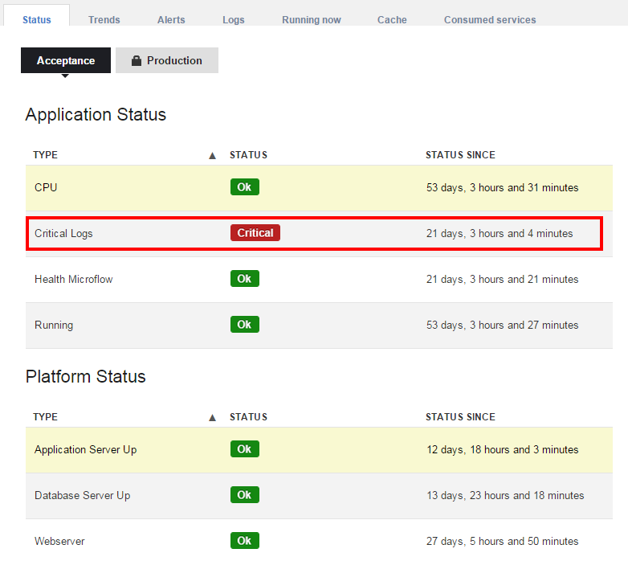
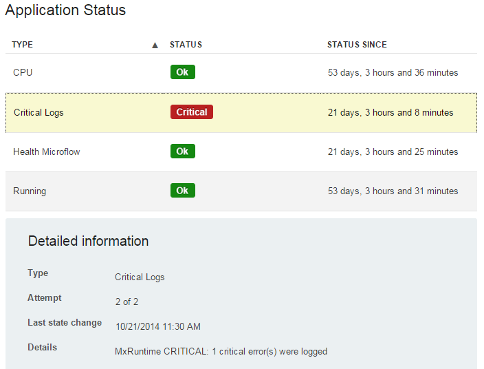
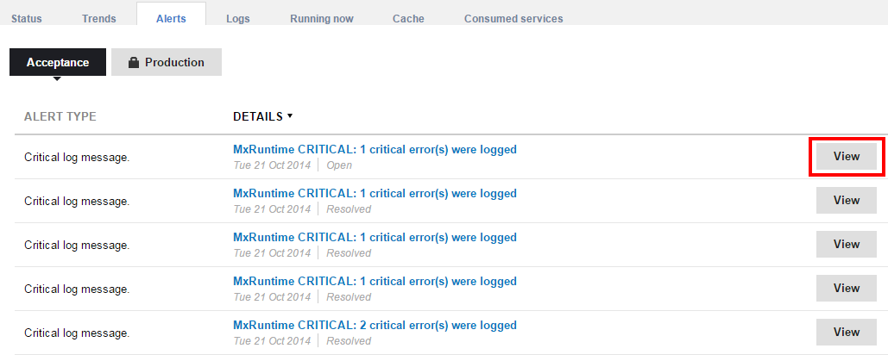

<table><thead><tr><th class="confluenceTh">Mendix Version</th><th class="confluenceTh">Create Date</th><th colspan="1" class="confluenceTh">Modified Date</th></tr></thead><tbody><tr><td class="confluenceTd">5</td><td class="confluenceTd">Nov 11, 2014 13:27</td><td colspan="1" class="confluenceTd">Nov 25, 2015 09:40</td></tr></tbody></table>

When your application has reached production status, it's important to keep track of its status and health. This How-To will teach you how to inspect your application's health in the Mendix app platform. You will learn how to access the application status page, what the information on this page means and how to look at the alerts for your app. 

# Table of contents

## 1\. Application status

The Mendix app platform automatically monitors the health and status of apps that are deployed on cloud nodes. To access the information gathered in this way, follow these steps.

1.  Open a browser to [https://sprintr.home.mendix.com](https://sprintr.home.mendix.com).
2.  Click on the project you want to monitor on the right.
    

3.  Inside your project, go to the **Monitor** page in the top menu bar.
    

4.  This will take you to the application status overview, which displays the status of your app node in various categories.
    



The buttons "Acceptance" and "Production" at the top allow you to switch between viewing the status for either you production or acceptance node. Note that accessing production information may require additional authentication and is subject to your project's security settings.



There are a number of categories on the status overview, related to various technical parts of your app node. Any category that does not display "OK" is a cause for investigation. Each category indicates a different part of the app infrastructure that is monitored:

*   Application status

    *   CPU: The processor of the app node is not overloaded.
    *   Critical Logs: No critical log messages have been emitted by your app.
    *   Health Microflow: The health microflow does not return errors.
    *   Running: The app is running and accessible.
*   Platform status
    *   Application Server Up: The Mendix app server component is running.
    *   Database Server Up: The Mendix database component is running.
    *   Application Server Disk Usage: There is enough free disk space on the application server
    *   Database Server Disk Usage: There is enough free disk space on the database server
    *   Webserver: The webserver in front of your app is running.

     5\.  Click a line that does not display **OK** to show additional information on the error.

This will tell you important information that you either need to resolve the issue, or needs to be included when creating support request to Mendix. Any status that could cause your app to stop functioning will result in an alert (which will be sent). See the next paragraph for information on how to view these alerts.

## 2\. Alerts History

The monitoring information you saw in the previous chapter showed that one of the status indicators was "Critical". When this happens to one of your nodes, all users that are subscribed to alerts will receive an e-mail alert.Alerts are also stored in the app monitoring part of the Mendix app platform. To access the alerts for your app, follow these steps.

1.  From the monitoring page, click **Alerts History** in the menu bar.
    

2.  You will see an overview of all alerts that have been sent for this application.
    

    The overview shows alert types and details including date and time. The alert types gives a broad indication of the type of error that occurred, such as critical log messages or failures of the health check microflow. Recovery notifications will also be shown here.

    


    The buttons "Acceptance" and "Production" at the top allow you to switch between viewing the status for either your production or acceptance node. Note that accessing production information may require additional authentication and is subject to your project's security settings.

    

3.  Click the alert details or "View" button. This will open the alert details, which contains additional information. More information might be available in your application's log file.

    

## 3\. Related content

*   [Finding the Root Cause of Runtime Errors](Finding+the+Root+Cause+of+Runtime+Errors)
*   [Clearing Warning Messages in Mendix](Clearing+Warning+Messages+in+Mendix)
*   [Testing web services using SoapUI](Testing+web+services+using+SoapUI)
*   [Debugging Microflows](Debugging+Microflows)
*   [Common Mendix SSO Errors](Common+Mendix+SSO+Errors)
*   [Monitoring Mendix using JMX](Monitoring+Mendix+using+JMX)
*   [Debugging Java Actions](Debugging+Java+Actions)