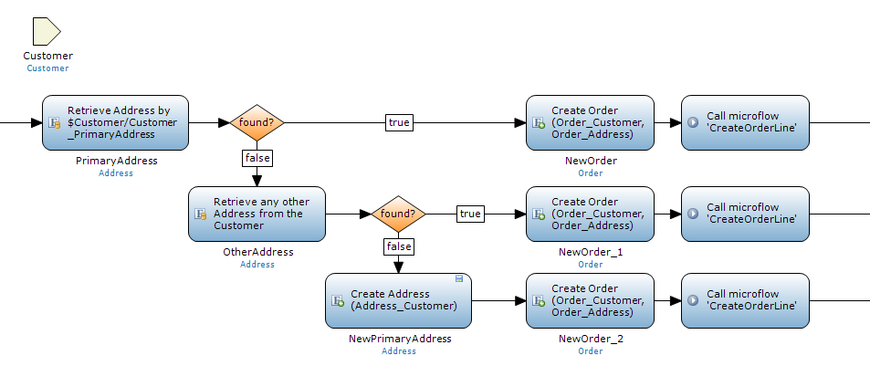
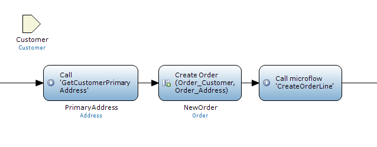
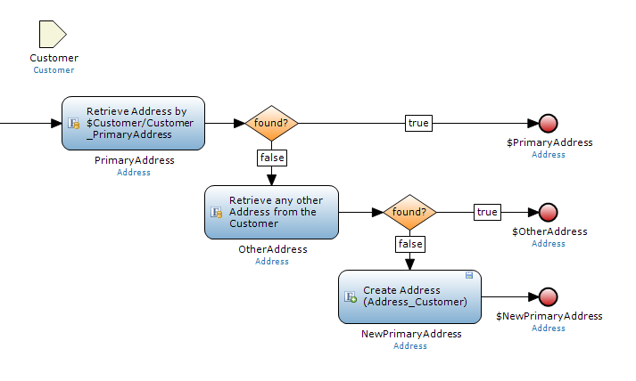
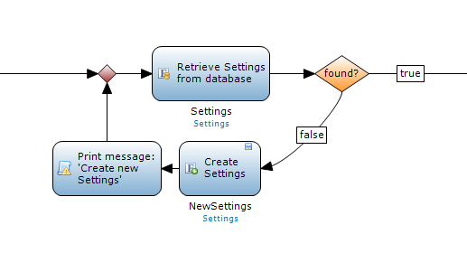

<table><thead><tr><th class="confluenceTh">Mendix Version</th><th class="confluenceTh">Create Date</th><th colspan="1" class="confluenceTh">Modified Date</th></tr></thead><tbody><tr><td class="confluenceTd">5.20</td><td class="confluenceTd">May 21, 2015 18:06</td><td colspan="1" class="confluenceTd">Oct 09, 2015 15:47</td></tr></tbody></table>

Often in processes you need to retrieve objects in order to complete the process. But what if those objects could not be found? Usually additional actions are required, but since the objects you retrieve and create are assigned different variable names you often can't merge back to a single flow.

### Find or create objects to continue your process

A common example is shown below, when creating an order it needs to be associated with the customer and its primary address. This example ends up in three different flows and cannot be merged back into the main flow because that causes the 'OtherAddress' or 'NewPrimaryAddress' to be unreachable. 

You want to prevent creating the same objects multiple times on different places. This causes a lot of unnecessary maintenance, one solution could be to copy the logic (partially) into a subflow as shown in the example but this doesn't make it easy to read. 

Working around this can easily be done by using a subflow at a different place. Avoid making exceptions in your microflow for the default behavior, so don't put the standard logic in a difficult to read sub microflow because of one exception earlier in the process. Since we got to this point because of an exception it makes most sense to solve this problem by altering the exception and changing it in such a way that it fits in our standard flow.

The easiest way to implement this is to move all the logic for acquiring the primary address into a subflow. This way all logic after getting the address only needs to be specified once and the microflow is still easily readable. 

  

 The subflow 'GetCustomerPrimaryAddress' does contains the same logic as the original example except this way there is only one result: 'The correct primary address'

### Retrieving an instance of an object

Sometimes you need to have a specific instance of an object, and building a subflow for just one retrieve and create seems like a bit much work. An alternative could be building your own loop. This allows you to have one main flow but still be able to find and create objects during this process. 
But there is a risk for creating an infinite loop, if the retrieve applies a constraint which is not correctly set during the create. So always make sure to print a log message so you can easily identify any problems in your design.

## Related content

*   [Defining access rules using XPath](Defining+access+rules+using+XPath)
*   [Triggering Logic using Microflows](Triggering+Logic+using+Microflows)
*   [Creating a Custom Save Button](Creating+a+Custom+Save+Button)
*   [Extending Your Application with Custom Java](Extending+Your+Application+with+Custom+Java)
*   [Working With Lists in a Microflow](Working+With+Lists+in+a+Microflow)
