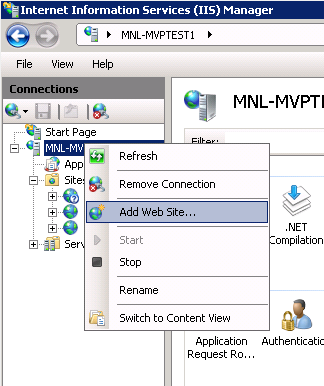
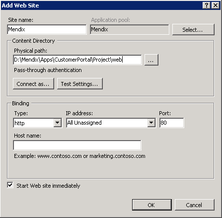
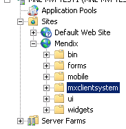
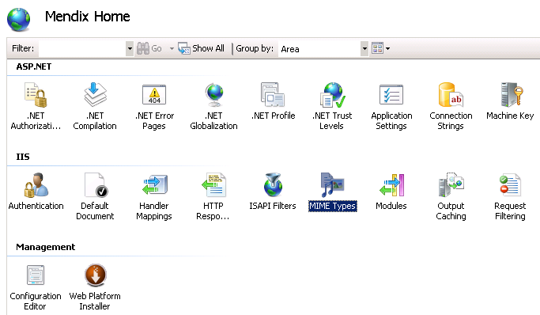
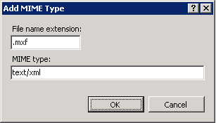
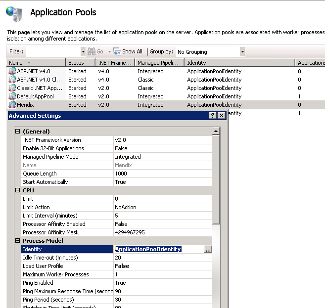
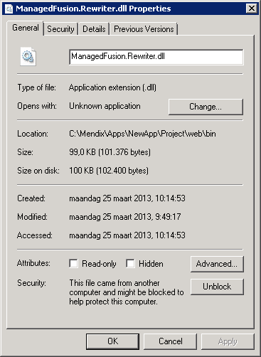

This installation guide is deprecated. DO NOT USE it to install Mendix on Windows.

Please find the new documentation here: **[Deploying Mendix on Microsoft Windows](Deploying+Mendix+on+Microsoft+Windows)**.

## Description

This section describes how to configure a separate IIS environment as front-end for the Mendix application. In this configuration, all static web files will be handled by IIS, all other URLs will be handled by the Mendix application.

To accomplish this behavior, we use the ASP.NET component Managed Fusion URL Rewriter. The URL Rewriter redirects a defined set of requests of IIS to the Mendix Runtime.

## Prerequisites

Before starting installation, please make sure your environment meets the following requirements:

*   The .NET framework 3.5 Feature of Windows is installed
*   The Windows Web server (IIS) role is installed with at least the following role services:
    *   IIS Management console
    *   Static content
    *   ASP.NET

## Instructions

### First steps

If IIS runs at another system than the Mendix server, then the following step must be completed first:

*   Create the same folder structure on the IIS system as on the Mendix server system, but only with the folders needed to serve. These are the folders Application\web and Mendix\Servers\<version number>\runtime\mxclientsystem. Copy the contents of these folders from the Mendix system to the IIS system, maintaining the same folder structure.
    In fact, in our example, we now have the following folders:
    *   D:\Mendix\Apps\CustomerPortal\Project\web
    *   D:\Mendix\Servers\<version number>\runtime\mxclientsystem

Now follow the next steps:

*   Create a new website by right-clicking your server name within the IIS console:



*   Have it point to the Project\web folder (in our example: D:\Mendix\Apps\CustomerPortal\Project\web



*   Verify the existence of an IIS virtual folder called "mxclientsystem" within your site. This virtual folder should already be in place when working with Mendix console version 4 or later. If it is not, create the folder by inserting a symbolic link pointing to the Runtime\mxclientsystem folder in your Project\Web folder of your application. The symbolic link can be created by executing the following command from within an elevated command prompt:

    **CMD**
    ```
    C:\<Insert Project\Web folder of your application here>\mklink /D mxclientsystem <Insert the Runtime\mxclientsystem folder location of your application here>

    ```

    The mxclientsystem virtual folder should now be visible in your website tree:



*   Add the MIME type text/xml for the extension .mxf
    *   IIS 6: Properties of the website --> tab page HTTP Headers --> MIME Types... --> Add...
    *   IIS 7(.5): Select your website name --> MIME Types





*   In IIS 7(.5) (Windows Server 2008 (R2)) and 8 (Windows Server 2012), you must disable the IIS custom errors for the 'xas' requests. To accomplish this, please create a file called "web.config" in your Project\Web folder, and copy / insert the following XML code into this file:

*   If the server runs Windows Server 2003 (R2) (IIS 6):

    **web.config**
    ```xml
    <?xml version="1.0" encoding="UTF-8"?>
    <configuration>
    <configSections>
    	<section name="managedFusion.rewriter" type="ManagedFusion.Rewriter.Configuration.ManagedFusionRewriterSectionGroup"/>
    </configSections>
    	<managedFusion.rewriter xmlns="http://managedfusion.com/xsd/managedFusion/rewriter"/>
    <system.web>
    	<httpModules>
    		<add name="RewriterModule" type="ManagedFusion.Rewriter.RewriterModule, ManagedFusion.Rewriter"/>
    	</httpModules>
    </system.web>
    <location path="xas">
    	<system.webServer>
    		<httpErrors errorMode="Detailed" />
    	</system.webServer>
    </location>
    </configuration>

    ```

*   If the server runs Windows Server 2008 (R2) (IIS 7/7.5) or Windows Service 2012 (IIS 8):

    **web.config**
    ```xml
    <?xml version="1.0" encoding="UTF-8"?>
    <configuration>
    <configSections>
    	<section name="managedFusion.rewriter" type="ManagedFusion.Rewriter.Configuration.ManagedFusionRewriterSectionGroup"/>
    </configSections>
    <managedFusion.rewriter xmlns="http://managedfusion.com/xsd/managedFusion/rewriter"/>
    <system.webServer>
    	<validation validateIntegratedModeConfiguration="false"/>
    	<modules runAllManagedModulesForAllRequests="true">
    		<add name="RewriterModule" type="ManagedFusion.Rewriter.RewriterModule, ManagedFusion.Rewriter"/>
    	</modules>
    	<handlers>
    		<add name="RewriterProxyHandler" preCondition="integratedMode" verb="*" path="RewriterProxy.axd" type="System.Web.HttpForbiddenHandler, System.Web, Version=2.0.0.0, Culture=neutral, PublicKeyToken=b03f5f7f11d50a3a"/>
    	</handlers>
    </system.webServer>
    <location path="xas">
    	<system.webServer>
    		<httpErrors errorMode="Detailed" />
    	</system.webServer>
    </location>
    </configuration>

    ```

### Rewriter configuration

*   Download the latest version of the Url Rewriter from [this website](http://urlrewriter.codeplex.com/).
    This rewriter has a proxy timeout of 100 seconds. If an action requires more time to execute and a user invokes this action, then the user will be logged off after 100 seconds. Mendix has changed the Url Rewriter and has extended the proxy timeout to 24 hours. This changed version, based on the original version 3.5.2, can be [downloaded here](#), until there is an official version from Managed Fusion which supports longer timeouts.
*   Make sure Microsoft .NET 2.0 SP1 or greater is installed on the server.
*   If the machine runs IIS 6, follow the next instructions. For IIS 7(.5) or 8, skip this step.
    *   Right click on the web site node, choose Properties and click on the tab ASP.NET. Make sure that at least 2.0.50727 is chosen as ASP.NET version.
    *   Click on the tab Home Directory.
    *   Click the 'Configuration' button under Application Settings section
    *   Click the 'Insert...' button to create a new wildcard mapping
    *   Set the executable textbox to the aspnet_isapi.dll file location. For .NET 2.0, 3.0, 3.5, this path is mostly C:\Windows\Microsoft.NET\Framework64\v2.0.50727\aspnet_isapi.dll on x64 systems and C:\Windows\Microsoft.NET\Framework\v2.0.50727\aspnet_isapi.dll on x86 systems.
    *   Make sure the checkbox 'Verify that file exists' is NOT checked.
    *   Press 'OK' to confirm and close all the windows.
*   Create a new folder called 'bin' in the 'web' folder of the Mendix application
*   Put the following file into this folder:
    *   ManagedFusion.Rewriter.dll (file can be found in the Libraries folder of the downloaded ZIP file.
*   Next, a file with mapping rules has to be created. These rules are needed to define that all traffic for the Mendix Runtime must be redirected to that server. All other traffic (static files) can be handled by IIS.
    Create a file for the rules named 'ManagedFusion.Rewriter.txt' in the 'web' folder of the Mendix application. Put the following text into this file:

    **ManagedFusion.Rewriter.txt**
    ```
    RewriteEngine On

    RewriteCond %{QUERY_STRING}     ^(.+)$
    RewriteCond %{PATH_INFO}        !^/$
    RewriteCond %{PATH_INFO}        !^/pages/
    RewriteCond %{PATH_INFO}        !^/mxclientsystem/
    RewriteCond %{PATH_INFO}        !^/css/
    RewriteCond %{PATH_INFO}        !^/js/
    RewriteCond %{PATH_INFO}        !^/img/
    RewriteCond %{PATH_INFO}        !^/widgets/
    RewriteCond %{REQUEST_FILENAME} !-f
    RewriteRule ^/?(.*)             http://localhost:8081/$1?%1 [P,L]

    RewriteCond %{QUERY_STRING}     ^$
    RewriteCond %{PATH_INFO}        !^/$
    RewriteCond %{PATH_INFO}        !^/pages/
    RewriteCond %{PATH_INFO}        !^/mxclientsystem/
    RewriteCond %{PATH_INFO}        !^/css/
    RewriteCond %{PATH_INFO}        !^/js/
    RewriteCond %{PATH_INFO}        !^/img/
    RewriteCond %{PATH_INFO}        !^/widgets/
    RewriteCond %{REQUEST_FILENAME} !-f
    RewriteRule ^/?(.*)             http://localhost:8081/$1 [P,L]	

    ```

*   If your application is mobile-enabled, please use the following rules file:

    **ManagedFusion.Rewriter.txt**
    ```
    RewriteEngine On

    RewriteCond %{QUERY_STRING}     ^(.+)$
    RewriteCond %{PATH_INFO}        !^/$
    RewriteCond %{PATH_INFO}        !^/pages/
    RewriteCond %{PATH_INFO}        !^/mxclientsystem/
    RewriteCond %{PATH_INFO}        !^/css/
    RewriteCond %{PATH_INFO}        !^/js/
    RewriteCond %{PATH_INFO}        !^/img/
    RewriteCond %{PATH_INFO}        !^/widgets/
    RewriteCond %{REQUEST_FILENAME} !-f
    RewriteRule ^/?(.*)             http://localhost:8081/$1?%1 [P,L]

    RewriteCond %{QUERY_STRING}     ^$
    RewriteCond %{PATH_INFO}        !^/$
    RewriteCond %{PATH_INFO}        !^/pages/
    RewriteCond %{PATH_INFO}        !^/mxclientsystem/
    RewriteCond %{PATH_INFO}        !^/css/
    RewriteCond %{PATH_INFO}        !^/js/
    RewriteCond %{PATH_INFO}        !^/img/
    RewriteCond %{PATH_INFO}        !^/widgets/
    RewriteCond %{REQUEST_FILENAME} !-f
    RewriteRule ^/?(.*)             http://localhost:8081/$1 [P,L]

    RewriteCond %{PATH_INFO}        ^/$
    RewriteCond %{QUERY_STRING}     ^$
    RewriteCond %{HTTP_USER_AGENT}  Phone [OR] #iPhone, Windows Phone
    RewriteCond %{HTTP_USER_AGENT}  iP[ao]d [OR]
    RewriteCond %{HTTP_USER_AGENT}  Android [OR]
    RewriteCond %{HTTP_USER_AGENT}  BlackBerry
    RewriteRule ^/$                 index-mobile.html  [L]

    ```

*   In this file, the address [http://localhost:8080](http://localhost:8080) is visible twice. The address [http://localhost:8080](http://localhost:8080) means that all Runtime requests (such as /xas and /ws) will be redirected to [http://localhost:8080](http://localhost:8080). In this case, localhost:8080 is the location of the Mendix Runtime server. Change this address (at both places!) to the real location of your Mendix Runtime server.
    More information about the rule syntax can be found [here](http://httpd.apache.org/docs/2.0/mod/mod_rewrite.html).

**Known errors**
 _Error page or white page shown_
When using IIS 6 (Windows Server 2003) and an error page is shown or a white page after login, probably the redirection does not work. The cause can be that ASP.NET 2.0 is not allowed by IIS. In the IIS Manager, go to Web Service Extensions and check if ASP.NET v2.0.50727 has the status Allowed. When the item does not exist (ASP.NET v1.1.4322 is not the correct one!), make a new item which points to the library 'aspnet_isapi.dll', see the correct path above.

 _Server Error in "/"Application_
The application pool identity used for the Mendix application might be configured to use an identity with too limited rights on de URL Rewriter's BIN folder:



Change the application pool identity to an account with at least read rights on the rewriter's BIN folder.

 _The URL Rewriter is not redirecting requests to the Mendix Server_
A malfunctioning rewriter can have several causes. Make sure the following is in order:

*   Check the ManagedFusion.Rewriter.txt filename for a double extension (.txt.txt)
*   Check if the URL Rewriter's DLL is blocked for use:



*   Check the NTFS rights on the rewriter's BIN folder. Your IIS user should have at least read rights on this folder.

 _HTTP Error 500.19 - Internal Server Error_
Error details: This configuration section cannot be used at this path.
This error might be caused by restrictions set in the applicationhost.config file (this file can be found in: C:\Windows\System32\inetsrv\config) Please find and change the following values in your applicationhost.config file:

**applicationhost.config**
```
<section name="handlers" overrideModeDefault="Deny" />
```

should be changed into:

```
<section name="handlers" overrideModeDefault="Allow" />
```

And:

**applicationhost.config**
```
<section name="modules" allowDefinition="MachineToApplication" overrideModeDefault="Deny" />
```

should be changed into:

```
<section name="modules" allowDefinition="MachineToApplication" overrideModeDefault="Allow" />
```

### Compression (optional)

To speed up the loading times of the application via IIS, compression can be set up. However, compression does not work in combination with version 6 (Windows XP) of Microsoft Internet Explorer. See for information about compression:

IIS 6

*   [http://weblogs.asp.net/owscott/archive/2004/01/12/IIS-Compression-in-IIS6.0.aspx](http://weblogs.asp.net/owscott/archive/2004/01/12/IIS-Compression-in-IIS6.0.aspx)
*   [http://www.microsoft.com/technet/prodtechnol/WindowsServer2003/Library/IIS/d52ff289-94d3-4085-bc4e-24eb4f312e0e.mspx?mfr=true](http://www.microsoft.com/technet/prodtechnol/WindowsServer2003/Library/IIS/d52ff289-94d3-4085-bc4e-24eb4f312e0e.mspx?mfr=true)

IIS 7

*   [http://weblogs.asp.net/owscott/archive/2009/02/22/iis-7-compression-good-bad-how-much.aspx](http://weblogs.asp.net/owscott/archive/2009/02/22/iis-7-compression-good-bad-how-much.aspx)
*   [http://technet.microsoft.com/nl-nl/library/cc771003(WS.10).aspx](http://technet.microsoft.com/nl-nl/library/cc771003%28WS.10%29.aspx)

### Related articles

*   [Installing Mendix on RedHat and CentOS](/howto50/Installing+Mendix+on+RedHat+and+CentOS)
*   [Installing Mendix on Debian GNU Linux](/howto50/Installing+Mendix+on+Debian+GNU+Linux)
*   [Create and Deploy Your First App](/howto50/Create+and+Deploy+Your+First+App)
*   [Security checklist for your on-premises installation](Security+checklist+for+your+on+premises+installation)
*   [Deploying Mendix on Microsoft Windows](/howto50/Deploying+Mendix+on+Microsoft+Windows)