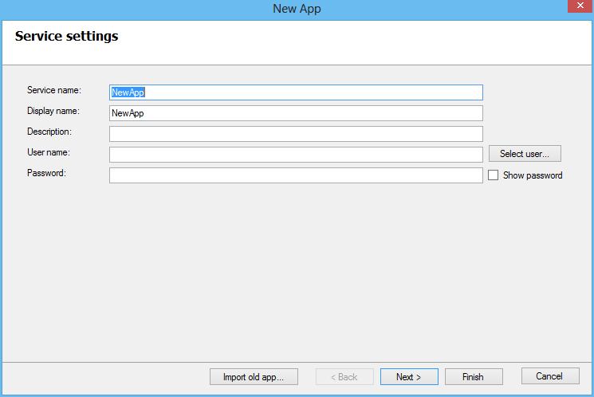

This installation guide is deprecated. DO NOT USE it to install Mendix on Windows.

Please find the new documentation here: **[Deploying Mendix on Microsoft Windows](Deploying+Mendix+on+Microsoft+Windows)**.

## Adding an app

To add a new app, click on the Add app button. A wizard will be visible to configure the new app.

At the bottom of the wizard is a button to import old apps. When you choose this button, you can give up a folder containing an old app. After clicking OK, you can change the settings of the imported app through the wizard.

The wizard has up to five steps:

*   [App service settings](Service+form)
*   [Project files](Update+app+form)
*   [Database settings](Database+form)
*   [Common configuration](Configuration+form)
*   Application constants (only visible if there are constants defined in your project)

After you click on Finish, you can change each setting by opening the same configuration forms via the buttons on the first toolbar of the app panel.

[(Back to Top)](Setting+up+a+New+Mendix+Application)