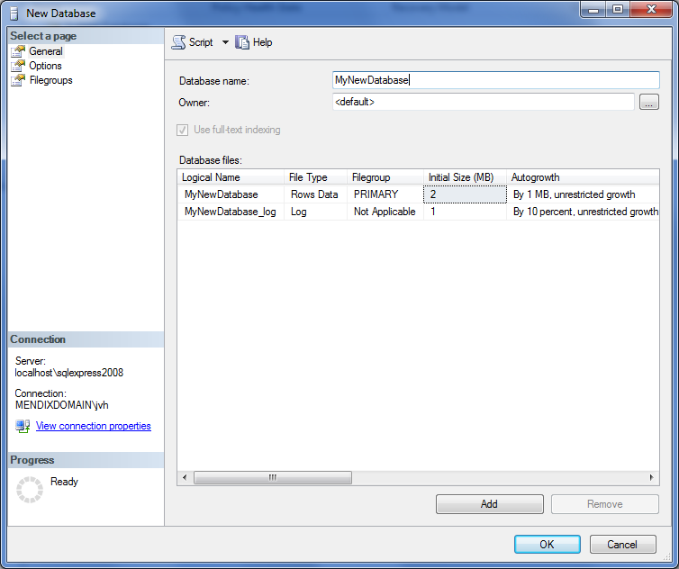
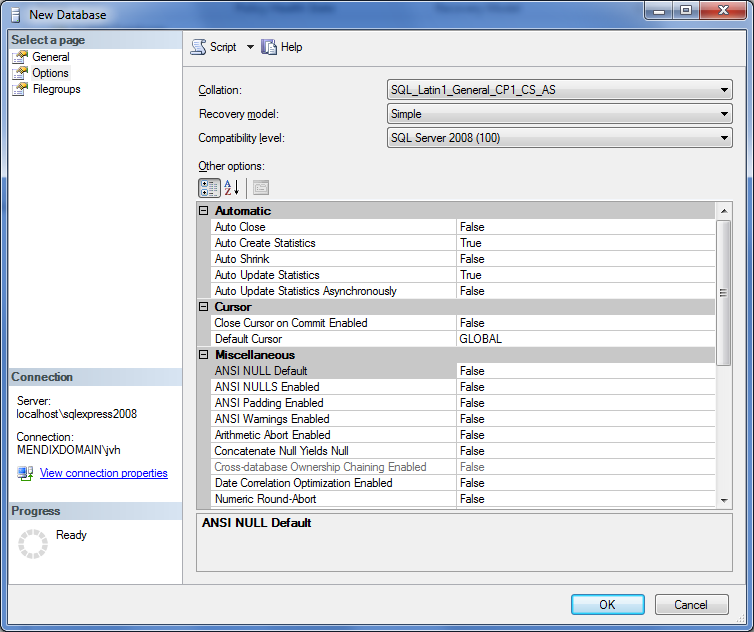

# Setting up a new SQL Server database

<table><thead><tr><th class="confluenceTh">Mendix Version</th><th class="confluenceTh">Create Date</th><th colspan="1" class="confluenceTh">Modified Date</th></tr></thead><tbody><tr><td class="confluenceTd">5</td><td class="confluenceTd">Feb 09, 2015 18:06</td><td colspan="1" class="confluenceTd">Sep 03, 2015 15:36</td></tr></tbody></table>


# Table of contents

## 1. Requirements

The database needs to be Read_Committed_Snapshot = on.

Function and assembly need to be created for  timezone handling. In order to do that CLR needs to be enable on the SQL server instance. If your are not working on the same timezone as UTC, you really want to enable CLR and this function. Without time zone support in the platform it makes development of your functionality much more difficult.

## 2\. Setting up a new Database

When setting up a new database for Mendix most of the settings can be left to the default configuration. When looking at the General settings, all that needs to be done is to setup the database name. Please setup the database files according to the Microsoft SQL server best practices.



In the database options the default properties need to be evaluated. When choosing a collation you need to be wary on the type of collation you are using. Mendix uses UTF-8 for all data evaluation. Depending on your exact locale it is most likely you want to choose one of the SQL_Latin1_General_... collations. The exact encoding will depend on your OS, for an en_US installation this will be CP1\.  

The last two options identify how sorting and uniqueness is interpreted. For example the collation option _CS_ indicates the collation will sort case-sensitive. See this page for more information on collations.[https://msdn.microsoft.com/en-us/library/ms143515.aspx](https://msdn.microsoft.com/en-us/library/ms143515.aspx) 

As a recovery model Mendix only requires the Simple mode. Functionality offered in the Full recovery model option is not used by Mendix. Usage of the Full recovery model does not harm Mendix, but could increase data usage of all transactions and might slow down any rollbacks in case of an error. 
 

After the database is created, the Mendix Platform can initiate the initial setup and prepare all tables and functions for usage by the platform. When starting the platform for the first time, there are two queries that require elevated privileges from a sysadmin role. The sysadmin role can be **temporarily** assigned to the user, or these queries can be executed by the administrator as well.
There are two more queries that are only being executed once, but these privileges are implicitly assigned to the db_owner role. As long as the user is db_owner the function and procedure can be created without problems.

##### _Queries to be executed as sysadmin. _

```
ALTER DATABASE [Scheduler2] SET READ_COMMITTED_SNAPSHOT ON;
```

```
CREATE ASSEMBLY [Mendix.SqlServerExtensions] FROM "D:\MyFolder\Mendix\server\runtime\lib\Mendix.SqlServerExtensions.dll" WITH PERMISSION_SET = SAFE;
```

The permission above does require CLR to be enable on the SQL Server instance. If CLR is not enable this can be enable using the following query:

```
EXEC sp_configure 'clr enabled' , '1';
RECONFIGURE;
```

##### Queries to be executed with the database role db_owner or db_ddladmin

```
CREATE FUNCTION [dbo].[mx_toLocalDateTime] (@utcDateTime datetime, @dstTimeZone nvarchar(50)) RETURNS datetime AS EXTERNAL NAME [Mendix.SqlServerExtensions].[Mendix.SqlServerExtensions.DateTimeLocalizer].[ConvertToLocalDateTime];
```

```
CREATE PROCEDURE [dbo].[usp_nextsequencevalue] 
@SeqName nvarchar(128)
AS
BEGIN
DECLARE @NewSeqVal bigintSET NOCOUNT ON
UPDATE [mendixsystem$sequence]
SET @NewSeqVal = [current_value] = [current_value] + 1
WHERE [name] = @SeqName
RETURN @NewSeqVal
END;
```

## 3\. Related content

*   [How to execute an SQL statement on an external database](/bestpractices/How+to+execute+an+SQL+statement+on+an+external+database)
*   [Activate Your Mendix License](Activate+your+Mendix+license)
*   [Troubleshooting](Troubleshooting)
*   [Setting up the database user](Setting+up+the+database+user)
*   [Sharing the Development Database](Sharing+the+Development+Database)
*   [Setting up Internet Information Services](Setting+up+Internet+Information+Services)

