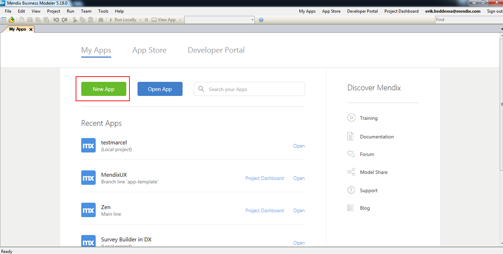
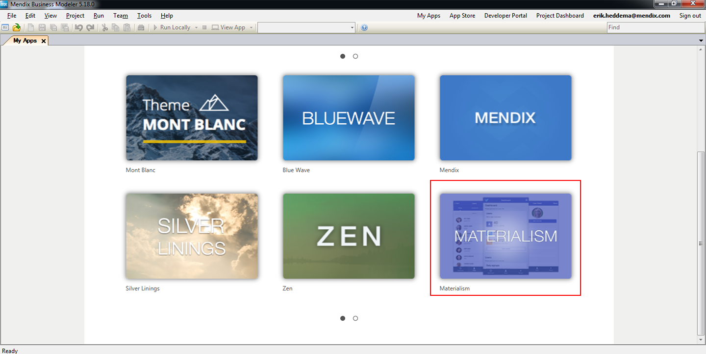
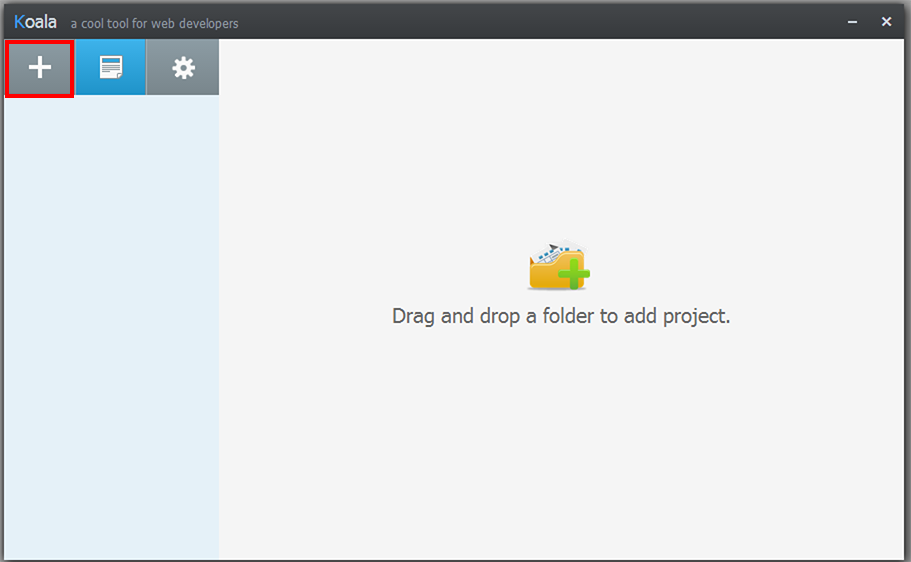
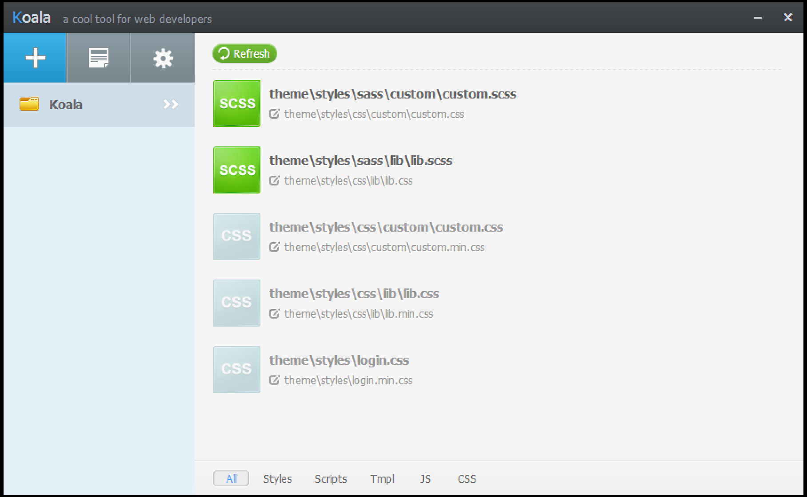
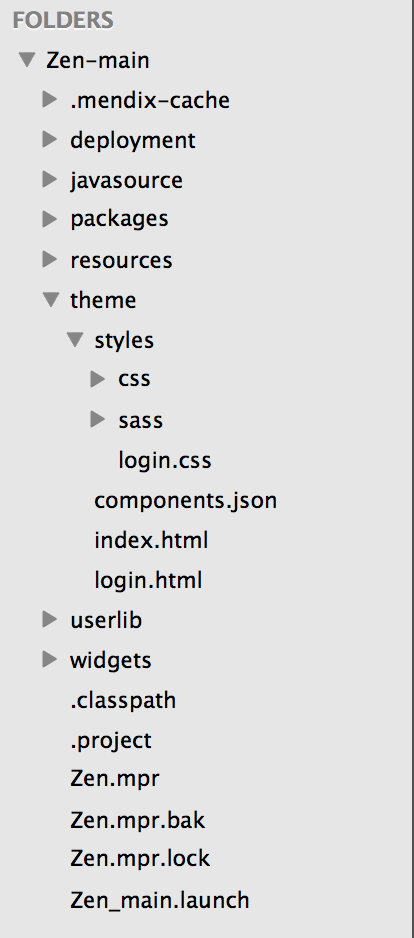
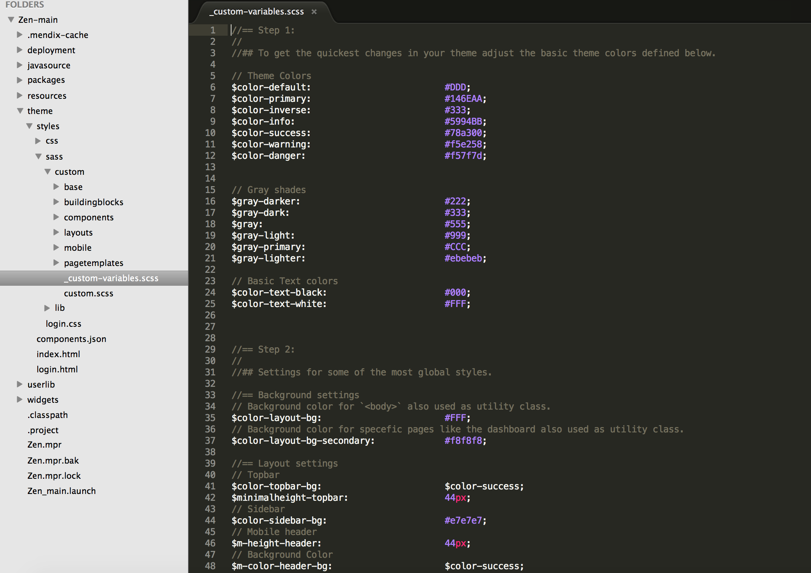
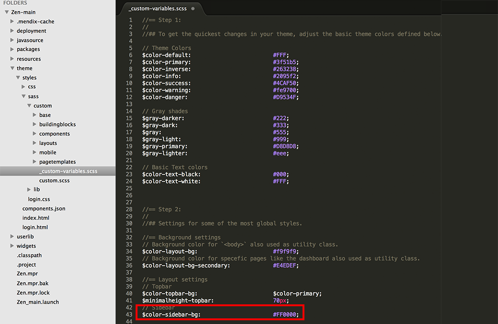
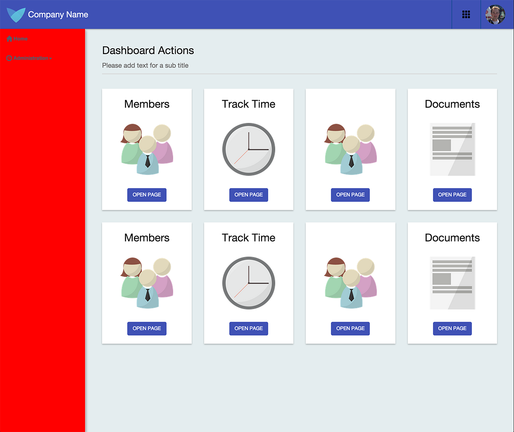

# Setup Mendix UI Framework with Koala

<table><thead><tr><th class="confluenceTh">Mendix Version</th><th class="confluenceTh">Create Date</th><th colspan="1" class="confluenceTh">Modified Date</th></tr></thead><tbody><tr><td class="confluenceTd">5</td><td class="confluenceTd">Sep 24, 2015 16:02</td><td colspan="1" class="confluenceTd">Sep 24, 2015 16:08</td></tr></tbody></table>

In this how-to we will go through how to setup the [Mendix UI Framework](https://ux.mendix.com/) with the program called Koala.

**After completing this how-to you will know:**

*   How to create a new App
*   How to setup Koala and the [Mendix UI Framework](https://ux.mendix.com/)
*   How to make your first styling changes

## 1. Preparation

Before you can start with this how-to, please make sure you have completed the following prerequisites.

*   Download the latest [Mendix Business Modeler](https://appstore.mendix.com)
*   Download [Koala](http://koala-app.com/) ([or use a different compiler](http://sass-lang.com/install))
*   Download text editor [Sublime Text](http://www.sublimetext.com/)

## 2\. Create a new App in the Mendix Business Modeler

In this chapter we will create a new app and select a theme from the New App selector.

1.  Open the **Mendix Business Modeler**.
2.  Create a **New App** from the **My Apps** screen in the Mendix Business Modeler.

     
3.  Select a theme for your app.

    
4.  You can now deploy your app or just head over to section 3 to configure Koala.

## 3\. Configure Koala

The Mendix UI Framework uses **Sass**, which relies on Ruby. However, you can install [Koala](http://koala-app.com/) to run Sass in a self-contained Ruby environment, letting you effortlessly manage all of your Sass projects with a handful of clicks. This way you don't have to worry about using the terminal. You can still do this if you are familiar with Sass and terminal.

1.  Open your **App Project Folder** in Koala by clicking on the plus button in the left sidebar at the top (or drag your folder in Koala).

    
2.  Select the **project directory** from your newly created App. Koala auto detects the Sass and CSS files and you are ready. Koala auto compiles the files you want to adjust.

    

## 4\. Configure your text editor

1.  Open the **Project Directory** from your App in your desired text editor.

    
2.  The **theme **folder is where you can find the theme that was selected when creating a New App. The folder theme\styles\custom will be used to make our own changes. Let's change the background for our sidebar!
3.  Open up the file _ <u>**custom-variables.scss**</u> .

     
    Let's take a look at **Step 2 **in the _ <u>**custom-variables.scss **</u> file. As the comments suggest we can adjust the background-color for the sidebar. 
4.  Change the color from white (#FFF) to red (#FF0000) and save the file.

    

5.  Deploy (or redeploy) your app and see the change you made to the sidebar!

    

    As you can see our sidebar is now red, not the best look and feel but it works!

## 5\. Related content

*   [Scout and Windows 10 Workaround](/howto50/Scout+and+Windows+10+Workaround)
*   [Scout and Windows 10 Workaround](/howto6/Scout+and+Windows+10+Workaround)
*   [Filtering Data on an Overview Page](/howto50/Filtering+Data+on+an+Overview+Page)
*   [Layouts and Snippets](/howto50/Layouts+and+Snippets)
*   [Layouts and Snippets](/howto6/Layouts+and+Snippets)
*   [Filtering Data on an Overview Page](/howto6/Filtering+Data+on+an+Overview+Page)
*   [Setup Mendix UI Framework with just CSS](/howto50/Setup+Mendix+UI+Framework+with+just+CSS)
*   [Setting Up the Navigation Structure](/howto50/Setting+Up+the+Navigation+Structure)
*   [Creating your first two Overview and Detail pages](/howto50/Creating+your+first+two+Overview+and+Detail+pages)
*   [Setup Mendix UI Framework](/howto50/Setup+Mendix+UI+Framework)

