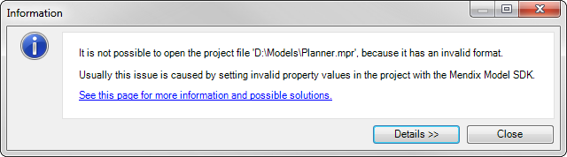
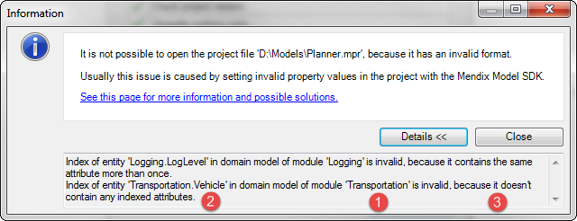
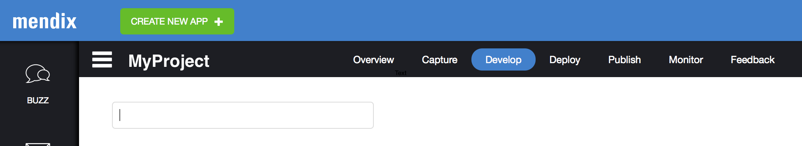

This how-to will help you to solve problems that may occur when opening a project in the Mendix Modeler.

One possible cause of errors that prevent loading is the usage of the [Mendix Model SDK](/MXSDK/Mendix+SDK+Home) for creating or editing the project. With the Mendix Model SDK it's possible to edit your project in such a way that its format becomes invalid, and in the process preventing the Business Modeler from opening it. When this happens the following message is shown:

Read on to find out how to determine the origin of these errors, and possible ways to solve them.

## 1\. Determine the actual problems

1.  Click the **Details >>** button to show the actual errors that occurred while loading your project:
    

These detailed messages tell you:

1.  The module and document in which the error occurred (e.g. the domain model of the module 'Transportation').
2.  The model element that caused the error (e.g. the entity 'Vehicle').
3.  What the actual problem is (e.g. there's an index that doesn't contain any attributes, which is not permitted).

## 2\. Determine the origin of your project

Before trying to solve the problems, it's useful to discover the origin of the project, because the errors may be introduced by someone else. Go through the following possibilities:

### 2.1 Is this a Team Server project?

If your project is a [Team Server](/refguide5/Team+Server) project, and you just did a [download or update](Using+Team+Server+-+Version+Control) from the server, the problem may have been added in a revision that was recently committed to the Team Server. You can check who made the most recent commit in the **Develop** menu item in the top menu of your Project Dashboard in the [Mendix Dev Portal](https://sprintr.home.mendix.com).

If the latest change on your branch line was committed by someone other than yourself, please inform the person about the problem.

### 2.2 Did you obtain the model from someone else?

If you received the model from someone else, for example as a [project package](Importing+and+Exporting+Objects) (.mpk) file, then it's possible they created the model with the Mendix Model SDK. Please inform the person about the problem and ask them for a solution.

### 2.3 Did you create the project yourself?

If you created or edited the project yourself, you will want to read the next section of this how-to to find out what you can do to solve the problem.

## 3\. Solving the problems

The problems described in this how-to can't be solved by editing the project in the Mendix Modeler, because the project's file format is invalid in a way that prevents the Modeler from reading it. This also means the problems are probably not caused by working on the project with the Modeler.

The most likely cause for these kinds of errors is a faulty script that was run on the Mendix Model SDK and, if this is the case, means you will also need to use the SDK to fix the problems. If you created or edited the model yourself using the Mendix Model SDK, you will probably know what to do to solve the problems by carefully reading the messages in the error dialog, and locating the relevant part of you SDK code, after which you can change your SDK script to make the project valid again. Be sure to check the [Mendix Model SDK documentation](/MXSDK/Mendix+SDK+Home) if you need information about constructing or altering models with SDK scripts.

Finally, in the unlikely event that you encounter this error while working on your project with the Mendix Modeler, it's best to contact Mendix support and open a ticket to get help with the problem.

## 4\. Related content

*   [Clearing Warning Messages in Mendix](Clearing+Warning+Messages+in+Mendix)
*   [Common Mendix SSO Errors](Common+Mendix+SSO+Errors)
*   [Debug a Hybrid Mobile Application](Debug+a+Hybrid+Mobile+Application)
*   [Debugging Java Actions](Debugging+Java+Actions)
*   [Debugging Java actions remotely](Debugging+Java+actions+remotely)
*   [Debugging Microflows](Debugging+Microflows)
*   [Debugging Microflows Remotely](Debugging+Microflows+Remotely)
*   [Finding the Root Cause of Runtime Errors](Finding+the+Root+Cause+of+Runtime+Errors)
*   [How to connect a different project to a node](/mxsupport/How+to+connect+a+different+project+to+a+node)
