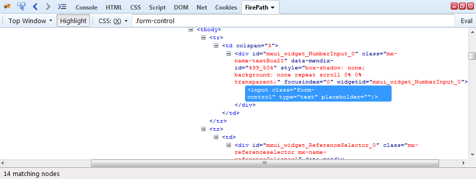
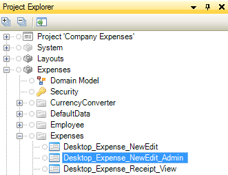
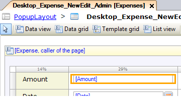
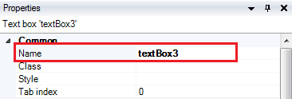
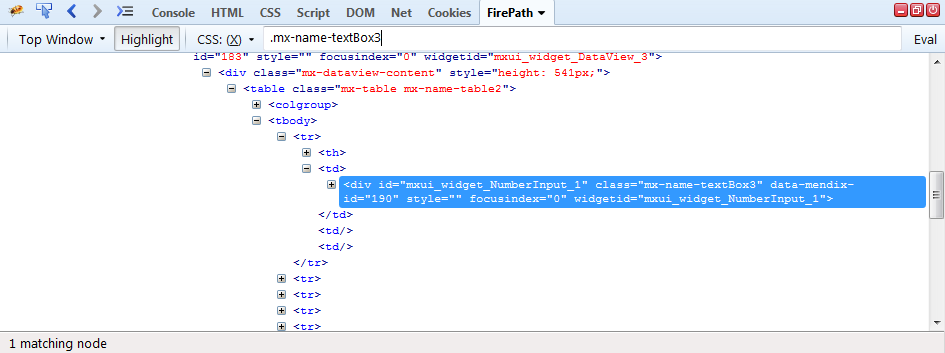
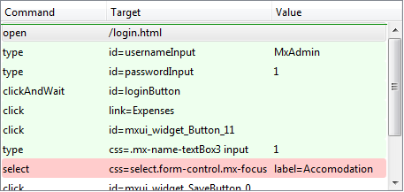
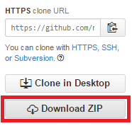

Selenium IDE is a Firefox plugin which records and plays back user interactions with the browser. 

**After completing this how-to you will know:**

*   How to record test scripts with Selenium IDE. 
*   How to find unique CSS selectors with FirePath.

# Table of contents

## 1. Preparation

Before you can start with this how-to, make sure you have completed the following prerequisites.

*   Download and install [Firefox](https://www.mozilla.org/nl/firefox/new/).
*   Download and install [Selenium IDE](http://docs.seleniumhq.org/download/) (Scroll down to chapter Selenium IDE and download the latest version). When Selenium IDE is installed, it is then available as a Firefox plugin.
*   Install Firefox add-on [Firebug](https://addons.mozilla.org/nl/firefox/addon/firebug/).
*   Install Firefox add-on [FirePath](https://addons.mozilla.org/nl/firefox/addon/firepath/).

<table><thead><tr><th class="confluenceTh">Software</th><th class="confluenceTh">Version used in this how-to</th></tr></thead><tbody><tr><td class="confluenceTd">Firefox</td><td class="confluenceTd">37.0.2</td></tr><tr><td class="confluenceTd">Selenium IDE</td><td class="confluenceTd">2.9</td></tr><tr><td class="confluenceTd">Firebug</td><td class="confluenceTd">2.0.9</td></tr><tr><td colspan="1" class="confluenceTd">FirePath</td><td colspan="1" class="confluenceTd">0.9.7.1</td></tr></tbody></table><div class="alert alert-warning">

All images, names and steps in this how-to are based on these versions. When using other versions the images and/or names on your screen may be different than the images or names used in this how-to.

</div>

## 2\. Install and run the Company Expenses App

In this chapter you will install and run the Company Expenses App

1.  Open the **Mendix Business Modeler**.
2.  Click the **App Store** button.
    
3.  Search for _Company Expenses_.
4.  Click **Company Expenses**.
    
5.  Click **Download**.
6.  Click **OK**. This will open the **Company Expenses** app in the **Mendix Business Modeler**.
    
7.  Click **Run Locally** (F5).
8.  Click **View App** (F9).

## 3\. Create your first automated test

In the first part of this chapter you will create an automated test by using the record button in Selenium IDE.

1.  Open **Firefox.**
2.  Go to _http://localhost:8080/index.html_.
3.  Click the **Selenium IDE** button (DEFAULT RECORDING). **
    **
4.  Enter the following login details on the Mendix login screen:

    <table><thead><tr><th class="confluenceTh">Field</th><th class="confluenceTh">Value</th></tr></thead><tbody><tr><td class="confluenceTd">Username</td><td class="confluenceTd">Mxadmin</td></tr><tr><td class="confluenceTd">Password</td><td class="confluenceTd">1</td></tr></tbody></table>

    

5.  Click **Sign in**.
6.  Click **Sign out**.
7.  Click the **Record** button in **Selenium IDE**.
    

    Selenium IDE should look like the image below:
    
8.  Click the **Run current test case** button.
    

    Every passed test step will be marked green as you can see in the image below:
    

Well done! You have just created your first automated test!

### 3.1 Use Firebug and FirePath to locate the element

Selenium IDE can be used to record tests scripts, but almost alway these scripts need to be edited before you can use them (e.g. HTML tag IDs are generated dynamically and will be different with each run of the same page). In this paragraph you will edit some test steps that don't, by using Firebug and FirePath to find the right locator. Locators tell Selenium IDE which GUI elements (e.g. buttons, textboxes, datagrids) it needs to operate on. To make it easier to create a locator for Mendix elements, ‘mx-name’ is added to the class of an element. When the position of an element in the form changes, there is no need to rewrite the script.

1.  Press **CTRL+N** to create a new test case in **Selenium IDE**.
2.  Click the **Record** button.
3.  Enter the following login details on the Mendix login screen:

    <table><thead><tr><th class="confluenceTh">Field</th><th class="confluenceTh">Value</th></tr></thead><tbody><tr><td class="confluenceTd">Username</td><td class="confluenceTd">MxAdmin</td></tr><tr><td class="confluenceTd">Password</td><td class="confluenceTd">1</td></tr></tbody></table>
4.  Click the **Sign in** button.
5.  Click the **Expenses **tab.
6.  Click the **New Expense **button.
7.  Enter 1 in the **Amount** field.
8.  Select _Accomodation_ in the **Type** selectbox.
    
9.  Click the **Save** button.
10.  Click the **Sign out** button.
11.  Click the **Record** button in **Selenium IDE** to stop recording.
12. Click the **Run current test case** button. The test will fail because it can not find the element with target `css=input.form-control.mx-focus`.

    

    The element with target `css=input.form-control.mx-focus` does not exist on the page. The element does contain the CSS class `.mx-focus` during recording the script, but does not contain the CSS class while running the test. You need to find another CSS selector for the same element with the use of Firebug and FirePath.
13. Repeat steps 3 till 6.
14.  Click the **Firebug** button in the Firefox toolbar.
    
15.  Click the **FirePath** tab.
     
16. Click the **Inspect Element** button.
    

17. Click the **Amount** field.
    
    The CSS selector _.form-control_ is not unique; there are 14 matching nodes. We need to find a unique selector for the **Amount** field. Mendix 5 uses CSS classes to identify page content like widgets and popups. You can use these classes in Selenium to manipulate pages and verify data. Widgets can be given a name in the Mendix Business Modeler. These names appear in the HTML document as class names prefixed by _mx-name-_. For instance, a grid named _EmployeeGrid_ will get a CSS class _mx-name-EmployeeGrid_. This is true for all widgets.
18. Open the **Desktop_Expense_NewEdit_Admin **page in the Mendix Business Modeler.
    
19. Select the **Amount** field.
     

    The name of the **Amount** field is _textBox3._ Every element will automatically get the CSS class _mx-name-[Name]_. So the amount field will have the CSS class _mx-name-textBox3_.
    

20. Enter _.mx-name-textBox3_ in **FirePath** and press Enter.
    
    There is only 1 matching node, so you have now found a unique selector for the **Amount** field.

21. Change the following value:

    ```java
    css=input.form-control.mx-focus
    ```

    into

    ```css
    css=.mx-name-textBox3 input
    ```

    in Selenium.

    <div class="alert alert-info">

    Because it is an input field, you have to add _input_ to the target.

    </div>
22. Click the **Run current test case** button.

    The test will fail because it can not find the element with target _css=.mx-name-textBox3 input_. The element can't be found because the page with the element is not loaded yet.
23. Switch the speed control to slow.
    

    The speed control determines how fast your test script runs. Default the speed control is set to the maximum speed. When the test runs too fast, it is possible that the test started asserting for an element on the page even before the page is fully loaded by the browser. Try to run your test script as fast as possible.
24. Click the **Run current test case** button.

    The test will fail because it can not find the element with target _css=[input.form-control.mx](http://input.form-control.mx)-focus_.
     

25. Open the **Desktop_Expense_NewEdit_Admin** page in the Mendix Business Modeler.
26. Click the **Type **selectbox.
    The name of the **Type **selectbox is _referenceSelector1_ and will have the CSS class _mx-name-_referenceSelector1__.
27. Enter _._mx-name-_referenceSelector1___ in **FirePath** and press Enter.

    Two elements are found: one in the popup and one on the page in the background. To retrieve the element of the active page, you need to add _.mx-window-active_ to the target.
28. Enter _.mx-window-active __._mx-name-_referenceSelector1___ in **FirePath** and press Enter.

    There is only 1 matching node, so you have now found a unique selector for the **Type** selectbox. 
29. Change the following value:

    ```java
    css=select.form-control.mx-focus
    ```

    into

    ```css
    css=.mx-window-active .mx-name-referenceSelector1 select
    ```

    in Selenium.

    <div class="alert alert-info">

    Because it is a dropdown list, you have to add _select_ to the target.

    </div>
30. Click the **Run current test case** button.

    The test will pass.
    

Congratulations! You have just created your second automated test.

<div class="alert alert-info">

Some widgets, like a Grid or a Listview, can show multiple items. Every item has a CSS class `mx-name-index-[indexNumber].` The index number starts at 0.

</div>

### 3.2 Install the Selenium Mendix locator builder plugin

Manually editing a lot of test steps is time consuming. Marcel Groenweg created a Selenium plugin for Mendix test recording. When you add the plugin to Selenium IDE, the test steps will have mx-name- CSS selectors rather than the Selenium default. It will also look for parent grids and list views and add selectors to get the correct row by it's index. This reduces the time spent on editing the test steps.

1.  Go to [https://github.com/mgroeneweg/SeleniumMendixLocatorBuilder](https://github.com/mgroeneweg/SeleniumMendixLocatorBuilder).
2.  Click on **Download ZIP**.
    
3.  Unzip **SeleniumMendixLocatorBuilder-master.zip**.
4.  Open **Selenium IDE**.
5.  Go to **Options > Options**.
6.  Click on **Browse** to select a Selenium IDE extension.
7.  Select **MendixNameLocatorBuilder.js** from extracted folder.
8.  Click **Open**.
9.  Click **OK**.
10.  Restart Selenium IDE.
11.  Click on **Options > Options**.
12.  Select tab **Locator Builders**.
13.  Drag **css:MendixName** to the top.
14.  Restart Selenium IDE.

Now the test steps will have 'mx-name-' CSS selectors rather than the Selenium default.

### 3.3 Create an automated test with the Selenium Mendix locator builder plugin

1.  Open **Selenium IDE**.
2.  Enter the following login details on the Mendix login screen:

    <table><thead><tr><th class="confluenceTh">Field</th><th class="confluenceTh">Value</th></tr></thead><tbody><tr><td class="confluenceTd">Username</td><td class="confluenceTd">Mxadmin</td></tr><tr><td class="confluenceTd">Password</td><td class="confluenceTd">1</td></tr></tbody></table>
3.  Click the **Sign in** button.
4.  Click the **Expenses **tab.
5.  Click the **New Expense **button.
6.  Enter 1 in the **Amount** field.
7.  Select _Accomodation_ in the **Type** selectbox.
    
8.  Click the **Save** button.
9.  Click the **Sign out** button.
10.  Click the **Record** button in **Selenium IDE** to stop recording.
11. Click the **Run current test case** button. The test will fail because it can not find the element with target _css=.mx-window-active .mx-name-textBox6 input_. The element can't be found because the page with the element is not loaded yet.
     
12. Switch the speed control to slow.
    

    The speed control determines how fast your test script runs. Default the speed control is set to the maximum speed. When the test runs too fast, it is possible that the test started asserting for an element on the page even before the page is fully loaded by the browser. Try to run your test script as fast as possible.
13. Click the **Run current test case** button. The test will pass.
    

## 4\. Related content

*   [Testing Mendix applications using Selenium IDE](Testing+Mendix+applications+using+Selenium+IDE)
*   [Creating automated tests with TestNG](Creating+automated+tests+with+TestNG)
*   [Testing microflows using the UnitTesting module](Testing+microflows+using+the+UnitTesting+module)
*   [Finding the Root Cause of Runtime Errors](Finding+the+Root+Cause+of+Runtime+Errors)
*   [Clearing Warning Messages in Mendix](Clearing+Warning+Messages+in+Mendix)

Learn more about this topic using the following helpful links:

*   [Selenium IDE Documentation](http://docs.seleniumhq.org/docs/02_selenium_ide.jsp)
