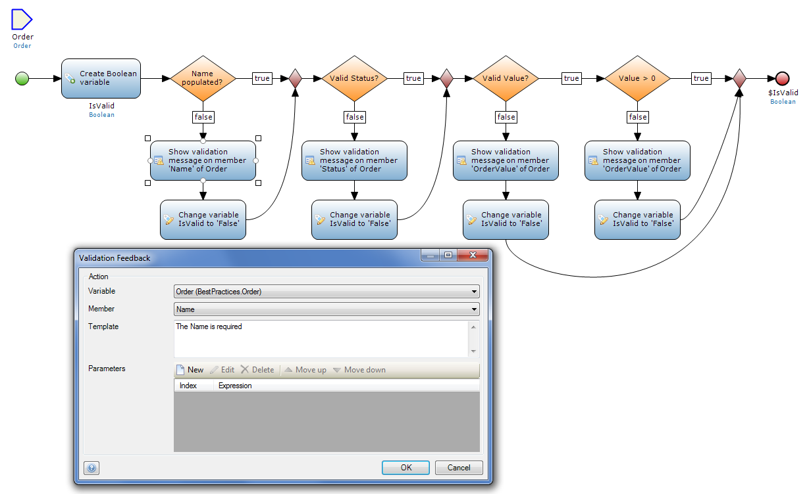
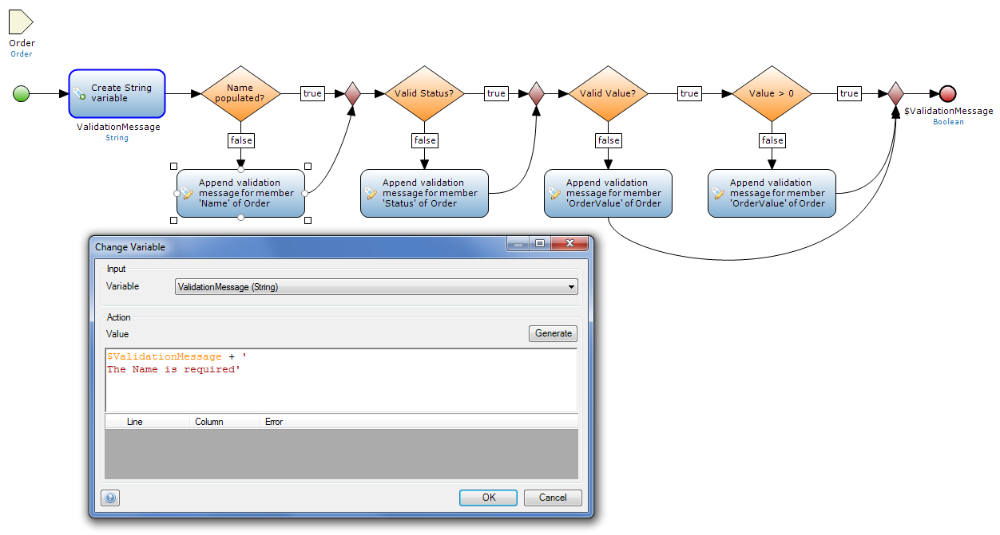
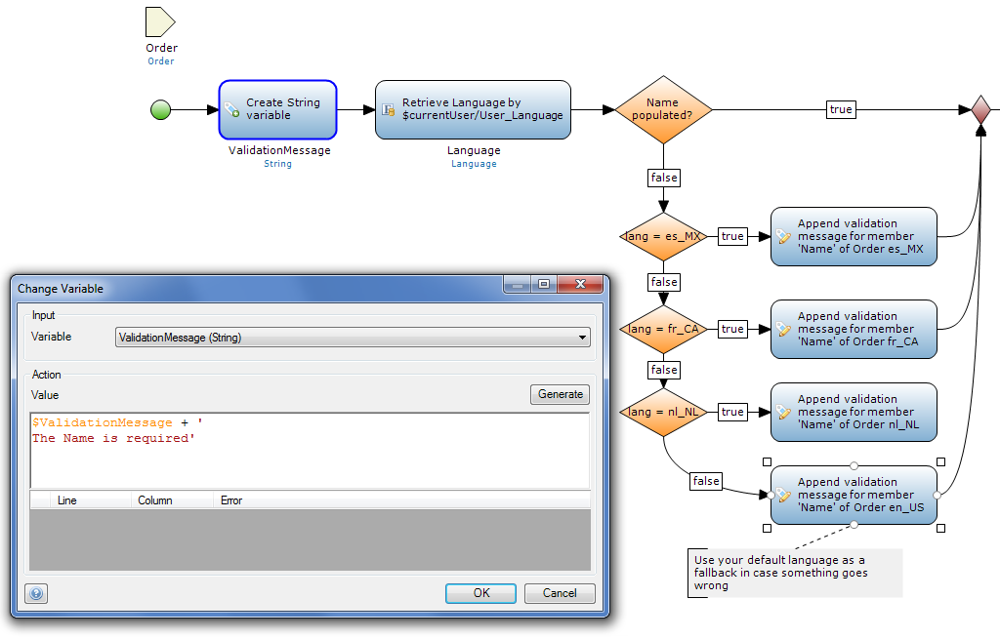
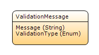
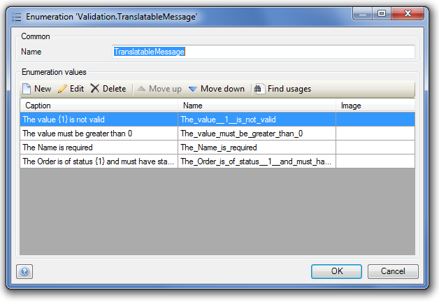

<table><thead><tr><th class="confluenceTh">Mendix Version</th><th class="confluenceTh">Create Date</th><th colspan="1" class="confluenceTh">Modified Date</th></tr></thead><tbody><tr><td class="confluenceTd">5.20</td><td class="confluenceTd">May 21, 2015 17:08</td><td colspan="1" class="confluenceTd">Oct 09, 2015 15:48</td></tr></tbody></table>

Setting up validation rules should be relatively straight forward. Per object or per process step you want to have a single microflow that is in charge of the validation. That microflow has the required input parameters, validates all values. If a value is invalid the microflow will execute the validation feedback activity. When completing the microflow it will return a boolean true/false whether or not the object has been successfully validated.
These types of validation actions should be used throughout your project.

However you will often run into situations where you need to be able to show or process your validation rules in a different way than just as validation feedback. On option that gives you more control is building one large string message variable. The validation microflow should return that message. If anything has been returned, the object is invalid.
Or if you need to differentiate between the different validation messages you can also build a list of (non-)persistent objects, instead of appending a message you should create an object and add the object to a list. Also take a look at the validation best practices.

### Simple alternative for translating messages:

There is one big problem with this second solution, you loose the ability to translate your validation message. String variables or attributes can not be translated by the platform. If you only have a hand full of these types of validation rules you might want to consider modelling out all language combinations. For each validation message you have to add splits and activities per language. This could become a lot of work, but as long as you only have to do this one a couple of places it might not be worth to use the more complicated solution described below. 

### Translating validation rules

If you have to translate multiple validation rules, it will be worth it to develop a more advanced validation module which supports you in your maintenance of all these rules and messages.

Prepare a validation entity in the domain model

Create an enumeration containing all validation messages

This is the microflow you should use to create the message you should store in the entity:

<iframe width="100%" height="400px" frameborder="0" src="https://modelshare.mendix.com/models/34614f4f-a2d3-43ff-81c8-a14605e06a05/get-i18n-text-using-1-parameter?embed=true" allowfullscreen=""></iframe><iframe width="100%" height="400px" frameborder="0" src="https://modelshare.mendix.com/models/c1d54c7d-def4-4b39-9d90-92c6d5dab59f/get-i18n-text-using-2-parameters?embed=true" allowfullscreen=""></iframe>

The GetI18NText microflow validates and acquires the text like this. This is done to prevent any nullpointers in case of incorrect modelling.

<iframe width="100%" height="400px" frameborder="0" src="https://modelshare.mendix.com/models/45864420-7a30-42cd-9f36-ba0976fd5315/get-i18n-text?embed=true" allowfullscreen=""></iframe>

The text is replaced by this microflow, the input is the translated text, the variable (parameter) text you want to add to the text, and the token nr to indicate the position (i.e. {1}, {2}, {3})

<iframe width="100%" height="495px" frameborder="0" src="https://modelshare.mendix.com/models/6a80d12a-5670-48fe-bbdf-ba793af6cf8d/replace-i18n-token?embed=true" allowfullscreen=""></iframe>

## Related content

*   [Finding Object Activities](Finding+Object+Activities)
*   [Finding Unused Items](Finding+Unused+Items)
*   [Finding your way through a project](Finding+your+way+through+a+project)
*   [Showing a Project in the Directory in Explorer](Showing+a+Project+in+the+Directory+in+Explorer)
*   [Querying over self-references](Querying+over+self+references)
