The Mendix modeler has a lot of out of the box functionalities and widgets such as data grids and snippets. However, if you want to extend your application with more widgets and modules such as 'forgot password' functionality, simple charts, excel importer and other features – you will need to add the content from the appstore. The appstore contains a many useful and reusable widgets and modules created by Mendix, our partners, and customers. You can access and browse the appstore content [here](https://appstore.home.mendix.com/).

This How-to will cover the basics of how to access the appstore within the modeler and provide a simple example of how to add a widget and a module to your application.

## 1\. Adding a widget from the appstore

In this part of the how-to you will learn how to add a radio button widget. You can follow the same steps to download any appstore content you need. 

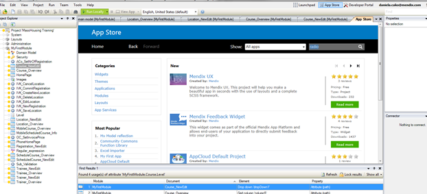

1. Open the appstore inside the modeler by clicking the ‘App Store’ button on the top dashboard.

2. Search for your widget or appstore content in the search box – In this instance you are searching for ‘radio’.

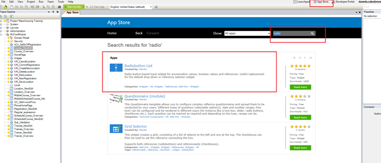

3. Click on **RadioButton List** to open the RadioButton information.

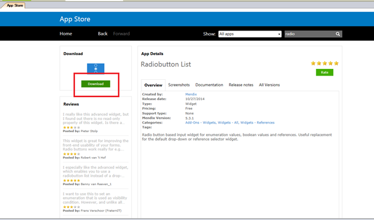

4\. Click Download. This will add the widget to the Mendix Modeler.

### 1.1 Where to find downloaded widgets in the modeler

Once you have downloaded a widget from the appstore you can find it under the **Add-On** menu. All of the widgets that you add will show up in the Add Ons in the Page overview section.

1\. Open a page where you want to use the radio button.

2\. Open the Add-On menu and you will see all the widgets you have downloaded.

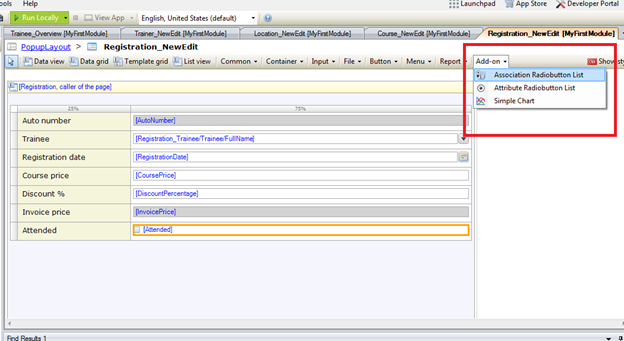

3\. Another way to see the Add On is to select the exact field you want to use the widget in.

4. Right Click on the field, go to ‘Add Widget’ > ‘Add-On’ and you will again see all the widgets you have downloaded.

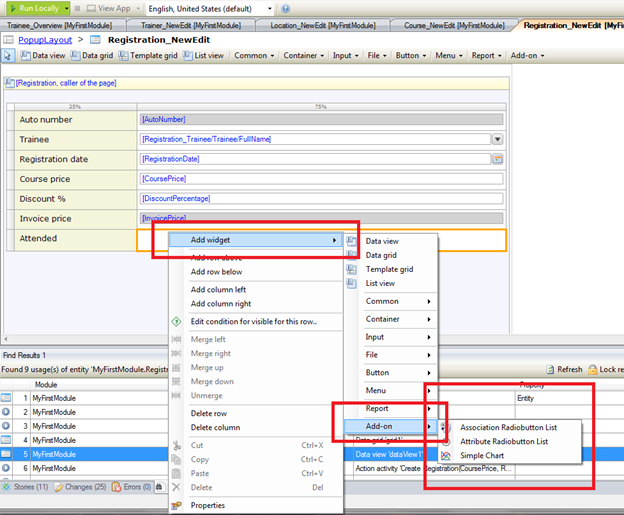

5. Click on the widget that you want to use and it will be added to the page – in our example want to click on “Attribute Radiobutton List” and the widget will be placed within your page

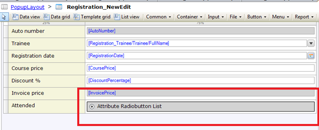



Please make sure that you download the correct version of the widget. If you are using Mendix 5 always download a widget that has a Mendix 5 version as well. You need to make sure that the widget or module versions you download from the appstore are compatible with the version of the Modeler you are working in.

Do not download a widget that has a higher release version than the modeler you are in. You can access older versions of the widgets in the All Versions Tab and download the most compatible version.

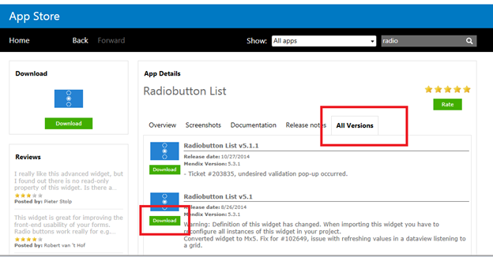


### 1.2 How to use downloaded widgets

Each widget that you download from the appstore is different and has different ways of being used. For more information you should check out the documentation that is specific to each widget. Most widgets will require you to configure them.

That's why, whenever you drop the widget within the page, you will most likely see an error in the error view. The steps below will highlight how to resolve specifically the radio button error.

1. Open the error view and review the error message.

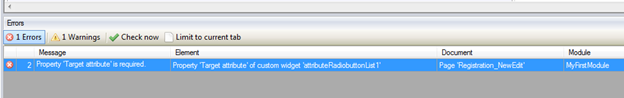

2. In this example, the property “Target attribute” in the radio button is required.

3\. Double click on the radio button and it will open up all the options for the radio button.

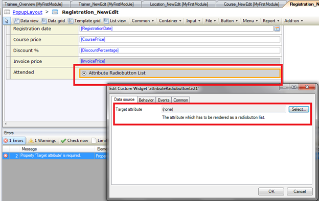

4. Notice that the “Target Attribute” is empty or set to none. Double click on the Select and it will open a new window.

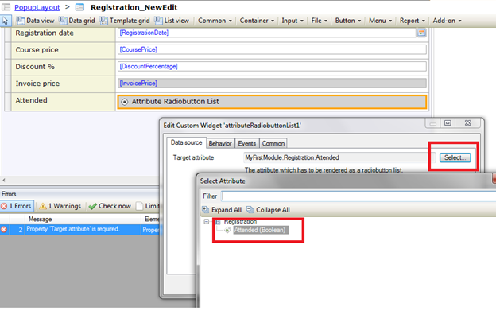

5\. Select the attribute that you want to display as a radio button. Note that the radio button works on Booleans and Enumeration attribute types.

Every widget has a Documentation Tab in the appstore which provides more information on what the widget does and how it can be implemented. You can ask questions on our [forum](https://mxforum.mendix.com) and reach out to the developers in the documentation.

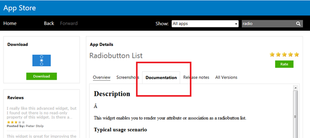

## 2\. Adding a module from the appstore 

In addition to widgets, you can download entire modules from the appstore. Examples of modules you can download from the appstore are Excel Importer, Forgot Password Functionality, Email with templates, LDAP integration and so on. The modules include whole functionalities and integrations which can be very helpful when you are building your application.

In this example you will learn how to add the Google Maps module. 

1\. Open the appstore in the Mendix modeler.

2\. Search for “Google maps”.

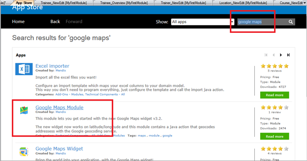

3. Click on the **Google Maps Module** and download the module.

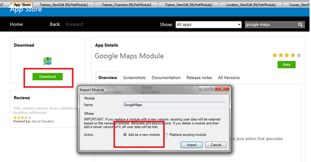


Notice the “Add as a new module” and “Replace existing module” options. The “Add as a new module" is the default option when the module is being downloaded for the first time.


5. Click on **Import** and a pop-up stating “The app was successfully imported into the project” will show up. Click **ok** and you are done.



If you have made any edits or customization to the module that you have already downloaded, be aware of the “Replace existing module” option. It will override all of your changes with the standard appstore content. Hence, unless you are an expert and understand the implications of your changes and will not update your widget in the future. It is not recommended to make edits to the downloaded project widgets or modules.



### 2.1 Where to find the downloaded module in the modeler

Unlike the widgets, the modules will be visible on your Project Explorer overview and will contain a domain model, pages and microflow logic.  

1. Open the project explorer to view the Google Maps. Modules downloaded from the appstore will have a light blue icon to differentiate them from the development modules.

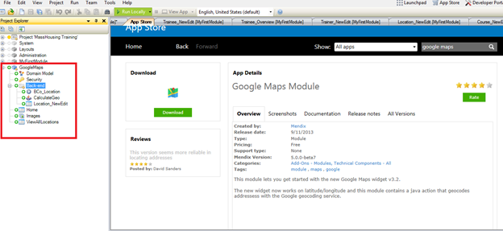

### 2.2 How to use downloaded modules

Each module is different and some modules might give errors because they are connected to other modules. For example, if you download the Excel importer you will need to download MxModelReflection to make the 336 errors disappear. If you run into any problems, always check the documentation tab for any dependencies and how to install guidelines. 

1. For the Google Maps module, add the “Home” and “ViewAllLocations” to your navigation.

    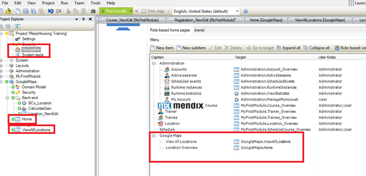

2. Review the Google Map by running your app locally and adding some locations.



Sometimes additional widgets are added when you download a module, for example the Google Maps widget is included when you download the Google Maps Module.



## 3\. Related content

*   [Managing your Application Requirements with Mendix](managing-your-application-requirements-with-mendix)
*   [Starting your own repository](starting-your-own-repository)
*   [Contributing to a GitHub repository](contributing-to-a-github-repository)
*   [Using Team Server - Version Control](using-team-server-version-control)
*   [Gathering user feedback](gathering-user-feedback)
*   [Creating a basic "hello world" custom widget](creating-a-basic-hello-world-custom-widget)
*   [Blog post on useful widgets](http://www.mendix.com/blog/top-5-mendix-widgets-speeding-application-development/)
*   [Common Widget Properties](/refguide5/common-widget-properties)
*   [Blog post on feedback widget](http://www.mendix.com/blog/feedback-widget-bridging-the-gap-between-users/)
