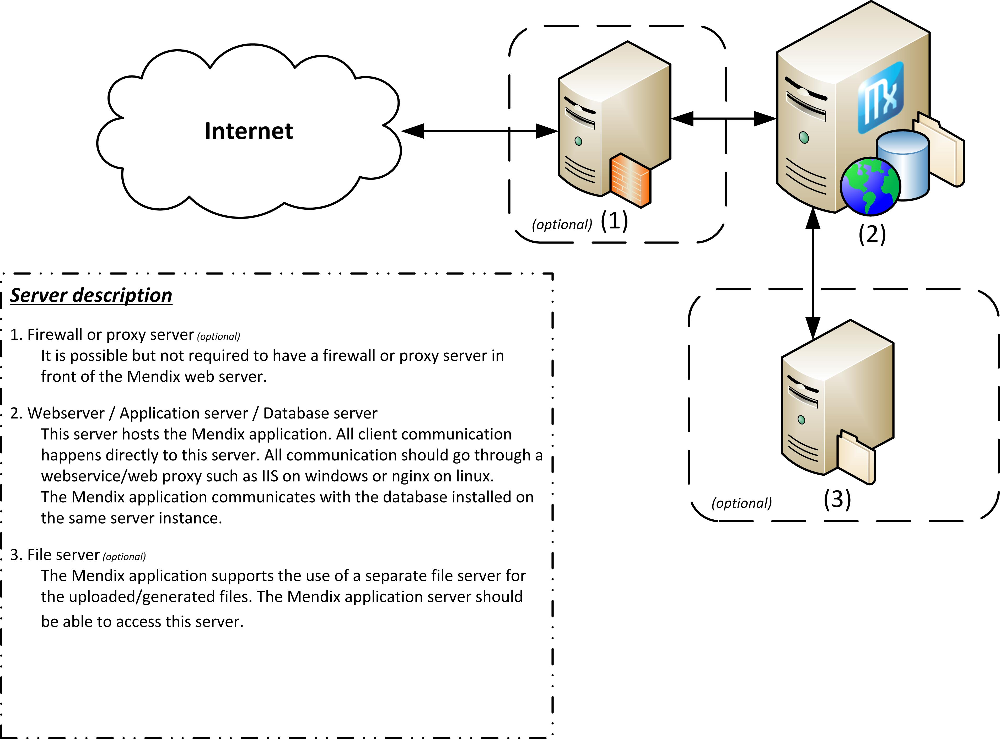
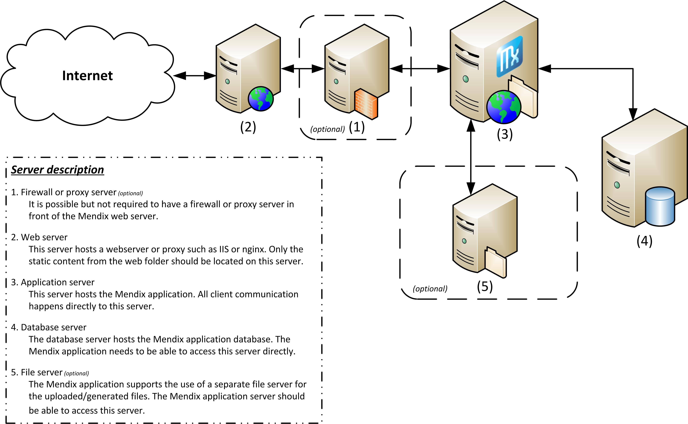
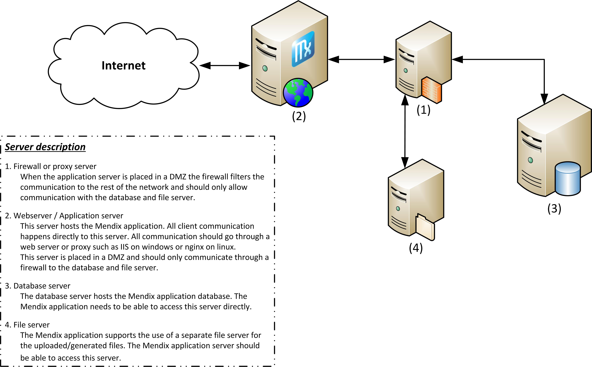

# Architecture Options

When designing your server architecture there are an infinite number of possibilities in how you want to setup your environment. There isn't really a right or wrong configuration, it depends on what your requirements are on security, availability and performance. 

The options below are just a few examples of the most commonly used architectures. The Mendix Cloud uses a (more complex) architecture based on option 2 without a separate file server(4), and with a proxy server(1) to redirect the traffic to the correct environment. 

# Table of contents

## 1. Option 1: Minimal server architecture

_Simplest solution with the least configuration and connection problems. This configuration is used in the Mendix cloud as well, except the cloud is linux based, with nginx instead of IIS and postgresql as database server._

_
_

## 2\. Option 2: Hosting with a separate database server

## 3\. Option 3: Separate database server and a separate webserver

_This option is hardest to maintain, every update has to be performed twice. Once on your application server as normal, but after an update you have to replicate all static content to the webserver as well. This means you have to copy the contents of the web folder (including mxclientsystem) to the webserver every time you do an update. This is an option that should be avoided. _

_
_

## 4\. Option 4: Separate Mendix webserver in a DMZ

## 5\. Is load balancing supported, and how can this be configured?

The platform can handle a load balancer in front of the platform. The only additional requirement is that the load balancer uses sticky sessions. When a problem occurs on a single instance, the only thing an active user could lose is the data he is working on. Everything that was only available in the memory of the failed instance will be gone. All the stored data will still be available for the user. 
When updating the application, it is best to stop every instance. If the database structure has changed, and a single instance updates the database structure it could cause some strange behavior on all running instances since they are still expecting the old database structure.

For more information please see the [How to page on High availability](high-availability)

## 6\. Related content

*   [Updating a Mendix Application](updating-a-mendix-application)
*   [Troubleshooting](troubleshooting)
*   [Architecture Options](architecture-options)
*   [High Availability](high-availability)
*   [Mendix on Windows - Microsoft SQL Server](mendix-on-windows-microsoft-sql-server)
*   [Setting up a new SQL Server database](setting-up-a-new-sql-server-database)
*   [Restoring a SQL Server database](restoring-a-sql-server-database)
*   [Setting up a SQL Server user](setting-up-a-sql-server-user)
*   [Setting up the database user](setting-up-the-database-user)
