This how-to is based on the video "Build a simple HRM app: Smarten up your app with business logic", which is part of the [Getting Started videos](http://gettingstarted.mendixcloud.com/link/courses/gettingstarted).

This is the last how-to in a series of five on how to create a simple HRM application. In this how-to you learn how to smarten up your application by adding business logic.

**After completing this how-to you will know:**

*   How to create a microflow.
*   How to build business logic.

## 1. Preparation

Before you can start with this how-to, make sure you have completed the following prerequisites.

*   [Build a simple HRM app 4: Enrich the GUI with Filter Options](build-a-simple-hrm-app-4-enrich-the-gui-with-filter-options)

## 2\. Create a microflow

In this chapter you will create a microflow.

### 2.1 Add an action button that calls a microflow

1.  Open the **Employee_Overview** page of the MyFirstModule module.
2.  Right-click on the **grid control bar** of the data grid in the master detail container.
3.  Click on **Add button > Action**. Click [here](/refguide5/action-button) to learn more about an action button.
    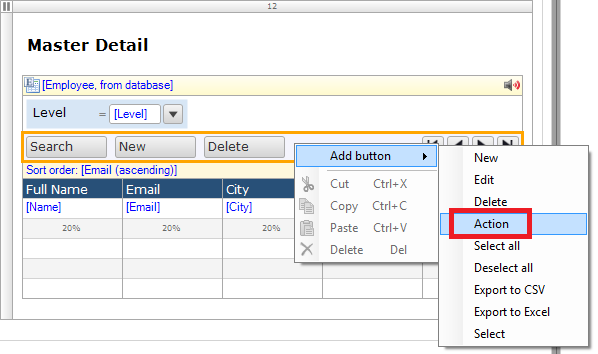 
4.  Double-click on the new button.
5.  Change the **caption** of the new button to _Promote_.
     
6.  Select _Call a microflow_ as **on click event**. Click [here](/refguide5/microflows) to learn more about a microflow.
     
7.  Click on **Select** to select a microflow.
     
8.  Click on the **MyFirstModule** module.
9.  Click on **New** to add a new microflow to the Responsive module.
     
10.  Enter _Employee_Promote_ in the **Name** field.
     
11.  Click **OK** to create the microflow.
12.  Click **OK**.
13.  Right-click on the new button.
14.  Click on **Go to microflow**.
    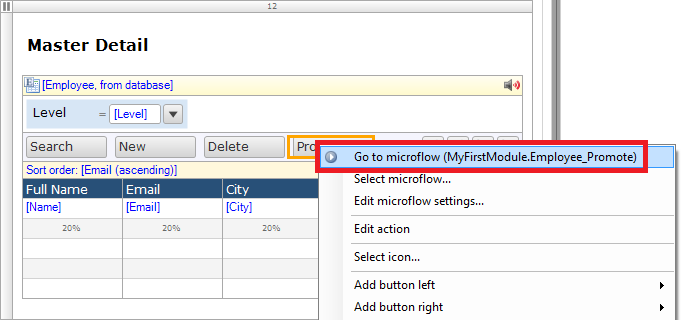 

The microflow should look like the image below:
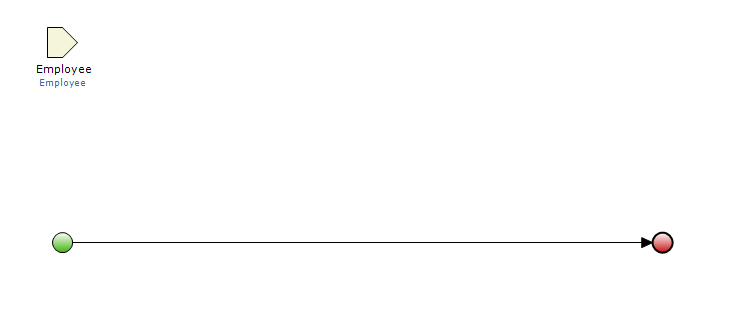 

### 2.2 Add an exclusive split

1.  Select an **exclusive split** from the toolbar of the microflow editor. Click [here](/refguide5/exclusive-split) to learn more about an exclusive split.
     
2.  Click on the line to add the **exclusive split** to the flow.
     
3.  Double-click the **new exclusive split** to open the properties editor.
    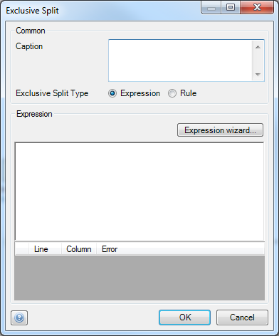
4.  Enter _Level?_ in the **caption** field. 
5.  Press **CTRL + SPACE** in the expression field to display suggestions. Click [here](/refguide5/microflow-expressions) to learn more about microflow expressions.
     
6.  Select **$Employee (MyFirstModule.Employee)**.
    This employee object corresponds with the input object of the microflow.
    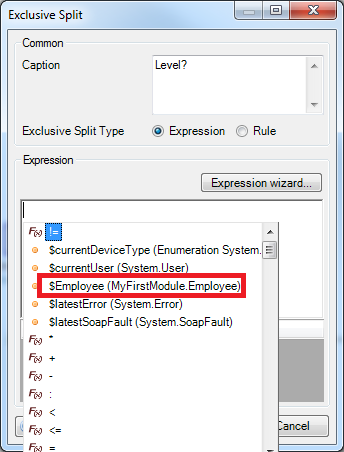
7.  Add a _/ (forward slash)_ to the value in the **expression** field.
    This will show all the attributes of the employee object.
    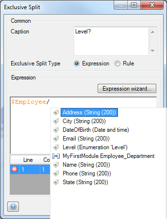
8.  Select **Level** **(Enumeration 'Level')**.

    
9.  Click **OK**.
    The exclusive split will now evaluate values from the Level attribute.
     
10.  Double click on the line between the exclusive split and the end event.

11.  Select _Junior_ in the **Value** dropdown.
    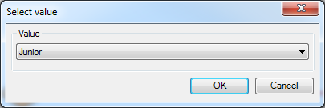 
12.  Click **OK**.
    
    When the Employee in the input parameter has the Junior level, this path will be executed.
13.  Select an **end event** from the toolbar of the microflow editor. Click [here](/refguide5/end-event) to learn more about an end event.
     
14.  Add the **end event** to the flow.
    
15.  Drag a line from the exclusive split to the new end event.
    
16.  Double click on the line between the exclusive split and the new end event.
17.  Select _Medior_ in the **Value** dropdown.
    
18.  Click **OK**.
19.  Repeat steps 27 through 32 for the **Value **_Senior_ and _(empty)_.
    The microflow should look like the image below:
    

### 2.3 Add activities to the microflow

1.  Drag a **Change object** activity from the Toolbox to the Junior path. Click [here](/refguide5/activities) to learn more about activities.
    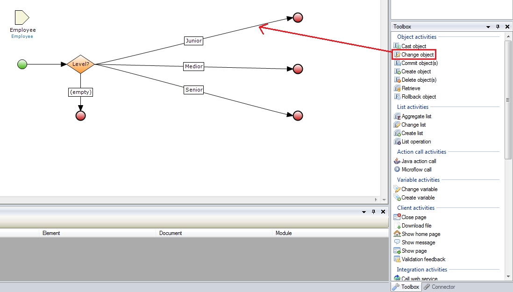

    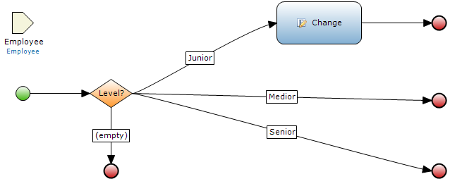
2.  Double-click on the new **Change object** activity to open the properties editor.
    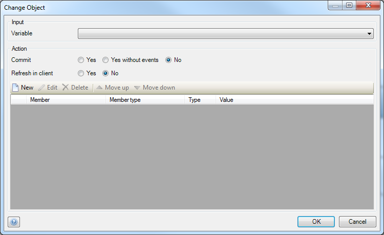
3.  Select _Employee (MyFirstModule.Employee)_ in the **input variable** dropdown.
    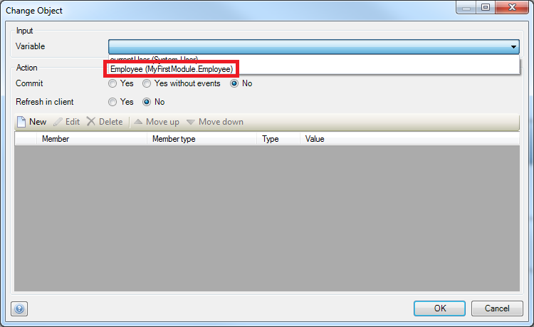 
4.  Set **Commit** to _Yes_. This will save the change to the database.
5.  Set **Refresh in client** to _Yes_. This will update the value in the user interface.
6.  Click on **New** to add a new change item.
    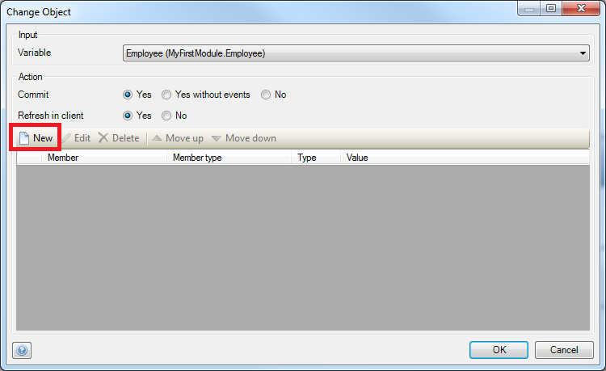 
7.  Select _Level (Enumeration 'Level')_ in the **Member** dropdown.
     
8.  Click on **Generate**.
     
9.  Select _Medior_ in the **Constant** dropdown.
     
10.  Click **OK**.
11.  Click **OK**.
12.  Click **OK** to save the change object properties. The microflow will look like the image below:
    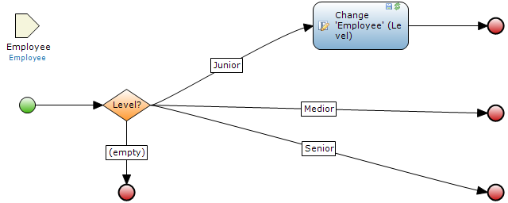 

13.  Repeat steps 1 through 12 for the Medior path. Make sure that you set the level value to Senior. The microflow should look like the image below:
    

14.  Drag a **Show message** activity from the Toolbox to the Senior path.
     
15.  Double-click on the **Show message** activity to open the properties editor. 
16.  Enter _Employee is already at senior level_in the **Template** field.
    
17.  Click **OK**.
18.  Drag a **Change object** activity from the Toolbox to the path which will be executed when the Employee has no level.
19.  Repeat steps 2 through 12 for this new **Change object **activity and make sure that you set the level value to Junior. The microflow will look like the image below:
    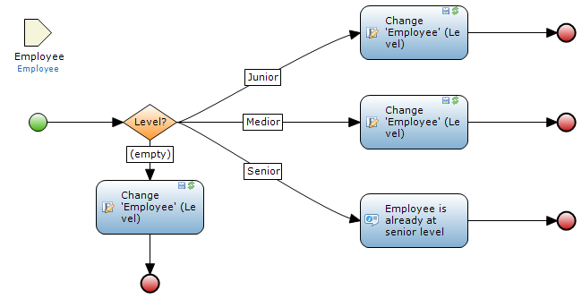 

## 3\. View your app

1.  Click on **Run in Sandbox**.
2.  Click on the **Save and continue** button.
3.  Click on **View App**.
4.  Click on **Employees** in the navigation list.
5.  Select an employee with level **Medior**.
6.  Click on **PROMOTE**.
    The level of the employee will change from Medior to Senior.
7.  Click on **PROMOTE**. 
    You will see a message that you can not promote the employee because the employee is already Senior.

## 4\. Related content

*   [Build a simple HRM app 1: Create, manage and deploy the app](build-a-simple-hrm-app-1-create-manage-and-deploy-the-app)
*   [Build a simple HRM app 2: First steps in building a rich GUI](build-a-simple-hrm-app-2-first-steps-in-building-a-rich-gui)
*   [Build a simple HRM app 3: Show related data in the GUI](build-a-simple-hrm-app-3-show-related-data-in-the-gui)
*   [Build a simple HRM app 4: Enrich the GUI with Filter Options](build-a-simple-hrm-app-4-enrich-the-gui-with-filter-options)

Learn more about this topic using the following helpful links:

*   [Action Button](/refguide5/action-button)
*   [Microflows](/refguide5/microflows)
*   [Exclusive Split](/refguide5/exclusive-split)
*   [Microflow Expressions](/refguide5/microflow-expressions)
*   [End Event](/refguide5/end-event)
*   [Activities](/refguide5/activities)
