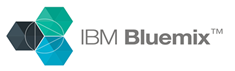
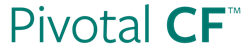
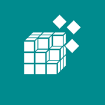
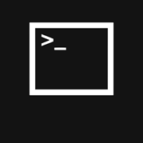
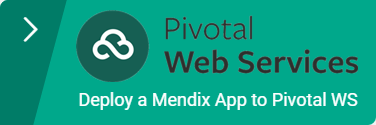
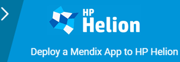
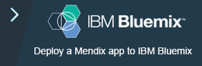

Cloud Foundry is an Open Source Platform-as-a-Service that can run all kinds of web applications. Its technical highlights are:

Horizontal Scaling

Applications run inside stateless containers

Applications are only reachable over HTTP, HTTPS or WebSockets

Binding services to applications for persistence, monitoring, e-mail etc.

Source code as input, running application as output

Extending to more software architectures via custom buildpacks

 Automatic health monitoring and recovery

## Introduction

**Mendix 5.15** and up integrate with the Cloud Foundry ecosystem in multiple ways. We added support for external filestores to store FileDocuments, we made the session cookie name configurable to support horizontal scaling and we added Cloud Foundry support in the Mendix Modeler. Furthermore, we released V1.0 of our [Mendix Cloud Foundry BuildPack](https://github.com/mendix/cf-mendix-buildpack).

<table><thead><tr><th class="blueheader confluenceTh">Traditionally there are four platforms for running Mendix apps</th></tr></thead><tbody><tr><td class="confluenceTd">Mendix Cloud</td></tr><tr><td class="confluenceTd">Mendix Cloud Community Edition Sandboxes</td></tr><tr><td class="confluenceTd">On Premises - Linux</td></tr><tr><td colspan="1" class="confluenceTd">On Premises - Windows</td></tr></tbody></table><table><thead><tr><th class="blueheader confluenceTh">With support for Cloud Foundry we are adding the following deployment options</th></tr></thead><tbody><tr><td class="confluenceTd">Pivotal Web Services</td></tr><tr><td class="confluenceTd">HP Helion Development Platform</td></tr><tr><td class="confluenceTd">On Premises - Cloud Foundry</td></tr></tbody></table>

## Compatibility

Mendix is compatible with all known versions of Cloud Foundry, as long as there are compatible database services (PostgreSQL or MySQL) and custom buildpacks can be used. External file store support can be set up with Amazon S3 or compatible systems. We have included two guides below for deploying Mendix apps to specific Cloud Foundry powered platforms: Pivotal Web Services and HP Helion Development Platform.

These guides focus on graphical interfaces, command line instructions can be found on the [GitHub page of our BuildPack](https://github.com/mendix/cf-mendix-buildpack).

## Select a Cloud Foundry guide

    
