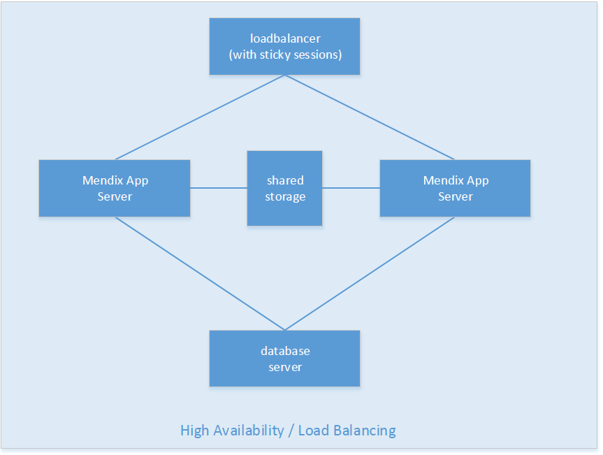

# Table of contents

## 1. Description

This section describes the requirements and limitations of using a Mendix application in a High Availability Architecture.

## 2\. Mendix High Availability & Load Balancing configuration

## 

It is possible to use the Mendix Platform in a load balancing environment. However it is important to know that the Mendix Platform is not Cluster capable or aware. The documentation doesn’t state exactly how the Mendix Platform should be configured in a Load HA architecture. Since Mendix doesn’t have too many requirements on how it can be installed there are many options to run Mendix behind a load balancer.

This document explains the requirements around installing Mendix on a server behind a load balancer. A prerequisite for reading this document is having basic knowledge of the Mendix Runtime components.

Mendix can run behind a Load balancer, basic requirements to this are having Sticky Sessions, a Shared Database and non-persistent HA Sessions.

### 2.1 Configuration details:

All Mendix Runtime instances are to be installed and executed separately. The Mendix Runtime is not aware of a clustered setup. Because of this the installation of the platform on all servers won’t vary from the normal setup with a single instance.

It is possible to keep the configuration synchronized between the Mendix Runtimes such as the m2ee.yaml file, which holds all the configuration.

If you are using Custom Settings to influence the Runtime behavior it is critical that you keep those in sync over the different instances. Having different settings in different instances will create unpredictable behavior.

*   Sticky sessions (in the loadbalancer):
    Can be configure to your own preference, as long as you are using Sticky Sessions.
*   MX Runtime port:
    All available ports are allowed, this is no different than a regular server setup.
*   File share & Document upload:
    Images and uploaded files should be stored on HA shared storage.
*   Application Root URL setting:
    Must be identical on each instance.
*   Keep-alive port, Health check & Monitoring
    The MX Runtime admin port can be used for health check from the Load Balancer. To identify if the server is still available the load balancer should check the keep-alive port in the configuration (the health check microflow). An http status code of 200 OK means the server is still available.
*   IP addresses of end users:
    The MX Runtime does not require the ip addresses of the end users. The application log does show the users that logged in, or it is possible to develop custom logic based on the ip address. It is useful to configure ip address forwarding in the load balancer as well so the information is still usable.
*   MX Runtime Sessions:
    In case an instance goes down and that instance was facilitating any end user sessions it often isn’t desirable that those users are logged out. To allow this you need to enable persistent sessions by using the custom setting: “PersistentSessions” and setting it to TRUE. This will make the MX Runtime store all session information in the database so it can be picked up by other instances.
*   Scheduled Event
    *   Running events on ALL instances. This isn’t a recommended solution, but it is possible. This will let the MX Runtime execute the Schedule Events at the same time on all the instances simultaneously.

1.  1.  Run events on a single instance. Having all Scheduled Events executed on a single instance solves the problem of executing the same actions multiple times. This should be configured manually on each environment. This solution is not failover capable though. If the Scheduled Event instance goes down the task will not be taken over by other instances.
    2.  Develop a custom ‘Scheduled Event Cluster Manager’. This is more complicated but is the most stable solution for guaranteed execution of Scheduled Events. 
        When developing a custom solution it is important to focus on common problems such as: quorum, split brain scenarios, fencing. For example:
        1.  Setup a heartbeat webservice between the Mendix Runtime instances and a configuration entity stating which instance should 'execute' on scheduled events.
        2.  If one instance goes down unexpected the other instances notice on the heartbeat and takes over scheduled events.
        3.  Controlled shut down for maintenance should also be captured in the configuration entity.
        4.  All Scheduled Event microflows handling should first check the heartbeat or configuration before 'executing' the current process.
        5.  This example requires one of the instances to stay online during maintenance, assuming changes by the service console are read into memory on start up and can be altered without risk.

### 2.2 Detailed example High Availability Architecture

## 3\. Related articles

*   [Updating a Mendix Application](/howto50/updating-a-mendix-application)
*   [Troubleshooting](/howto50/troubleshooting)
*   [Architecture Options](/howto50/architecture-options)
*   [High Availability](/howto50/high-availability)
*   [Mendix on Windows - Microsoft SQL Server](/howto50/mendix-on-windows-_-microsoft-sql-server)
*   [Setting up a new SQL Server database](/howto50/setting-up-a-new-sql-server-database)
*   [Restoring a SQL Server database](/howto50/restoring-a-sql-server-database)
*   [Setting up a SQL Server user](/howto50/setting-up-a-sql-server-user)
*   [Setting up the database user](/howto50/setting-up-the-database-user)
