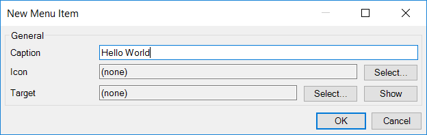
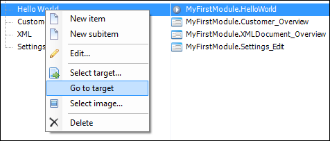
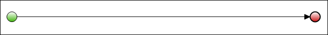
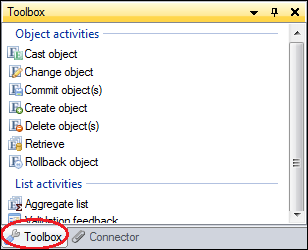
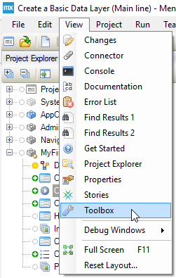
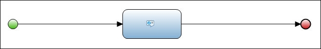
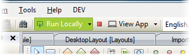

## 1 Introduction

Mendix uses visual models called microflows to define the logic of your application. Microflows are visual ways of expressing what traditionally would be written in code. This how-to explains how you can create a very simple "Hello World" microflow.

**This how-to will teach you how to do the following:**

* Create a menu item
* Create and edit a microflow

## 2 Creating a Menu Item

Microflows can be triggered in many different ways (for details, see [Trigger Logic Using Microflows](Triggering+Logic+using+Microflows)). For this how-to, you'll be using a menu item to trigger the new microflow.

To create a menu item, follow these steps:

1. Open the **Navigation** editor, add a menu item in the desktop navigation settings, and enter the caption of *Hello World*:
    
2. Click **Select...** in the **Target** section of the **New Menu Item** dialog box to open the **Select Navigation Target** pop-up window:
    
3. Select a module and click **New**:
    
4. Click **Create a microflow** to connect a new microflow to this menu item.
5. Name the new microflow *HelloWorld*.
6. Save the new menu item by clicking **OK**.

## 3 Editing the New Microflow

To edit the new microflow, follow these steps:

1. Open the new microflow by right-clicking the navigation item created in [2 Creating a Menu Item](#CreatingaMenuItem) and select **Go to target** from the context menu:
    

    You will see an empty microflow like this:
    
2. Open the **Toolbox** in the bottom-right corner of the Modeler:
    
    You can also open the **Toolbox** from the **View** menu:
    
3. Drag a **Show message** action from the **Toolbox** to the line between the green start even and red end event, which will insert a show message action activity:
    
4. Double-click the message activity to open the **Show Message** properties editor.
5. Enter *Hello World* for the **Template** value and click **OK**:
    
6. Run the application locally and click **View App** to see the application in your default browser:
    
7. Locate the new navigation item in the menu bar and click it to see the message.

## 4 Related Content

* [How to Define Access Rules Using XPath](Define+Access+Rules+Using+XPath)
* [How to Trigger Logic Using Microflows](Triggering+Logic+using+Microflows)
* [How to Create a Custom Save Button](Create+a+Custom+Save+Button)
* [How to Extend Your Application with Custom Java](Extending+Your+Application+with+Custom+Java)
* [How to Work with Lists in a Microflow](Working+With+Lists+in+a+Microflow)
* [How to Optimize the Retrieve Activities](Optimizing+Retrieve+Activities)
* [How to Configure Error Handling](Set+Up+Error+Handling)
* [How to Optimize Microflow Aggregates](Optimizing+Microflow+Aggregates)
* [How to Extract and Use Sub-Microflows](Extract+and+use+sub+microflows)
