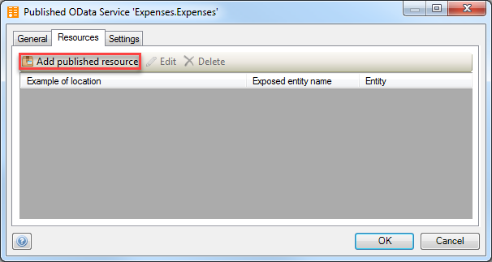
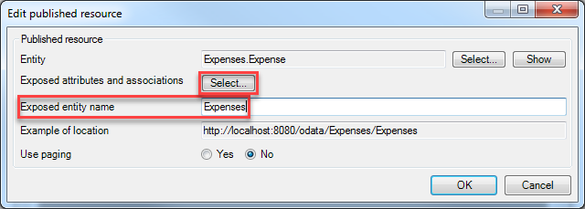
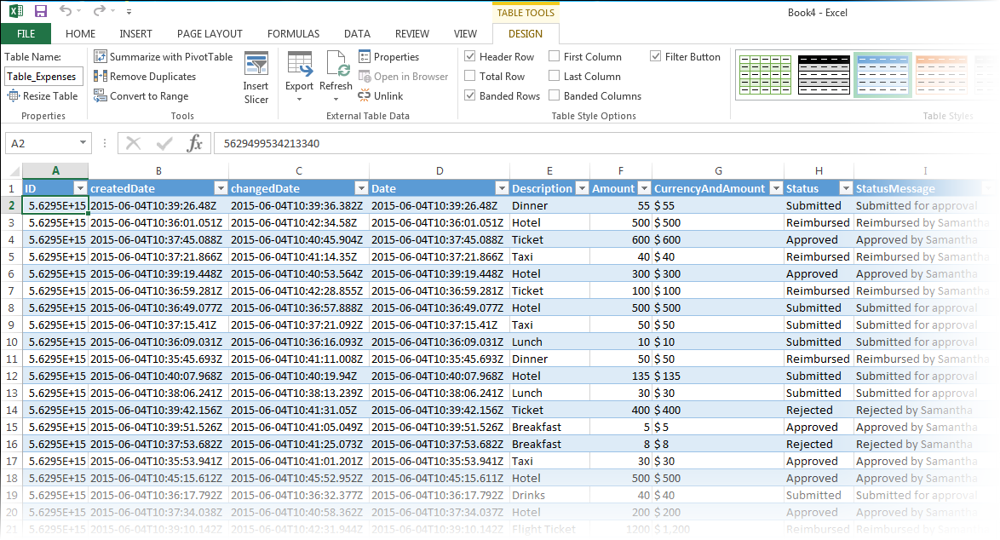
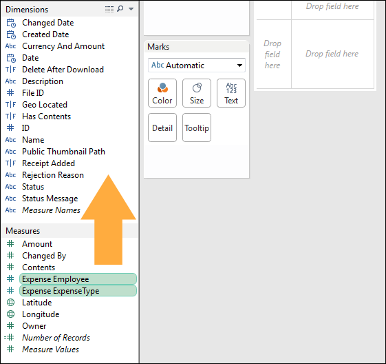
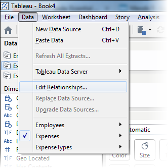
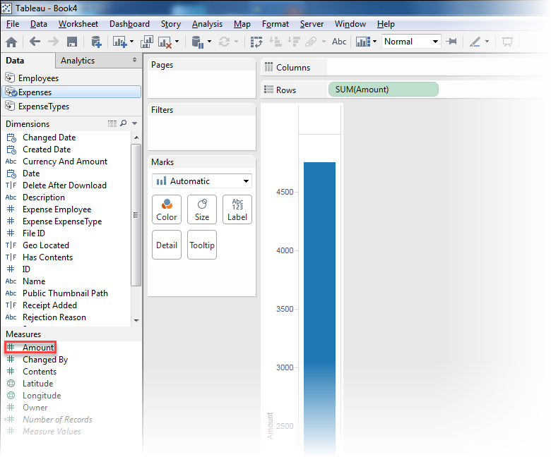

**Introduction**

Mendix applications, like many other applications, encourage the application of a services oriented architecture: multiple smaller services providing APIs and user interfaces for a specific set of data and logic. Enterprises build up complete solutions by assembling these services.

One important aspect of services is that all access to data and logic is handled by service operations. Direct access to databases used for storing the service data is discouraged, because this would bypass business rules and security handled by the service. This creates a challenge for generic reporting, data warehousing and ETL tooling.

**OData**

A new standard called oData is currently seeing growing adoption as this enables generic data access within a services oriented architecture. oData is “an open protocol to allow the creation and consumption of queryable and interoperable Restful APIs in a simple and standard way” ([www.odata.org](http://www.odata.org)). In other words, it enables tools to use any REST/OData service by providing metadata describing the data provided, and standardizing the messages exchanged with the oData services.

A reporting tool like Tableau or Excel can discover what data and functionality is available in an oData service and provide a generic way for users to build new queries for the data.

**After completing this how-to you will know:**

*   How to create a Published OData service with Resources
*   How to add the OData server to Tableau and Excel
*   How to combine resources in Tableau
*   How to create custom queries

## 1. Preparation

Before you can start with this how-to, make sure you have completed the following prerequisites.

*   Get the **Company Expenses Demo** app from the **Mendix AppStore**.
*   Add some expense reports to it so you have data to work with in the how-to.
*   Install Excel 2013.
*   Download and install [Tableau](http://www.tableau.com/). You can use a trial version for 14 days.

## 2\. Creating a Published OData Service

A Published OData service can be used by third-party applications to read data from a Mendix application. In this chapter you will create and configure such a service.

1.  Open the **Mendix Business Modeler**.
2.  Add a new folder to the **Expenses** folder called **OData Services**.
3.  Right click the OData Service folder and select **Add > Published services > Published OData service**.
    
4.  Enter the name **Expenses** and click **OK**.
    
5.  Go to the Resources tab.
    
6.  Click on **Add published resource**.

    In the Edit resource window you can select an Entity as data source for the OData Service. Security in OData is managed by the project security settings and entity level access rules. Therefore, if you have already configured access rules in your app, you don't have to configure it separately for OData.
    
7.  Click **Select** and select the **Expense** entity.
     
8.  Change the **Exposed entity name** to _Expenses_.
    
9.  Click the **Select **(exposed attributes and associations) button to select what values are exposed in the OData service.
    
10.  Click **OK** to save the resource.
11.  **Repeat** steps 6 - 9 for both **ExpenseType** and **Employee** entities.
    
12.  Click **OK** to save the OData service.

Restart the application, the OData service is now ready to be consumed.

## 3\. Working with Mendix Data in Excel 2013

1.  Open Excel and create a new blank workbook.
    
2.  Open the **DATA** tab page and select **OData Feed** from the **Other Sources** menu.
    
3.  Enter `http://localhost:8080/odata/Published_OData_service/Expenses` as **Location** of the data feed.
4.  Select **Use this name and password** and enter the **MxAdmin** credentials.
    
5.  Click **Next**.
6.  Select **Expenses** in the tables selector and click **Finish**.
    
7.  Select **Table** as Import method and click **OK**.
    
8.  The data of the Mendix application should now be imported in Excel.
    

## 4\. Working with Mendix Data in Tableau

In this exercise you will visualize data from the Company Expenses app in Tableau.

1.  Open **Tableau**.
2.  Go to **More Servers > OData**.
    
3.  Enter `http://localhost:8080/odata/Published_OData_service/Expenses` as **Server** address.
4.  Select **Use a specific username and password** and enter the **MxAdmin** credentials.
    
5.  Click **OK** to save the Server Connection. You should see the data source details:
    
6.  Click the name of the server connection and change it to **Expenses** for readability.
    
7.  Repeat step 2 - 6 to add a server connection for `http://localhost:8080/odata/Published_OData_service/Expenses`.
8.  Repeat step 2 - 6 to add a server connection for `http://localhost:8080/odata/Published_OData_service/Expenses`.)
9.  **Open** Sheet1.
10.  Drag **Expense_Employee** and **Expense_ExpenseType** from **Measures** to **Dimensions**
    
11.  Click **Edit Relationships...** to define the relation between the different data sources.
    
12.  Select **Expenses** as **Primary data source** and select **Employee** as **Secondary data source**.
    
13.  Switch from **Automatic** to **Custom** mapping and **remove** any default mappings.
14.  Click **Add...** to configure a field mapping.
    
15.  Select **Expense_Employee** as primary data source field and **ID** as secondary field.
16.  Click **OK** to save the field mapping.
17.  Keep **Expenses** as **Primary data source** and select **ExpenseTypes** as **Secondary data source**.
18.  Switch from **Automatic** to **Custom** mapping and **remove** any default mappings.
19.  Click **Add...** to configure a field mapping
    
20.  Select **Expense_ExpenseType** as primary data source field and **ID** as secondary field.
21.  Click **OK** to save the field mapping.
    
22.  Click **OK** to save the Relationships.
23.  Select **Expenses** as data source and drag the **Amount** attribute from the **Measures** section to **Rows**.
24.  Select **Employees** as data source and drag the **FullName** attribute from the **Dimensions** section to **Columns**.
25.  Click the icon next to the ID attribute to use ID as linking field.
    
26.  Select **ExpenseTypes** as data source and drag the **Name** attribute from the **Dimensions** section to **Color**.
27.  Click the icon next to the ID attribute to use ID as linking field.
    

You should now see a stacked bar chart with data combined over multiple data sources.

## 5\. Filtering Data With Query Parameters

By default all expenses are retrieved by Tableau, but Mendix allows you to add filters to the query so only the desired data is being retrieved.

1.  Right click data source **Expenses** and click **Edit Data Source...** 
2.  Click the OData url to change the connection settings.
    
3.  Add **?$top=3** to server url to only retrieve the first 3 expenses and click **OK**.
    
4.  Open sheet1, you should now only see a stacked bar chart with only the data of 3 expenses.
    
5.  You can combine filters by using the **&** character. Repeat steps 1 - 4 but now use `http://localhost:8080/odata/Expenses/Expenses?$skip=3&$top=3` as Server Url. You should now see a stacked bar chart showing data of expenses 4 to 6.

Other query examples are:

* `http:// localhost:8080/odata/Expenses/Expenses(1688849860265137)`
* `http ://localhost:8080/odata/Expenses/Expenses?$ top=100`
* `http://localhost:8080/odata/ Expenses/Expenses ?$skip=10&$ top=10`
* `http://localhost:8080/odata/ Expenses/Expenses /$ count`
* `http://localhost:8080/odata/ Expenses/Expenses ?$ filter=Firstname+eq+'Ivan'`
* `http://localhost:8080/odata/ Expenses/Expenses ?$ filter=Firstname+ne+'Ivan'`
* `http://localhost:8080/odata/ Expenses/Expenses ?$ filter=DateOfBirth+gt+datetime'1995-01-01T00:00:00'`
* `http ://localhost:8080/odata/ Expenses/Expenses ?$ filter=DateOfBirth+gt+datetime'2005-01-01T00:00:00 '&$ orderby=DateOfBirth`

## 6\. Related content

*   [Consuming a complex web service](Consume+a+Complex+Web+Service)
*   [Consuming a simple Web Service](Consume+a+Simple+Web+Service)
*   [Exporting XML documents](Export+XML+Documents)
*   [Importing Excel Documents](Importing+Excel+Documents)
*   [Exposing a web service](Expose+a+web+service)
*   [Selenium Support](Selenium+Support)
*   [Synchronizing user accounts using the LDAP module](Synchronizing+user+accounts+using+the+LDAP+module)
*   [Importing XML documents](Importing+XML+documents)
*   [Consuming a REST Service](Consume+a+REST+Service)
*   [Exposing data to BI tools using OData](Exposing+data+to+BI+tools+using+OData)
*   [Published OData Services](/refguide6/Published+OData+Services)
*   [OData Representation](/refguide6/OData+Representation)
*   [OData Query Options](/refguide6/OData+Query+Options)
