# Extending Your Application with Custom Java

Most application logic can be developed using Microflows. They are very powerful and contain a lot of features that you need in every application. To prevent you from getting stuck because of a missing feature, we made Microflows extendable. So whenever you feel something is missing you can add it yourself by use of Java actions. In this how-to you will extend your application with custom java code.

## 1\. Preparation

Before you start with this how-to please complete the following prerequisites:

*   [Create and Deploy Your First App](Create+and+Deploy+Your+First+App)
*   You need Eclipse: download it [here](https://eclipse.org/)

<div class="alert alert-info">

You can use any text editor to create custom Java actions, but we highly recommend using Eclipse. The Business Modeler contains a 'Deploy for Eclipse' feature that makes sure that everything that needs to be configured in Eclipse is done automatically for you. You only need to import the project into your Eclipse working environment and you're done.

</div>

## 2\. Adding Java Actions in the Business Modeler

1.  Right click the module **MyFirstModule** and select **Add > Resources > Java action** from the menu.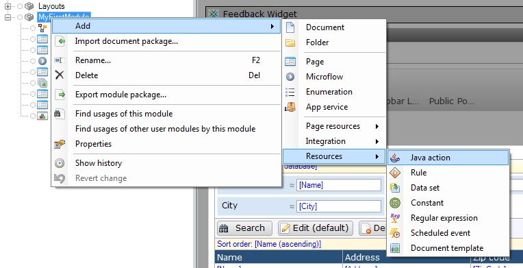
2.  Name the new Java action **ReverseCustomerName** and click **OK.**
    
3.  Click **Add **to add a parameter.
    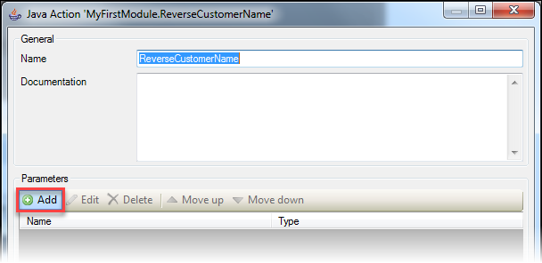
4.  Name the parameter **inputCustomer** and select **Object** as type.
5.  Click **Select...** and select **MyFirstModule.Customer** as object type.
6.  Click **OK.**
    
7.  Change the return type of the java action to **String** and click **OK** to save the java action.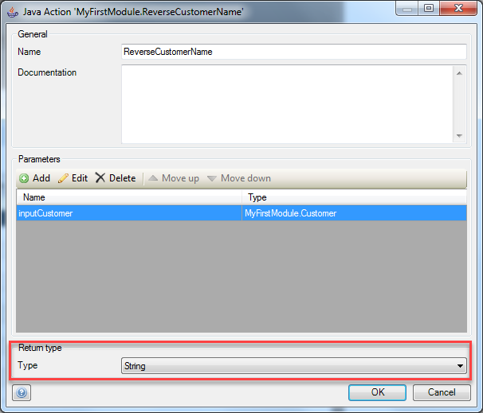
8.  Select **Deploy for Eclipse** from the project menu in the Business Modeler.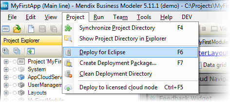

## 3\. Editing the Java Action in Eclipse

1.  Open **Eclipse** and **right click** somewhere in the package explorer.
2.  Select **Import...** from the menu. 
    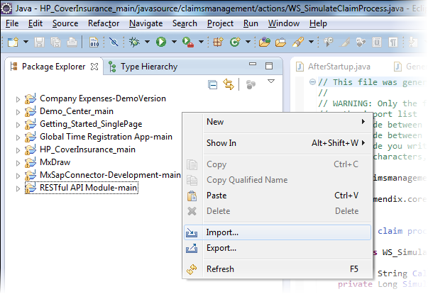
3.  Select **Existing Projects into Workspace** and click **Next.
    **
4.  Set the project directory as root directory for this project and click **Finish.** 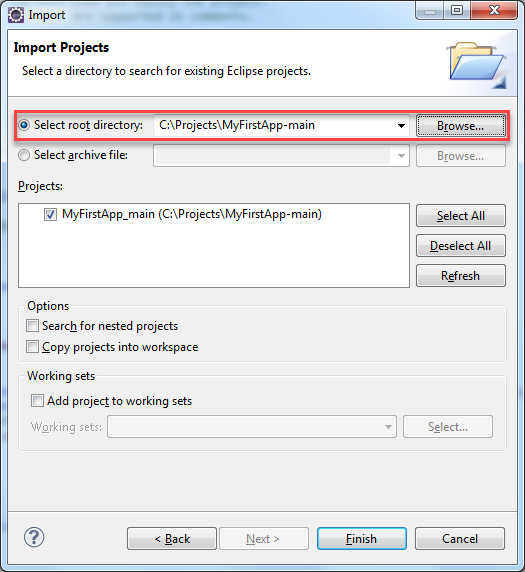

    If you don't know what the project directory is, click **Show Project Directory in Explorer** of the **Project** menu in the Business Modeler.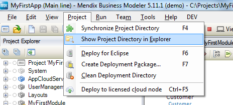
5.  Double click the **ReverseCustomerName.java** in the package explorer of Eclipse.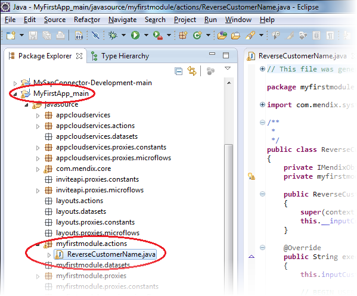
    In the Java code there is a placeholder marked with "//BEGIN USER CODE" and "//END USER CODE" comment statements. This is where you can add your own java code. The Business modeler will never overwrite the code between those two statements. 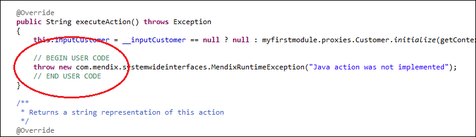
    As you can see, the Business Modeler generated a variable for the input customer object name 'inputCustomer'. You can use that variable to get the name of the customer and reverse it like this:

    ```java
    		String customerName = this.inputCustomer.getName(this.getContext());
    		return new StringBuilder(customerName).reverse().toString();
    ```

6.  Insert the above code between the **//BEGIN USER CODE **and **//END USER CODE** comment statements. It should look like this: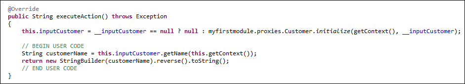
7.  Save the Java action in Eclipse.
    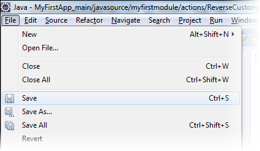

## 4\. Calling the Java Action from a Microflow

1.  Open the Business Modeler and locate the **Customer_Overview** page.
2.  Add a new **Microflow** button to the control bar of the data grid and change the caption to **Reverse Name**.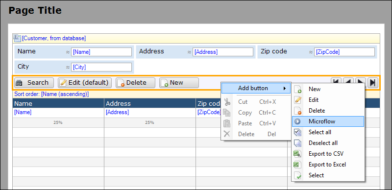
3.  Right click the new Microflow button and click **Select microflow...**.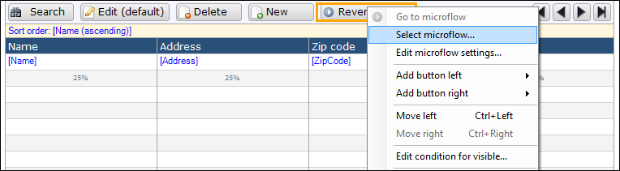
4.  Name the new Microflow **Customer_ReverseName** and click **OK**.
    
5.  Open the new Microflow, it should look like this:
    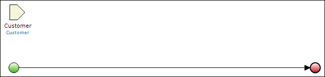
6.  Drag and drop the **Java action** from the project explorer onto the line between the green start and red end event. This generates a java action activity.
    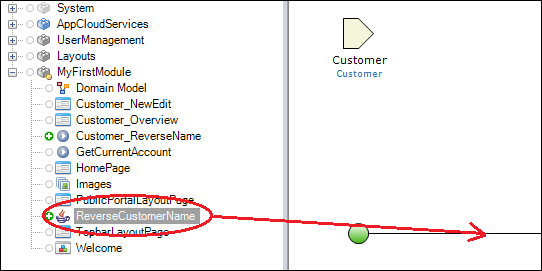
7.  Double click the generated activity to open the **properties** editor.
    
8.  Double click the first argument to open the **expression editor**.
9.  Press and hold the **Ctrl** button and press **space.** This opens code completion.
10.  Select **$Customer**.
    
11.  Click **OK** to save the expression.
12.  Change the **Output variable** into **ReversedName.
    **
13.  Click **OK** to save the properties. The Microflow should now look like this:
    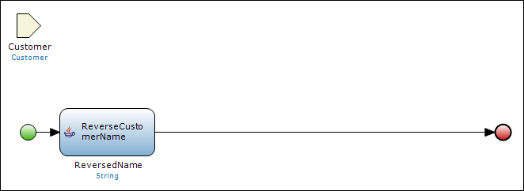
14.  Open the toolbox. It should be on the bottom right of the Business Modeler.
    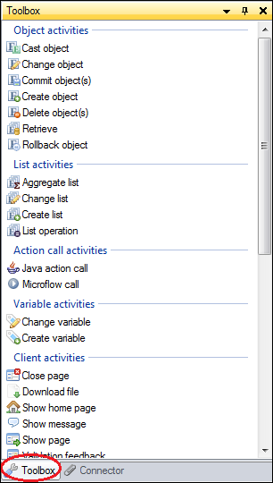
15.  If you can't find the toolbox, you can re-open it from the view menu.
    
16.  Drag and drop a show message activity from the toolbox to the line between the green start and red end event.
17.  Double click the activity to open the properties editor.
18.  Fill in **Reversed name: {1}** as Template. 
    
19.  Add a new parameter by clicking the **New** button. This opens the expression editor.
20.  Press and hold the **Ctrl** button and press **space.** This opens code completion.
21.  Select **$ReversedName.** This is the output variable of the Java action.
    
22.  Click **OK** to save the parameter. The show message properties should now look like this:
23.  Click **OK** to save the show message activity. This Microflow should now look like this:
    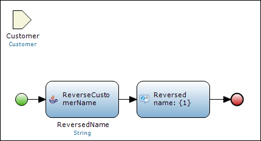

## 5\. Deploy and See the Results

1.  Click **Run in Sandbox** to deploy the application to the cloud. The Business Modeler automatically commits the changes to TeamServer (version control).
    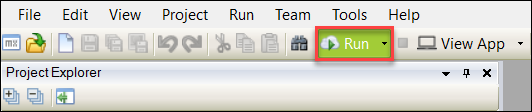
2.  As soon as the deployment process is complete, click **View App** to open the application in your browser.
    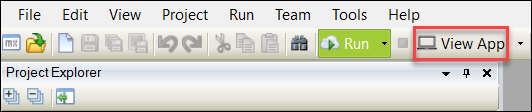
3.  Open the customers overview, select a row and click the **Reverse Name** button. You should now see a message pop-up with the reversed customer name.

## 6\. Related content

*   [Define access rules using XPath](Define+Access+Rules+Using+XPath)
*   [Triggering Logic using Microflows](Triggering+Logic+using+Microflows)
*   [Creating a Custom Save Button](Create+a+Custom+Save+Button)
*   [Extending Your Application with Custom Java](Extending+Your+Application+with+Custom+Java)
*   [Working With Lists in a Microflow](Working+With+Lists+in+a+Microflow)
*   [Optimizing Retrieve Activities](Optimizing+Retrieve+Activities)
*   [Error Handling](Set+Up+Error+Handling)
*   [Optimizing Microflow Aggregates](Optimizing+Microflow+Aggregates)
*   [Extract and use sub microflows](Extract+and+use+sub+microflows)
