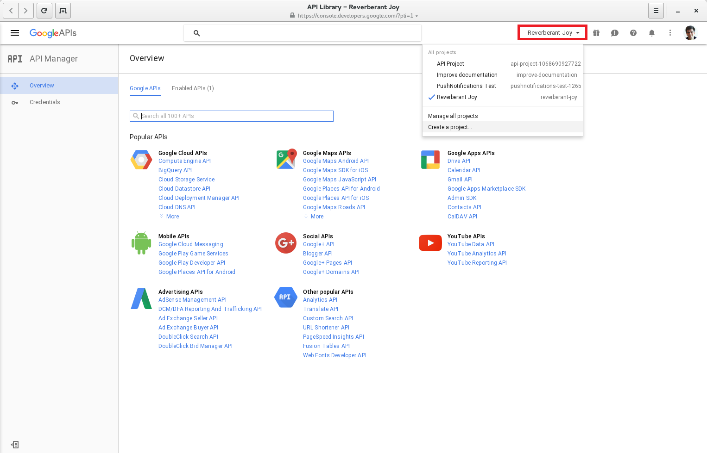
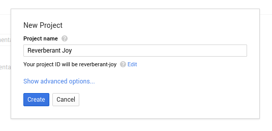
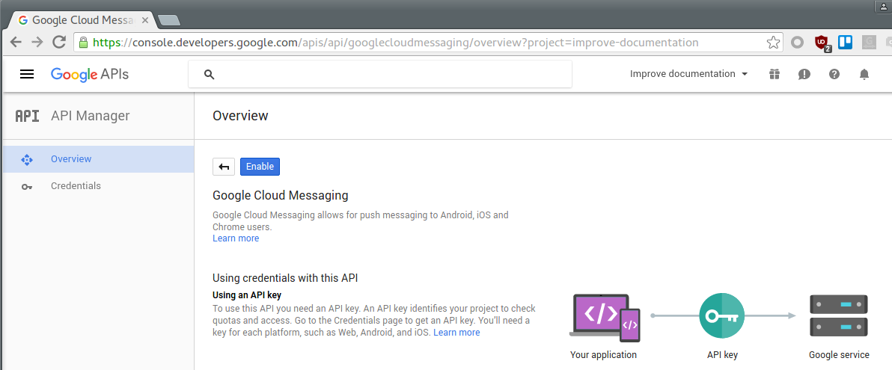
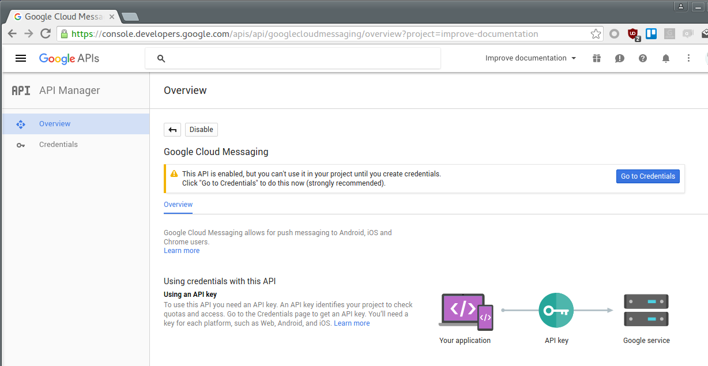
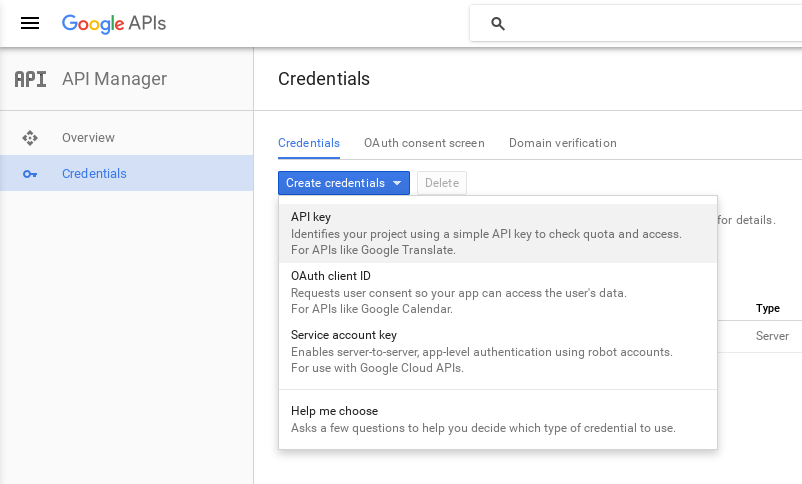

In order to send Google push notifications from this module you need to have set up a Google account with Google Cloud Messaging enabled. To register for Google Cloud Messaging and configure the service in the app, you will need to perform the following steps.

### Step 1 - Log in to developers console

Open up the Google [developers console](https://console.developers.google.com) and log in with your Google id.

### Step 2 - Create project

From the dropdown box in the upper-right corner of the page (see screenshot below), click `Create a project` and fill in the project name for your application. Optionally, customize the project ID that was generated. Then click `Create`.

### Step 3 - Enable Google Cloud Messaging

Once created, click the link to the Google Cloud Messaging API (section `Mobile APIs`) and click the `Enable` button.

### Step 4 - Adding credentials

Click on the menu option `Credentials`, located on the left hand side under the `API Manager` section.

Depending on if you are a new or existing user, you may get a different credential setting page.

If your page looks like the screenshot above, follow the steps in [section 4a](#step-4a---adding-credentials-as-a-new-user). If instead your page looks like the screenshot below, follow the steps in [section 4b](#step-4b---adding-credentials-as-an-existing-user).

### Step 4a - Adding credentials as a new user

*   For the question **Which API are you using?**, select "Google Cloud Messaging".
*   The next question, **Where will you be calling the API from?**, answer "Web server".

### Step 4b - Adding credentials as an existing user

Click on the `Create credentials` button. You would want to choose an API key of type `Server`.

### Step 5 - Create API key

Choose a name for your key and, optionally, restrict the IP addresses that can connect to the API.

Then, press the `Create API key` button. Remember to copy your created key for step 6.

For the next step, you'll need to look up the **project number**. You can find it in your Google project's `Project Information` pane ( ⁝ utilities menu on the top right).

### Step 6 - Configure GCM in your application

Open your Mendix application, log in as an Admin, and open the `PushNotifications_Administration` page. In this page, navigate to `Configurations` tab. Select the configuration object and click on the `Edit` button if it already exists, or on the `New` button if it does not. For the `DTAP mode` field, choose the option which corresponds to your environment. The `XMPP server` field should have the value `gcm.googleapis.com` whereas the `XMPP Port` field should be `5235`. Enter the **project number** into the `Sender id` field and the API key into the `API Key` field.

Note that at this moment, multiple configuration objects are not supported; having more than one of these objects will lead to unpredictable behavior. This will be fixed in the near future.

Once the information has been entered, tick the `Enabled` checkbox and press the `Save and Restart` button. From now on your application will always connect to the GCM service on startup.

For more information on setting up your Google API please refer to this article: [Google Cloud Messaging](https://developers.google.com/cloud-messaging/).
