## 1 Introduction

This how-to explains how to consume a (third-party) web service with which you can integrate your Mendix application and reuse functionality and data from other applications. Web services are the preferred way of integrating a Mendix application with external systems. They can be used to retrieve data, send updates, and perform operations. In Mendix, calling a web service is something you do in a microflow using the Call Web Service action.

**After using this how-to, you will know how to do the following:**  

* Import a web service using the wizard and directly
* Configure a web service call

## 2 Importing a Web Service Using the Wizard

This section will describe the powerful wizard that enables integrating – in just a few clicks – the creation of an imported web service, the related data entities, the XML-mapping, and a microflow to trigger the web service.

### 2.1 The Configuration

To import a web service using the wizard, follow these steps:

1. Open your domain model and click **Import web service/XML file** in the toolbar.
    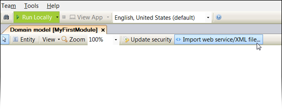
    This will open a straightforward wizard dialog that guides you through importing the result of a web service (or an XML file). As a result, it will generate the following items:
    * Domain model entities to store the results
    * An XML-to-domain mapping that maps the incoming XML to Mendix objects
    * An imported web service (or XML schema) document
    * A microflow that calls the web service (or imports an XML file) (optional)
2. On the **Import Web Service or XML Scheme** dialog box, select **Web service operation** and click **Next**:
    
3. On the **Import Web Service** dialog box, select **Create new imported web service** and click **Next**:
    
4. For **WSDL source** in the **Web service Description** section of the **New Web Service Operation** dialog box, select the WSDL to be used for this imported web service. You can either use a **URL** or load a **File** from your computer.
    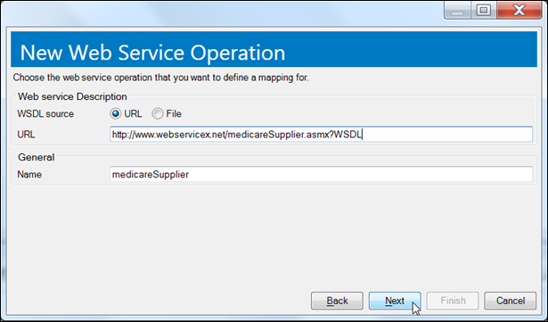
5. Click **Next** to fetch the services and operations in the WSDL.
6. On the **New Web Service Operation** dialog box, you can now review the services and operations available to the imported web service. Select a web service operation and click **Next**.
    
7. On the **Select Elements** dialog box, you can optionally select the elements to map as return values of the web service, and then click **Next**.
    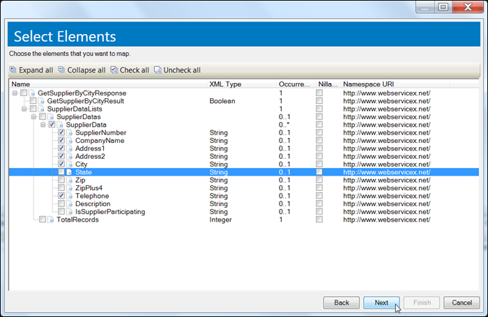
8. The final step in this wizard provides you with the option to create a microflow in which the imported web service is called and the option to add icons to the generated entities: 
    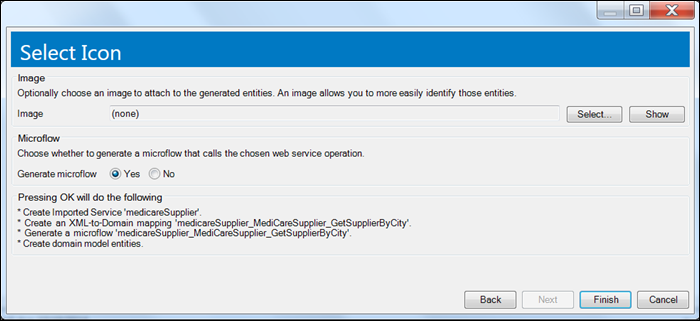
    Click **Finish** to create the web service.

### 2.1 The Outcome

When finished the wizard will add to your model based on the options selected:

* The imported service
* An XML to domain mapping
* A microflow in which the web service operation is called
* Domain model entities (by default, the Modeler creates non-persistent entities)

## 3 Importing a Web Service Directly

An alternative to using the wizard described above is to import a web service document directly into your project. For more information, see the [Consumed Web Services section of the Mendix Reference Guide](/refguide6/consumed-web-services).

To import a web service directly, follow these steps:

1. Add an imported web service to your project.
2. Double-click the imported web service in the **Project Explorer** to start configuring it.
3. In the **Imported Web Service** dialog box, you can change the name of the published web service in the **Name** field, and you can describe the design purpose of the web service in the **Documentation** field:
    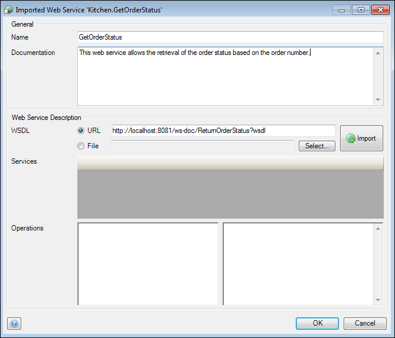
4. In the **Web Service Description** section, enter the WSDL to be used for this imported web service. You can use a **URL** or load a **File** from your computer. 
5. Click **Import** to fetch the services and operations in the WSDL.
6. Review the **Services** and **Operations** available to the imported web service:
    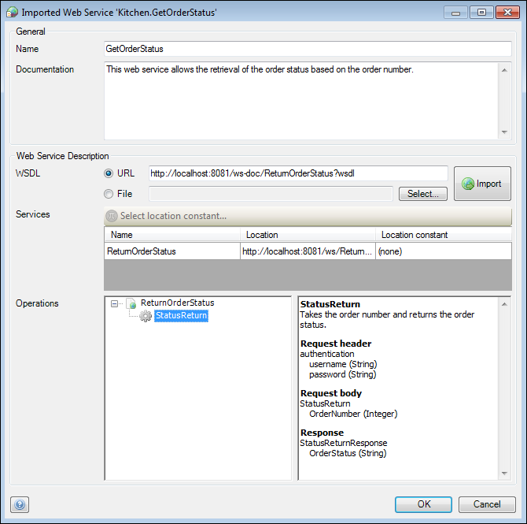

## 4 Configuring the Web Service Call

To configure the web service call, follow these steps:

1. If you have not used the web service wizard or have not used the option within this wizard to automatically create a microflow, you have to create a microflow that will call the imported web service:
    

    

    Make sure the microflow either creates the variables required as arguments for the web service call or has those passed to it.

    

2. If you are creating your own microflow, add the Call Web Service activity to the microflow. For details on how to add activities to microflows, see [Activities](/refguide6/activities) in the Mendix Reference Guide.
3. Click **Select...** in the **Web service operation** section of the **Call Web Service** dialog box:
    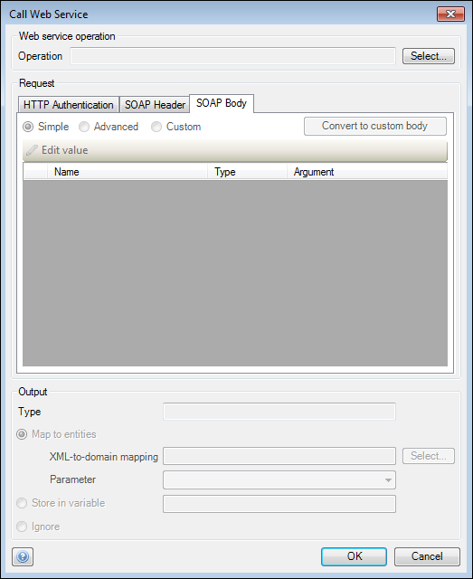
    This will bring up the **Select Web Service Operation** pop-up window, where you can choose the operation for this web service call:
    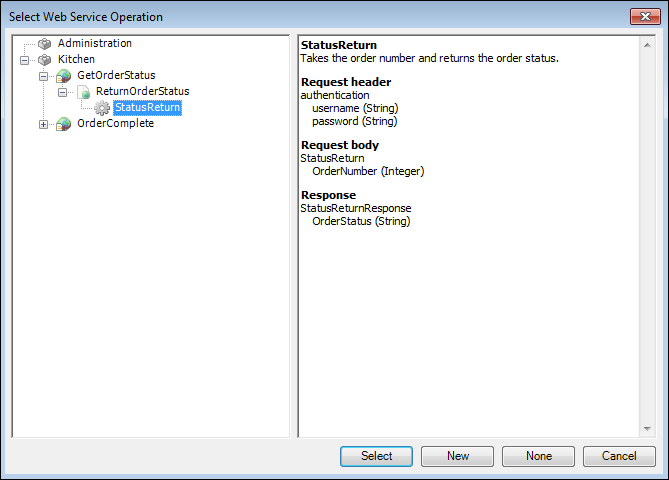
4. On the **SOAP Body** tab in the **Request** section of the **Call Web Service** dialog box (see above) you can configure the SOAP body, which contains the parameters needed to execute the web service request. The **Simple**, **Advanced**, and **Custom** option buttons enable choosing the type of SOAP body to use. Click **Edit value** to change the domain-to-XML mapping or the variables from the microflow used as input arguments.
    * Use the **Simple** option if the imported web service requires only primitive arguments:
    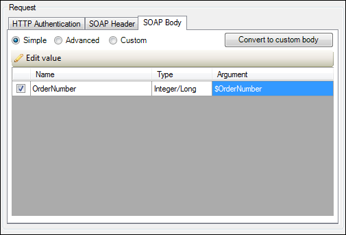

    * Use the **Advanced** option if the web service call needs a list of objects or if the domain model entities need to be mapped to XML elements: 
    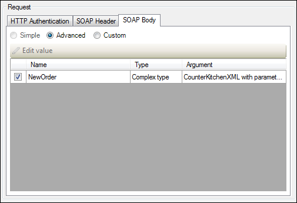

    * Use the **Custom** option for the definition of a custom XML body with parameters:
    
5. On the **SOAP Header** tab in the **Request** section of the **Call Web Service** dialog box, you can enter authentication information using the **Edit value** button if the imported web service requires authentication:
    
    There are three input options:
    * Use the **Simple** option if only static values or variables from the microflow need to be passed to the imported web service
    * Use the **Advanced** option if domain-to-XML mapping is needed for authentication
    * Use the **Custom** option to define a custom XML header and to specify parameters
6. On the **HTTP Authentication** tab in the **Request** section of the **Call Web Service** dialog box, enter the HTTP authentication information if the Mendix Runtime should use this before calling the web service:
    
7. In the **Output** section of the **Call Web Service** dialog box, you can configure the handling of the return from the web service call:
    * If the return is a complex XML structure, you can select the **Map to entities** option and use an XML-to-domain mapping to map the XML elements to the domain model entities:
    
    * If the return is a primitive, you can store it in a variable that you can name in the **Store in variable** field:
    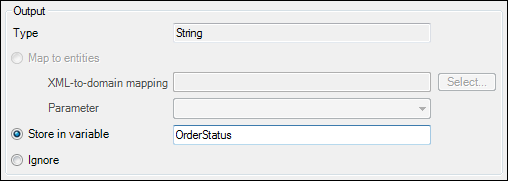
    * If you want to ignore the return, select the **Ignore** option
8.  Your imported web service is now ready to be used in your application.

## 5 Related Content

* [Consuming a Simple Web Service](consume-a-simple-web-service)
* [Exporting XML Documents](export-xml-documents)
* [Importing Excel Documents](importing-excel-documents)
* [Exposing a Web Service](expose-a-web-service)
* [Selenium Support](selenium-support)
* [Synchronizing User Accounts Using the LDAP Mmodule](synchronizing-user-accounts-using-the-ldap-module)
* [Importing XML Documents](importing-xml-documents)
* [Consuming a REST Service](consume-a-rest-service)
* [Exposing Data to BI tools Using OData](exposing-data-to-bi-tools-using-odata)