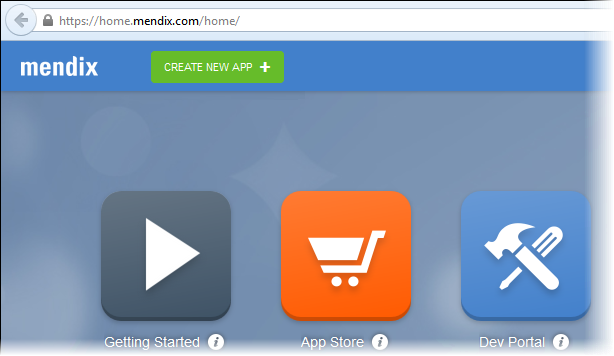
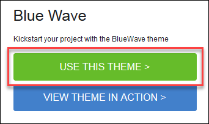
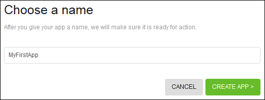
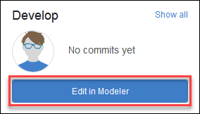
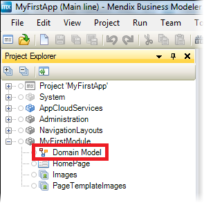
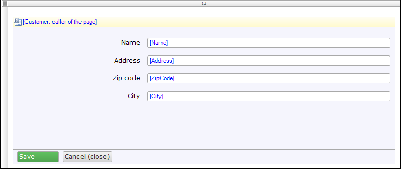
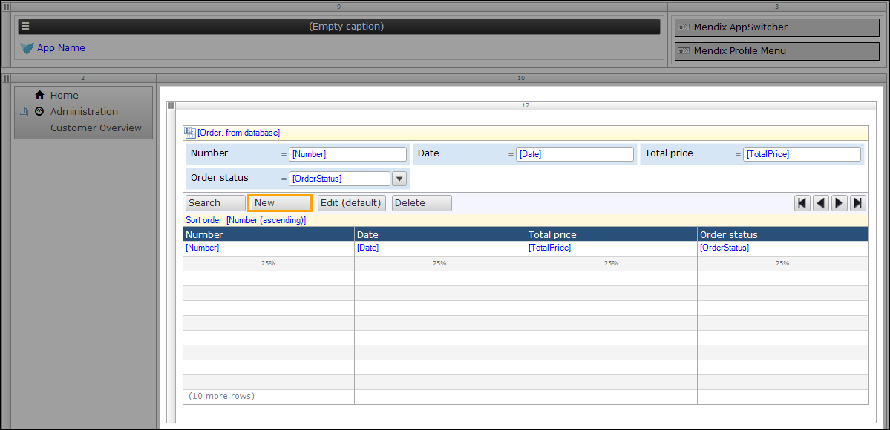
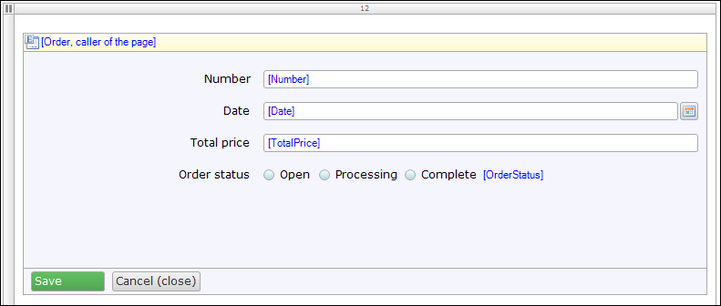

## 1 Introduction

In this how-to, you will build your first application and deploy it to the cloud.

**This how-to will teach you how to do the following:**

* Create an app in Mendix
* Deploy an app with Mendix
* Create overview and detail pages

## 2 Prerequisites

Before starting with this how-to, make sure you have completed the following prerequisites:

* Create a [Mendix account](http://www.mendix.com/try-now/?utm_source=documentation&utm_medium=community&utm_campaign=signup) and [log in](http://www.mendix.com/)
* Download and install the [Mendix Modeler](https://appstore.home.mendix.com/link/modelers)

## 3 Creating a Collaboration Project

With Mendix, you can manage requirements, build apps with version control, and deploy the apps into the cloud. Normally you would use multiple different environments for this, but Mendix is truly your one-stop-shop for enterprise application development. 

To manage your applications from idea to deployment, we use projects. To create a collaboration project, follow these steps:

1. Go to [http://home.mendix.com/](http://home.mendix.com/).
2. Click **CREATE NEW APP**.
     
3. You should now choose your starting point, so select **Blue Wave** as a theme: 
    
4. Click **USE THIS THEME**:
     
5. Enter a name for your new app, then click **CREATE APP**:
    
    
You've created your first project! You can now invite co-workers, share ideas, manage requirements, and deploy and monitor your app. Version control is still empty, but we'll fix that in a later section. 

## 4 Creating a Basic Data Layer

To create a basic data layer, follow these steps:

1. Click **Edit in Modeler** to open your project in the Modeler:
    
2. Expand the **MyFirstModule** module in the **Project Explorer** on the left side of the Modeler, and then double-click **Domain Model**, which will open the domain model document on the right side:
     
3. Create this domain model:
    
    For more information on creating an entity, see [How to Create a Basic Data Layer](create-a-basic-data-layer).

## 5 Creating Overview and Detail Pages

To create overview and detail pages, follow these steps:

1. Create an overview and detail page to manage the objects of the **Customer** entity. Your overview page should look like this:
     
    Your detail page should look like this:
    
    For more information on creating a page, see [How to Create Your Overviw and Detail Pages](create-your-first-two-overview-and-detail-pages).
2. Create an overview and detail page to manage objects of the **Order** entity. Your overview page should look like this:
     
    Your detail page should look like this:
    

## 6 Creating Menu Items

To create menu items, follow these steps:

1. Create a menu item to access the customer overview page. For more information on creating menu items, see [How to Set Up the Navigation Structure](setting-up-the-navigation-structure).
2. Create a menu item to access the order overview page.

## 7 Deploying an App to the Cloud

To deploy an app to the cloud, follow these steps:

1. Click the save all icon (or press Ctrl+Shift+S) to save all files:
    
2. Click **Run in Sandbox** to deploy the app to the cloud. The Modeler automatically commits the changes to the Team Server (for version control):
    
3. When the deployment process is complete, click **View App** to open the app in your browser:
    

## 8 Related Content

* [Build a Simple HRM App 1: Create, Manage, and Deploy the App](build-a-simple-hrm-app-1-create-manage-and-deploy-the-app)
* [Build a Simple HRM App 2: Perform the First Steps to Build a Rich GUI](build-a-simple-hrm-app-2-first-steps-in-building-a-rich-gui)
* [Build a Simple HRM App 3: Show Related Data in the GUI](build-a-simple-hrm-app-3-show-related-data-in-the-gui)
* [Build a Simple HRM App 4: Enrich the GUI with Filter Options](build-a-simple-hrm-app-4-enrich-the-gui-with-filter-options)
* [Build a Simple HRM App 5: Smarten Up Your App with Business Logic](build-a-simple-hrm-app-5-smarten-up-your-app-with-business-logic)
* [Test Microflows Using the UnitTesting Module](testing-microflows-using-the-unittesting-module)