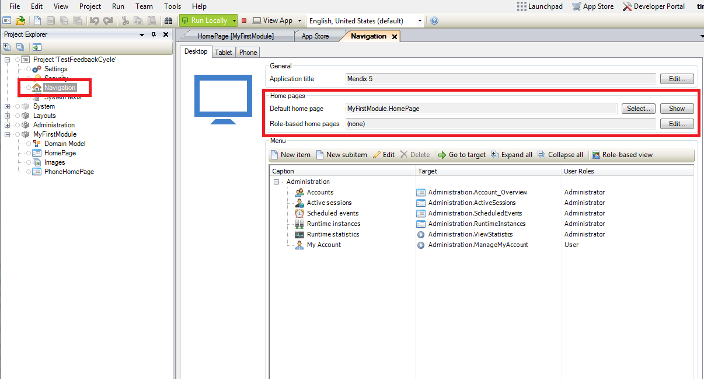
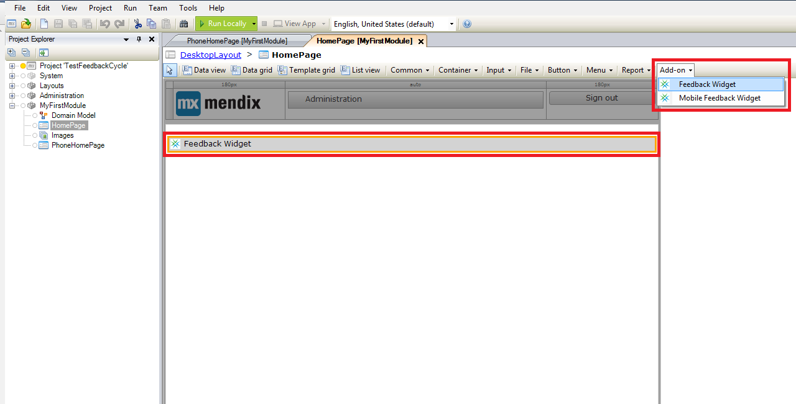
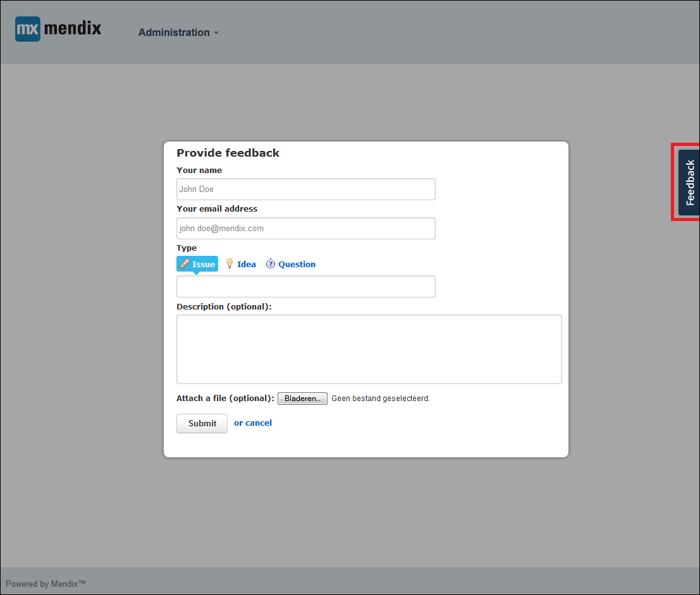
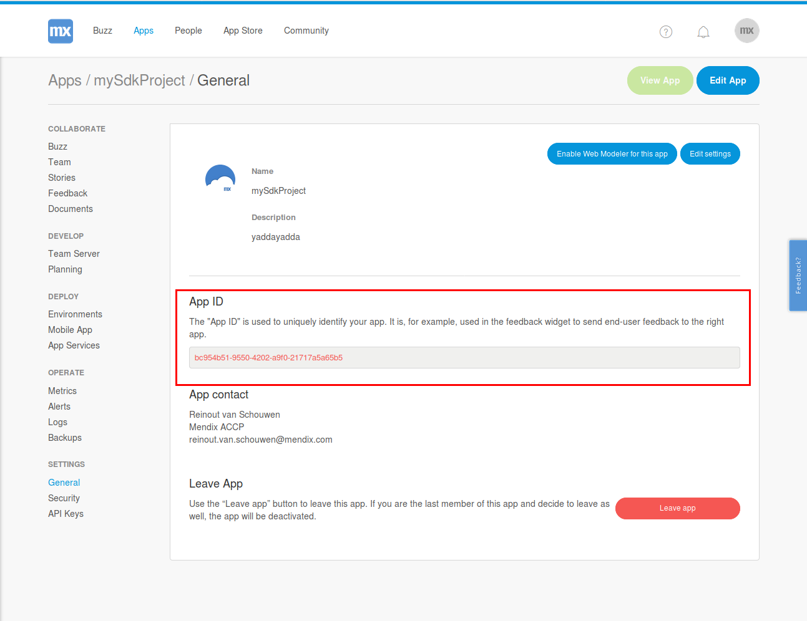
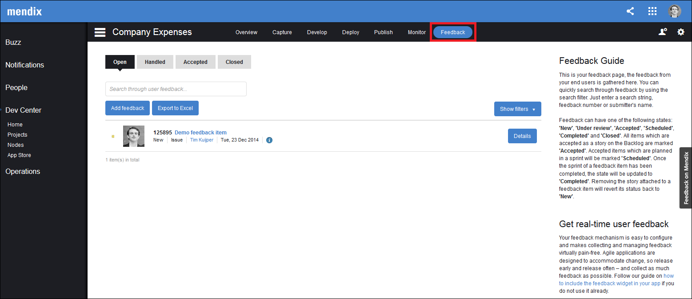
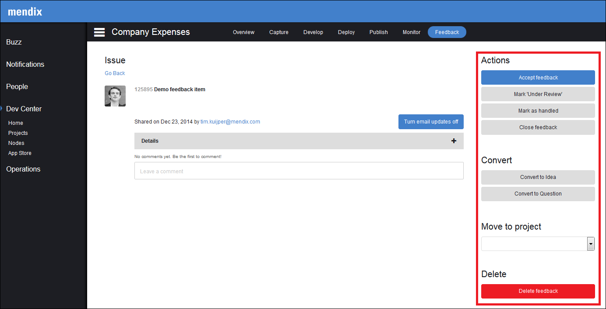
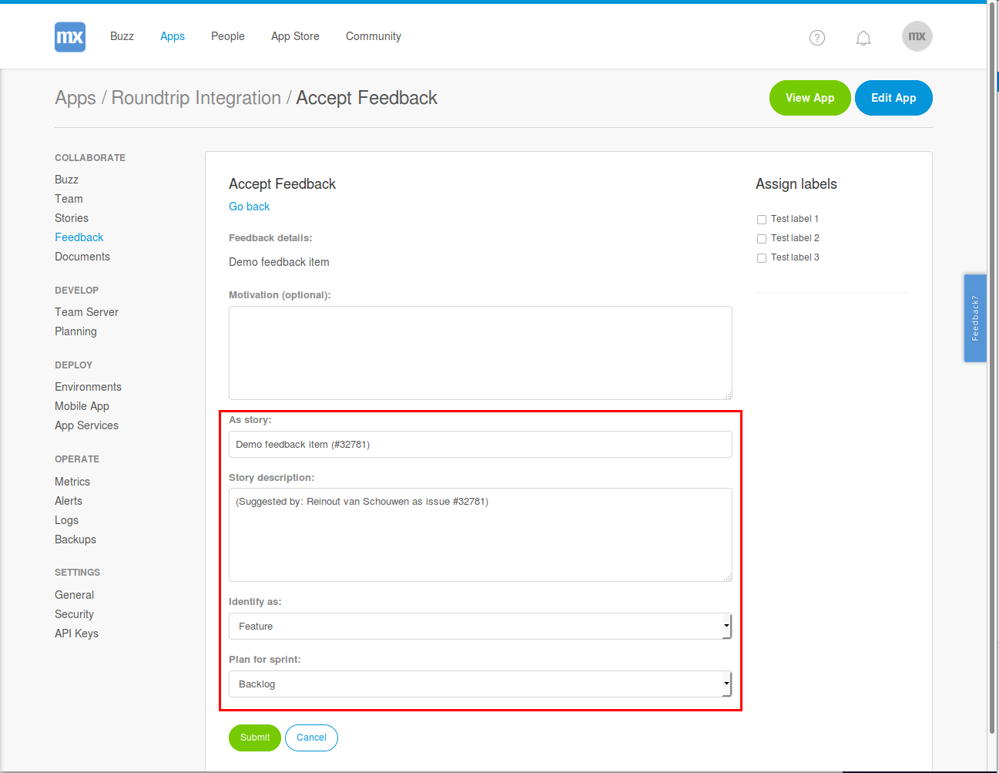

## Introduction

With Mendix, you can make use of the fully integrated feedback cycle functionality. Gathering feedback, evaluating the feedback, and converting valid feedback into actionable user stories is supported by Mendix out of the box. This how-to explains the entire process in detail and aims to enable developers to capture and process valuable user feedback.

**This how-to will teach you how to do the following:**

* Configure the widget
* Gather, receive, and process feedback
* Add a feedback story to the app backlog

## Prerequisites

Before starting this how-to, make sure you have completed the following prerequisite:

* Create an app containing a working application model

## Ensuring the Mendix Feedback Widget Is Included in Your App

The feedback widget is automatically included in any new app that you create. If you are working in an older Mendix app, the first step is to ensure you have the latest version of the Mendix Feedback Widget included in your app. To do that, follow these steps:

1. Download the latest version of the [Mendix Feedback Widget](https://appstore.home.mendix.com/link/app/199/Mendix/Mendix-Feedback-Widget) from the Mendix App Store.
2. When the latest Mendix Feedback Widget is included in your app, we need to ensure that the widget is added to the homepage of your application. Open the homepage from your app navigation:

    

3. If the Feedback Widget has not been added to the page, add the widget to the page or layout by selecting the Feedback Widget under **Add-on** and dropping the widget into any position in the document:

    

## Configure the Widget

To configure the widget, follow these steps:

1. Open the widget preferences by double-clicking the widget placed on the page. 
2. Select the **User** entity that is used in your application to store the name and email address of the user. Note that this object must be a specialization of the User entity within the System module (for example, Account in the Administration module).

    

3. Select the user name attribute that stores the name of the user and the email address attribute. This will be used to automatically fill the name and the email address of the user that is logged in when submitting feedback within the application.

    

4. Decide whether you want to allow users to add a file to the feedback item and whether you want to allow the inclusion of a screenshot of the page. 
5. Open the **Configuration** tab of the feedback widget preferences.
6. Ensure that the feedback server is set to `https://sprintr.home.mendix.com/`.
7. Ensure that the app identifier is filled in correctly. This is automatically done for the widget included in the default homepage of your application. If necessary, you can find the identifier of your app by clicking the Settings &gt; General link in the lower left corner of your app sidebar within the Mendix Developer Portal.

    

8. If you have configured multiple home pages for different user roles, you need to add the Mendix Feedback Widget to each home page for the user role from which you want to gather feedback. This can easily be done by copying the configured widget to the other relevant layouts and/or pages.

## Gathering Feedback

When a version of the application is deployed that contains a Mendix Feedback Widget configured and added to all home pages, you can start gathering feedback. 

## Receiving Feedback

When a user is logged into the application, the feedback button will appear on the right side of the screen.

Clicking the feedback button will open the **Provide feedback** dialog box that allows the user to enter feedback:

## Processing Feedback

Once you have received feedback, you and your team can process the feedback within the Mendix Developer Portal.

To process the feedback, follow these steps:

1. Open the app in the Mendix Developer Portal.
2. Open the **Feedback** page:

    

3. Click the title of the feedback item to open the details of that item.
4. Process the item by commenting on it (for example, ask for clarification) or by choosing one of the actions displayed in the menu bar on the right:

    

    These are the response and commenting action options:

    Action | Description
    | --- | --- |
    **Accept feedback** | Means this feedback is valid and that you wnat to add a story to your backlog on the basis of this item.
    **Mark as 'Under review'** | Notifies the user who submitted the feedback and your team that the item is under review.
    **Mark as 'Handled'** | Changes the status of the item from open to handled so that the item will not pollute your open items list.
    **Close feedback** | Closes the feedback (for example, when the item is already solved, a duplicate has already been accepted, etc.).
    **Convert to Idea** | Changes the feedback type to an idea.
    **Convert to Question** | Changes the feedback type to a question.
    **Move to app** | Moves the item to another app that you have access to.
    **Delete feedback** | Deletes the feedback.

## Adding a Feedback Story to Your Backlog

After clicking **Accept feedback**, you can create a story on the basis of the feedback item and add it to your backlog. To do that, follow these steps:

1. Fill in a logical name for the user story and a description.
2. Decide whether the feedback item should be classified as a bug or a feature.
3. Select the sprint/backlog to which you want to add the story.
4. Select any label that you want to add to the story.

    

## Providing Feedback to the User

Once a feedback item is connected to a user story, Mendix will automatically update the person who submitted the story on the progress made on that story:

* Adding a story with feedback attached from your backlog to a sprint will result in a message that the item has been planned
* Completing a sprint that contains a story with feedback attached will result in a message that the item has been completed

## Feedback Widget in Mobile Apps

To be able to load the Feedback Widget in your hybrid app, you will need to add the `mendix.com` domain to your whitelisted domains. See [Customizing PhoneGap Build Packages](/refguide6/customizing-phonegap-build-packages) for details.

## Conclusion

In a few simple steps, Mendix enables you to start collecting feedback from your users. Once feedback has been collected, it can easily be processed and transformed into actionable items for your backlog. To complete the cycle, the users will be updated automatically on the progress made in processing the feedback items.

## Related Content

* [How to Manage Your Application Requirements with Mendix](managing-your-application-requirements-with-mendix)
* [How to Contribute to a GitHub Repository](contribute-to-a-github-repository)
* [How to Start Your Own Repository](starting-your-own-repository)
* [How to Use Team Server and Version Control](using-team-server-version-control)
* [How to Share the Development Database](sharing-the-development-database)
