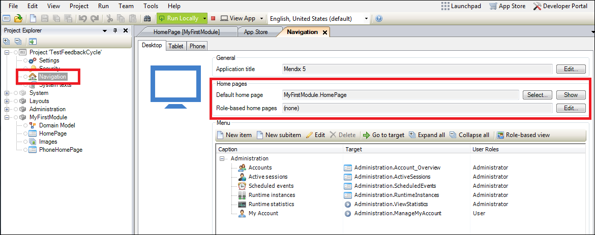
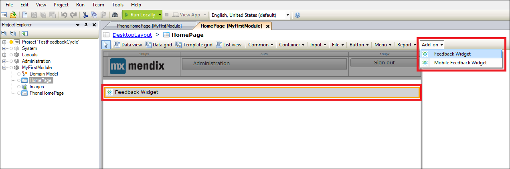
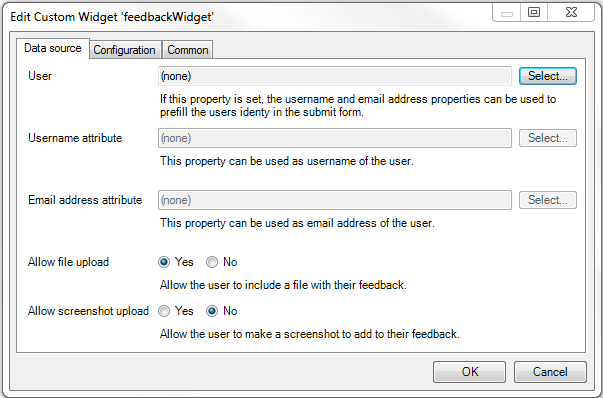
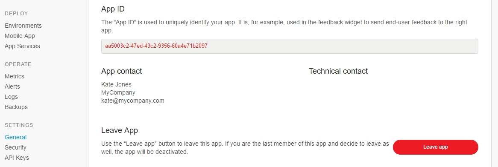
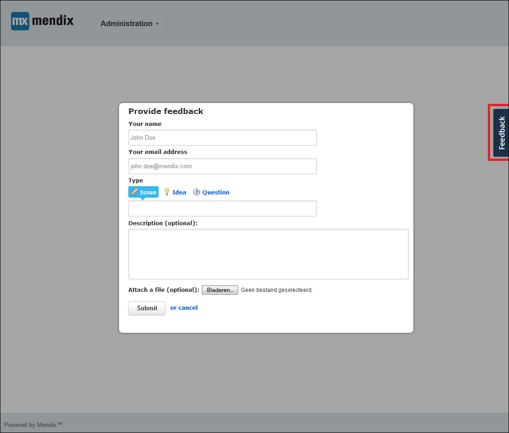
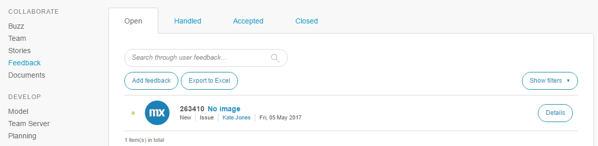
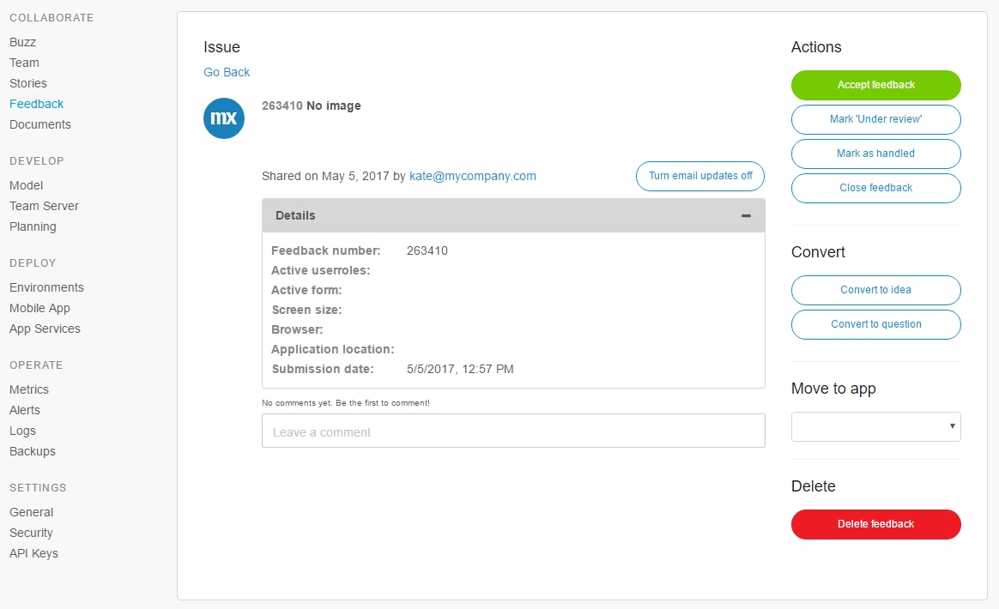
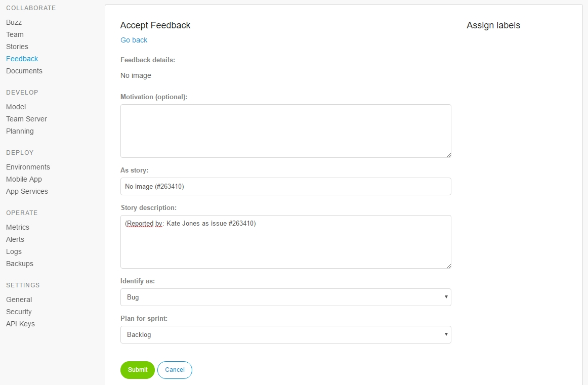
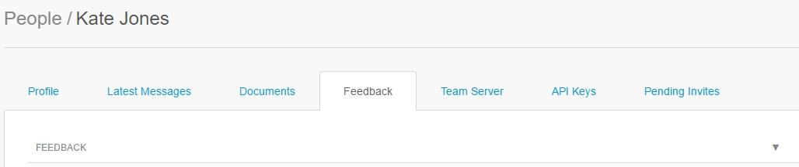

## 1 Introduction

With Mendix, you can make use of the fully integrated feedback cycle functionality. Gathering feedback, evaluating the feedback, and converting valid feedback into actionable user stories is supported by Mendix out of the box. This how-to explains the entire process in detail and aims to enable developers to capture and process valuable user feedback.

**This how-to will teach you how to do the following:**

* Configure the widget
* Gather, receive, and process feedback
* Add a feedback story to the App backlog
* View a list of your own provided feedback

## 2 Prerequisites

Before starting this how-to, make sure you have completed the following prerequisite:

* Create an App containing a working application model

## 3 Ensuring the Mendix Feedback Widget Is Included in Your App

The Feedback Widget is automatically included in any new App that you create. 
To ensure you have the lastest version of the Feedback Widget included in your App, follow these steps:

1. Download the latest version of the [Mendix Feedback Widget](https://appstore.home.mendix.com/link/app/199/Mendix/Mendix-Feedback-Widget) from the Mendix App Store.
2. When the latest Mendix Feedback Widget is included in your App, you need to ensure that the widget is added to the homepage of your application. Open the homepage from your App navigation:

    

3. If the Feedback Widget has not been added to the page, add the widget to the page or layout by selecting the Feedback Widget under **Add-on** and dropping the widget into any position in the document:

    

## 4 Configuring the Widget

To configure the widget, follow these steps:

1. Open the **Properties** of the widget by double-clicking the widget placed on the page. 
2. Select the **User** entity that is used in your application to store the name and email address of the user. 



Note that this object must be a specialization of the User entitiy within the System module (for example, Account in the Administration module).



3. Select the **Username attribute** that stores the name of the user and the email address attribute. This will be used to automatically fill the name and the email address of the user that is logged in when submitting feedback within the application.
4. Decide whether you want to **allow users to upload a file** to the feedback item and whether you want to **allow to include a screenshot** of the page. 

5. Open the **Configuration** tab of the Feedback Widget properties.
6. Ensure that the **feedback server** is set to `https://sprintr.home.mendix.com/`.
7. Ensure that the **project identifier** is filled in correctly. The project identifier is your **App ID** and is automatically filled in for the Feedback Widget. 



If necessary, you can find the identifier (App ID) of your App in the [Developer Portal](http://home.mendix.com). Go to the **Developer Portal**, open your App and click **General** under the **Settings** category.



8. If you have configured multiple home pages for different user roles, you need to add the Mendix Feedback Widget to each home page for the user role from which you want to gather feedback. This can easily be done by copying the configured widget to the other relevant layouts and/or pages.

## 5 Gathering and receiving Feedback

When a version of the application is deployed that contains a Mendix Feedback Widget configured and added to all home pages, you can start gathering feedback. 

When a user is logged into the application, the feedback button will appear on the right side of the screen.

Clicking the feedback button will open the **Provide feedback** dialog box that allows the user to enter feedback:

## 6 Processing Feedback in the Developer Portal

Once you have received feedback, you and your team can process the feedback within the [Developer Portal](http://home.mendix.com).

To process the feedback, follow these steps:

1. Open the App in the [Developer Portal](http://home.mendix.com).
2. Click **Feedback** under the **Collaborate** category:

    

3. Click **Details** of the feedback item to open the details of that item.
4. Process the item by commenting on it (for example, ask for clarification) or by choosing one of the actions displayed in the menu bar on the right:

    

    These are the response and commenting action options:

    Action | Description
    | --- | --- |
    **Accept feedback** | Means this feedback is valid and that you wnat to add a story to your backlog on the basis of this item.
    **Mark as 'Under review'** | Notifies the user who submitted the feedback and your team that the item is under review.
    **Mark as 'Handled'** | Changes the status of the item from open to handled so that the item will not pollute your open items list.
    **Close feedback** | Closes the feedback (for example, when the item is already solved, a duplicate has already been accepted, etc.).
    **Convert to Idea** | Changes the feedback type to an idea.
    **Convert to Question** | Changes the feedback type to a question.
    **Move to project** | Moves the item to another project that you have access to.
    **Delete feedback** | Deletes the feedback.

### 6.1 Adding a Feedback Story to Your Backlog

After clicking **Accept feedback**, you can create a story on the basis of the feedback item and add it to your backlog. To do that, follow these stepsL

1. Fill in a logical name for the user story and a description.
2. Decide whether the feedback item should be classified as a bug or a feature.
3. Select the sprint/backlog to which you want to add the story.
4. Select any label that you want to add to the story (if you have any labels).

    

## 7 Providing Feedback to the User

Once a feedback item is connected to a user story, Mendix will automatically update the person who submitted the story on the progress made on that story:

* Adding a story with feedback attached from your backlog to a sprint will result in a message that the item has been planned
* Completing a sprint that contains a story with feedback attached will result in a message that the item has been completed

## 8 View the List of Your Own Feedback items

After you have provided feedback yourself, you can view the feedback item in the feedback list in your profile settings. To find the list of the provided feedback items, follow these steps:

1. In the [Developer Portal](http://home.mendix.com) click on your profile in the right top corner.
2. Click **Show Profile**
3. Open the **Feedback** tab

    

## 9 Related Content

* [How to Manage Your Application Requirements with Mendix](managing-your-application-requirements-with-mendix)
* [How to Contribute to a GitHub Repository](contribute-to-a-github-repository)
* [How to Start Your Own Repository](starting-your-own-repository)
* [How to Use Team Server and Version Control](using-team-server-_-version-control)
* [How to Share the Development Database](sharing-the-development-database)
