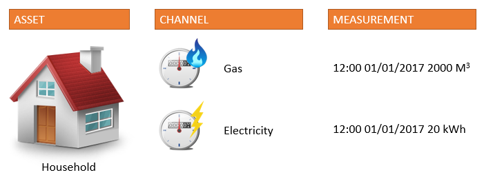

## 1 Introduction

This how-to is focussed on implementing and understanding the TimeSeries Connector and the TimeSeries Analytics platform.

**This how-to will teach you how to do the following:**

* Sign up for the TimeSeries Connector
* Configure the necessary settings
* Implement the actions

## 2 Prerequisites

Before starting this how-to, make sure you have completed the following prerequisites:

* Download and install Mendix Modeler 6.6 or higher
* Add CommunityCommons to your project

## 3 Sign Up for the TimeSeries Connector

Follow these steps to get access to the TimeSeries connector and receive an API key:

1. Sign up for the connector by going to [our Connector website](http://connector.timeseries.nl/ "Click here to go to the TimeSeries website") and register for free. You will receive your API key in an email after registering.

  

  It can take up to a few hours to generate the key and send it to you. Use this key to activate and access your TimeSeries Analytics instance.
  

2. After you receive the key, import the TimeSerices Connector module from the [Mendix App Store](https://appstore.home.mendix.com/link/app/31951/TimeSeries/TimeSeries-Connector "Click here for awesomeness") into your project.

## 4 Configure the Module Settings

After importing the module there are a couple of settings you need to configure. Some of these settings are already preconfigured.

### 4.1 Set the Constants
There are three constants that you can configure. Follow these steps to configure them:

1. Expand your project and go to **App Store modules > TimeSeriesConnector > Settings**.
2. Open the TimeSeriesAccessKey constant.
3. Paste your TimeSeries API key in the **Default value** field and click **OK**.

  

  
  There are two more constants that don't need to be configured unless otherwise instructed.
  
  * Dateformat: Is by default set to yyyy-MM-dd'T'HH:mm:ss.SSSZ and should remain like that
  * TimeSeriesBasePath: Is by default set to https://timeseries-connector.timeseries.nl:16000/ and should remain like that unless communicated otherwise

    

### 4.2 Available Enumerations
These are the available enumarations in the TimeSeriesConnector module:

* Enum_AggregationInterval: INTERVAL or REGISTER. These are the supported interval types for aggregation calls.
* Enum_AggregationPeriod: Hourly, daily, weekly, monthly or yearly. These are the supported periods in ISO format.
* Enum_MeasurementType: INTERVAL, REGISTER or EVENT. These are the supported measurement types. Note: measurements of type EVENT can not be aggregated.
* Enum_SearchType: Purely for UI. These are used to determine which search to perform.

## 5 Implementation Example

We'll explain the analytics platform using the concept of a house. In this scenario the house is an asset, of which you can have multiple. This house will use gas and electricity, which we call channels. Each channel can hold values over time; electricity usage is measured and saved every X seconds, minutes, hours, etc.. These measurements can later be used for analysis.

### 5.1 Create an Asset
You start the implemntation by creating an asset. Follow these steps to create an asset:

1. Make sure to provide an **Asset name**, otherwise the connector will return an error. You are free to chose the name.

<iframe width='100%' height='491px' frameborder='0' src='https://modelshare.mendix.com/models/12613211-22be-4c65-aac9-bb7d821ed99e/timeseries-connector-create-asset?embed=true'></iframe>

This action will return an **Asset ID**, which you can store in your database for access.

### 5.2 Create a Channel
Next, you create a channel. This channel should belong to an asset, so you start there:

1. Make sure your channel belongs to an asset, so provide the **Asset ID**.
2. Provide a **Channel key**. 
3. Provide a **Measurement interval**. 

You are free to chose the channel key name and the measurement interval. This interval is stored and can be used for analysis.

<iframe width='100%' height='491px' frameborder='0' src='https://modelshare.mendix.com/models/d0dc163e-9741-4efc-986e-00bcbbf86ce7/timeseries-connector-create-channel?embed=true'></iframe>

This action will return a boolean, specifying if the action was successful.

### 5.3 Store Measurement(s)
Now that you have created an asset with a channel, it's possible to start storing measurements. Follow these steps to store your measurements:

1. Make sure your measurement belongs to a channel (and thus, an asset).
2. Provide the **Date and time** of the measurement.
3. Provide the **Measurement type**.
4. Provide the **Value**.

  


  The **Date and time** needs to be formatted in UTC to the following format:  yyyy-MM-dd'T'HH:mm:ss.SSSZ, the **Measurement type** can be INTERVAL, REGISTER or EVENT and the **Value** is a decimal.

  

<iframe width='100%' height='491px' frameborder='0' src='https://modelshare.mendix.com/models/ab003bd9-159a-4b76-8fbe-42512951c28b/timeseries-connector-store-measurement?embed=true'></iframe>

This action will return a boolean, which is not used. 

### 5.4 Aggregate Your Data
Once your channel has sufficient data, the TimeSeries Connector will really start to shine. Instead of having enormous amounts of data in your database which takes a long time to aggregate for reporting, you can now simply ask the TimeSeries platform for an aggregation of your data. Follow these steps to set up your data aggregation:

1. Provide an empty **Type parameter** used to populate the results.
2. Provide the **Asset ID** and **Channel key** to aggregate in.
3. Provide a **Start date** and **End date** in epoch time.
4. Provide an *Aggregation period** such as hourly or daily in the correct ISO format.
5. Provide the **Timezone** in which the results will be aggregated.
6. Provide the **Measurement type** in which the measurements have been stored.

Make sure that the search result **Type parameter** has all the necessary attributes. An example entity:

Now you can create your logic.

<iframe width='100%' height='491px' frameborder='0' src='https://modelshare.mendix.com/models/9d9055e4-4301-4ee4-8ef9-fdcbcd05079e/timeseries-connector-get-aggregations?embed=true'></iframe>

This action will return a list of your type parameter. In this list you will find an aggregation of the channel data by the aggregation period specified. For example: From March 1st up to March 10th, you will receive a list of your total electricity usage per day. This means your list will hold 10 objects. 

## 6 Final Remarks

This how-to provides an example on how to implement a basic subset of the available actions. Over time, more actions will be released.

If you have any questions, please contact Paul Ketelaars at <paul.ketelaars@timeseries.nl> or Willem van Zantvoort at <willem.van.zantvoort@timeseries.nl>. 
