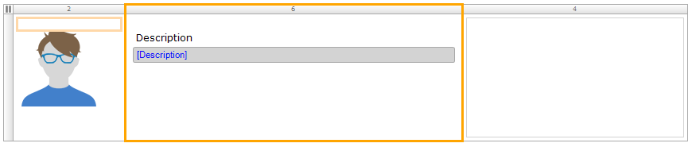

### Step 4 - Adding Another Data Dimension to the App

Now that data is received we can implement functionality to act on any outliers in the data. In this section, you are going to create alerts when thresholds for different measurements are met. 

#### Step 4.1 - Adding Cargo Type Pages

Not every cargo type should have the same threshold. Before you start working on the alert implementation, you are going to introduce a cargo type and register its thresholds for different measurements (for example, temperature and light). For an example scenario here, if a ship is transporting perishable goods, you will want to see an alert for any extreme activity with the indicators. 

To add the cargo type pages, follow these steps:

1. Add an entity to the domain model and name it **CargoType**.
2. On the **Attributes** tab of the entity **Properties** editor, click **New**. 
3. Name the new attribute **Description** and set the **Type** to **String**, then click **OK**.
4. Click **New** to add another attribute and name it **TemperatureThreshold**. Set **Type** to **Decimal**.
5. Click **New** to add another attribute named **HasTemperatureThreshold**. Set **Type** to **Boolean**.
6. On the **Access rules** tab, click **New** to create a new access rule: 
     a. Select **User** for **Rule applies to the following modules roles**. 
     b. Check **Allow creating new objects** and **Allow deleting existing objects**. 
     c. Grant **Read, Write** privileges for all members using the **Read,Write** button. 
     d. Click **OK**. 

7. In the Domain Model, drag an association from **Shipment** to **CargoType** (Not the other way around!). This means that each Shipment object can be associated to one of the Cargo type objects available.
8. Open the **Homepage** again. The right-side menu is a snippet, which means it can be reused across various pages. Right-click it and select **Show snippet**. This will open the snippet editor.
9. The snippet contains a navigation list widget. To edit the third navigation list item, do the following: 
    a. Right-click the gray bar in the row of the navigation list where the **Cargo Types** label is located and select **Edit action** > **Show a page**. 
     
    b. To connect a new page to the navigation list item, click **New** in the **Select page** dialog box. This opens the **Create Page** editor. 
    c. Enter *CargoType_Overview* for the **Page name** and select **TopBar_Sidebar_Full_Responsive** for the **Navigation layout**. 
    d. Select **Grids** and then **Listview basic**. 
    e. Click **OK**. 
10. Right-click the row of the navigation list in which the **Cargo Types** label is located and select **Go to page**, which will take you to the **CargoType_Overview** page. 
11. In the **Properties** pane of the newly created page, set the **Navigation** visibility to **User**.
12. Right-click the list view and select **Select entity...**. 

13. In the **Select Data Source** dialog box, select the **CargoType** entity that you just created.
14. Keep **Database** selected for the **Type**, but clear the **Automatically fill the contents of the list view** check box.
15. Right click the top input field with the 'No attribute selected' caption and select the **Description** attribute.
16. Delete the other two input fields as well as the **See details** button, because you only want to show the **Description**.
17. In order to add new 'Cargo type' items in the application you need to create a page where you can submit new cargo types. So now do the following: 
    a. Right-click the gray bar in the row of the outer layout grid and select **Insert row above**. 
     
    b. Select the default **full** row option. 
    c. Right-click the new row and select **Add widget** > **Button** > **Create button**. 
    d. In the **Select entity** dialog box, select **CargoType**. 
    e. Right-click the **New** button and select **Generate page...**. The preconfigured name of the page is **CargoType_NewEdit**. 
    f. In the **Create page** editor, change the **Navigation layout** to **PopupLayout**, then choose **Form basic horizontal**. 
18. Back on **CargoType_Overview**, right-click the **New** button and select **Go to page**.
19. On the **CargoType_NewEdit** form, click the **Cancel** button and in the **Properties** pane, change the **Button style** to **Danger**.
20. Click in the page so that its properties become visible in the **Properties** pane. Set the **Navigation > Visible for ** property to **User**.
21. Return to **CargoType_Overview**, which needs the same look and feel as the other pages. Right-click the left-side column in the grid and select **Add column right**.
* The layout grid is based on the [Bootstrap Grid system](http://getbootstrap.com/css/#grid) which enables easy responsive layout options.
22. Click the left-side column to edit it and change the **(Column) Weight** to **1** as the weight of the columns in a layoutgrid has to add up to 12. 
 
23. In the new column (which is now the middle column), right-click and select **Add widget** > **Button** > **Open page button**.
24. Select the **CargoType_NewEdit** page that you just created.
25. Click the new button and change its caption to **Edit**.
26. Simply drag and drop the **DataAdministrationMenu** snippet (from the **Step 4** folder) into the right side of the page to make it consistent with the other pages.
27. Click the **New** button on the page and in the **Properties pane**, change the **Button style** to **Success** so that it is in line with the styling on the other pages.
28. Click the **Description** input field in the right-side column and in the **Properties** pane, change **Show label** to **No**.
29. Save the changes, click **Run Locally**, then click **View App**.
30. Refresh the browser and navigate to the **Cargo Types** page.
31. No items are found, but now you are able to click **New** and edit a cargo type.
32. Add the **Description** of *Bananas*, set the **Temperature threshold** to *10.00*, and set **Has temperature threshold** to **Yes**. You will now see the **Bananas** cargo type you just created in the list.

#### Step 4.2 - Improving the Look and Feel of a Page

When you observe the **Cargo Types** page in the app, you can see that it is not in line with the other pages you have created. In this section, you will improve the title and the attached image for the cargo.

To improve the look and feel of this page, follow these steps:

1. Open the **CargoType_Overview** page in the Modeler.
2. Right-click the row with the **New** button, select **Insert row above**, then select the default **full** row option.
3. Click **View** in the top Modeler menu bar and select **Toolbox**. 
4. Drag the **Page title** widget from the **Toolbox** to the new row.
5. Select the whole page by clicking the grayed out area, go to the **Properties** pane, and change the **Title** to **Cargo types**. 
 
6. Right-click the avatar in the left-side column and select **Select image**. Enter the filter of *cargo* and select **cargotypes_black**.
7. Save the changes, click **Run Locally**, then click **View App**.
8. Observe the changes in the app. Looks better, right?

#### Step 4.3 - Adding a New Input to a Page
At this point you have created the possibility to associate shipments with cargo types from a data perspective.
In this section, you are going to enrich the user interface with an extra input option so that a user is able to associate shipments  with cargo types.

To add a new input to this page, follow these steps:

1. Select the **Shipment_NewEdit** page (from the **Step 4.3** folder).
2. Select the area below the **Cargo value** input.
3. In the **Connector** pane, double-click **Shipment_CargoType** > **CargoType** > **Description**.
4. Save the changes, click **Run Locally**, and click **View App**.
5. In the app, choose the **Shipments** page from the right-side menu.
6. Click **Edit** for the **TK124097987** shipment.
7. In the new **Cargo type** field in the **Shipment** editor, select **Bananas** from the drop-down menu, then click **Save**.
