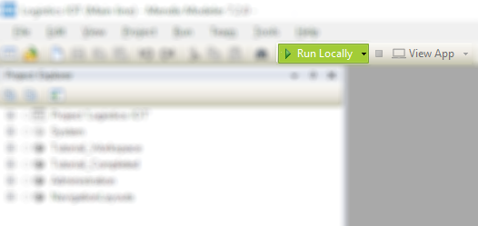
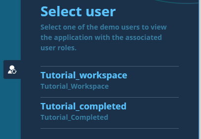
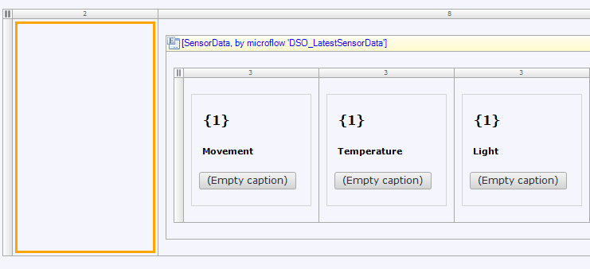
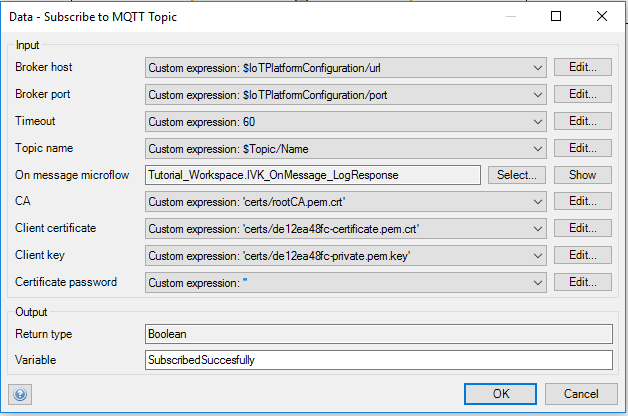
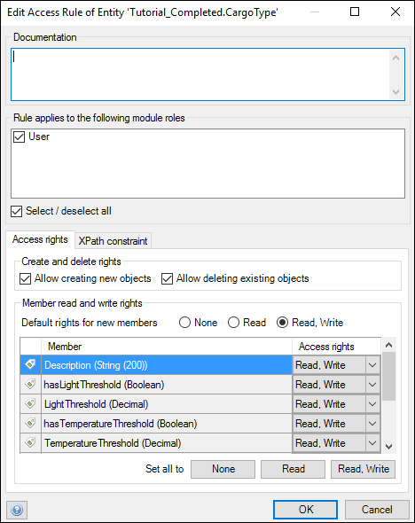
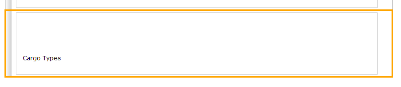
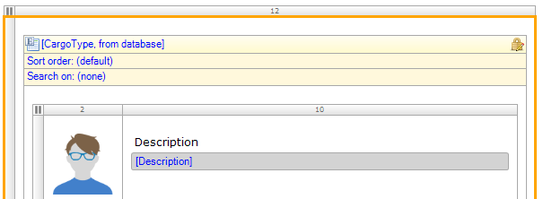
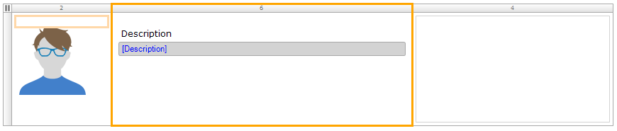
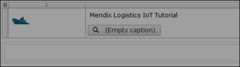

## 1 Introduction

One of the critical issues facing manufacturers, suppliers, carriers and ultimately customers across the supply chain is ensuring that transported goods arrive at their target destination, safe and fit for their purpose. Whilst in transit, there are many factors that can adversely affect cargo, such as exposure to light, temperature increases and decreases, movement, and humidity to name a few.

Ensuring the correct conditions are continually met while many different handlers and carriers are involved across the global supply chain can be challenging. In this Logistics App information about the environment conditions provided by sensors will be opened up to its end users.

**This how-to will teach you how to do the following:**

* Start a new App and instantly run it
* Apply some basic changes to the User Interface (UI)
* Connect to an IoT platform using drag and drop business logic to handle the data from the sensors, provided by the IoT platform.

This app obtains and measures data from various sensors in individual cargo shipments on a ship. In this scenario, a shipment of bananas needs to be monitored for the temperature inside the shipping container, and an alert needs to be sent whenever this temperature gets too high. The temperature sensor is connected to a cloud IoT platform (AWS), and its data is published via a channel that is called a topic. Subscribing to a topic makes it possible to use the data, generated by the various sensor indicators, in the app.

## 2 Prerequisites

Before starting this how-to, create a new instance of the **Logistics IoT** app using the [Mendix Platform Portal](https://home.mendix.com/link/startnewproject). After the Logistics IOT app has been created, you can open the app in the Modeler ([download](https://appstore.mendix.com/link/modelers) and install the Modeler in case you haven't done so already).

* **Tutorial_Workspace** is the module in which you will be making the changes
* **Tutorial_Completed** has the full final version of the app model to use as an example

## 3 How to Build an IoT App

Start by running the application so that you can experience how this app looks. You will see how you can switch between your workspace and the completed example app.

To deploy and view the app, follow these steps:

1. In the Modeler, click **Run Locally** and then click **View App** to see the app in your browser.
2. The app starts on the homepage in the workspace section of the app, which is an overview of all the shipments are listed.
3. Click the menu button in the top-right corner of the app to open the side menu. From here, you can navigate to other pages in the app where you can edit the data in this app. 
4. Select **Shipments** and click **Edit** on the preconfigured shipment, which will bring you to the **Shipment** form. Here you can edit the details about the shipment.
5. On the right-side of the screen, click the toggle with the user icon (located above the **Feedback** button). Switch to the **Tutorial_completed** section of the app, which contains the completed pages for you to use as a reference. **Tutorial_completed** and **Tutorial_workspace** both have their own data set. 
6. Click a container from the shipment overview to inspect the page with the container sensor details. This is the page that you are going to build in this tutorial.

### Step 1 -  Connecting App Pages

In this section, you are going to observe the app in the development environment. You will make your first change, which will enable you to view the live details of the shipments listed on the shipments overview.

To connect an app page, follow these steps:

1. In **Tutorial_Workspace** module, open **Step 1 - Connect pages** > **Homepage**. This is the homepage of the **Global shipments** app that you will be expanding and improving.
2. Inspect how this page is built. Notice that there is a grid that represents the overview of the shipments. On the right there is a menu, which takes you to the pages where you can configure and edit the shipment details, sensor data, and cloud platform configuration.
2. The **Action [default]** button in the grid is not connected to a page, so right-click the button and select **Edit action** > **Show a page**.
3. In the **Select page** dialog box, select the **Shipment_Detail** page, which we have prepared for you).
4. Click **Show** to display the **Shipment_Detail** page and then **OK**.
6. Save the changes, click **Run Locally** to deploy the app, then click **View App** to view the app in your browser.
7. Click the menu button in the top-right corner of the app and select **Shipments**.
8. Click **Edit** on the preconfigured shipment, which will bring you to the **Shipment** form, where you can edit the details about the shipment.

### Step 2 -  Configuring the Sensor Data Subscription

In this section, you will connect a shipment to an IoT device so the data that the device is generating can be used.

To configure the sensor data subscription, follow these steps:

1. In the Modeler, open the **Shipment_Detail** page.
2. Right-click the left-side column of the layout grid (in which **Movement**, **Temperature**, etc. are also located) and select **Add widget** > **Button** > **Call microflow button**.

3. In the **Select Microflow** dialog box, select the **IVK_Subscribe** microflow. You can find it by typing **IVK_Subscribe** in the *Filter* input box.
4. Double-click the button and enter the caption of *Subscribe*.
5. Right-click the button and select **Go to microflow** to inspect the microflow.
    * When invoking a microflow, you can pass the context of a page to it. That enables you to work with all the data assocations from context objects. In this case, the context object is **Shipment**. You can view the structure of the **Shipment** object, which is called an entity, by right-clicking the **Shipment** input parameter and selecting the **Go to entity** option. The Shipment is associated to other entities like **Alert** and **Topic** which means that objects from different entities are related to each other. The relation between a **Shipment** object and a **Topic** object and the relation between a **Topic** object and **IoTPlatformConfiguration** object enables retrieval of the data required for connecting to AWS.
    * Return to the microflow again to see what is happening there. In the outer left activity **Topic** object is retrieved over its association to the **Shipment** object. It is a best practice to check that the association is not empty. If that is **true**, the microflow retrieves the **IoTPlatformConfiguration** object that is associated to the topic. The microflow must check if there is an **IoTPlatformConfiguration** object available. If that is **true**, the data from those objects is used in the subscribe action (via the **AWS IoT Connector**, which is available in the [Mendix App Store](https://appstore.home.mendix.com/link/app/2868/Mendix/AWS-IoT-Connector)). In the subscribe activity a microflow action is configured for the subscription to the topic on AWS. So everytime new data is published on that topic, AWS will send a message to the app with that data and trigger this microflow.
6. Double-click the **Data - Subscribe to MQTT topic** activity and for the **On message microflow**, click **Show** to display the microflow from the details of the connector action. 
7. In the **IVK_OnMessage_LogResponse** microflow, there are two parameters: **Topic** (string) and **Payload** (string). You must log both parameters in the **Console** to verify that you are receiving data (if the Console is not open, click **View** > **Console**).
8. Save the changes, click **Run Locally**, then click **View App**.
9. Refresh the app in the browser, then click **Subscribe** and notice that you get a confirmation message. At this point you won't see anything happening in the app as you configured the app to log the messages it receives from AWS.
10. Return to the Modeler and observe the **Console**. Double-click the log message **Sensor data received**, which will open the **View Log Line Details** pop-up window, where you can see the **Topic** and **Payload** (JSON) in the **Message** section. Receiving this kind of log message means you have just connected to AWS and are receiving real world data!

### Step 3 - Handling the Sensor Data

In the previous section, you verified that you are receiving data. This is exciting because now we can take this data and handle it the way we like! In this section, you are going to process the data you receive in order to make it visible on the details page of the shipment.

To configure the handling of the sensor data, follow these steps:

1. Return to the **IVK_Subscribe** microflow and double-click the **Data - Subscribe to MQTT topic** activity.
2. Change the **On message microflow** to **IVK_OnMessage_HandleData** (located in the **Step 3** folder), which is the microflow that is triggered whenever AWS is sending data. It was originally configured to appear in the **Console**, and now you are configuring it to appear on the page.
    * The **Payload** parameter contains a message in JSON format, which is a lightweight data-interchange format. To work with this data we need to turn it into an object by mapping the JSON message to an entity. In this microflow the JSON message is mapped to a **SensorData** object. The **Topic** parameter is used to retrieve the **Topic** object from the database in order to retrieve the **Shipment object** associated to it.
3. Now you need to associate the shipment object with the sensor data object created from the JSON response. Add a **Change object** activity and double click it to edit it. Set the **Variable** to **SensorData**, and set **Commit** to **Yes**, which will persist the object to the database. Click **New** to add the **Tutorial_Workspace.SensorData_Topic** attribute and enter this **value**: `$TopicObject`.
4. On the details page we like to show the date and time the latest sensor data is received. For this you need to add a **Change object** activity to the flow: 
    a. Set the **Variable** to **Shipment**. 
    b. Set **Commit** to **Yes**. 
    c. Click **New** to add a new change item. Set the **Member** to **LatestSensorUpdate**. 
    d. Click **Generate** to set the **Expression value** to **Token** with **CurrentDateTime**. 
    e. Click **OK**. This new microflow action will allow you to see the last date a message from AWS was recieved on the **Shipment_Detail** page.
5. Save the changes, click **Run Locally**, then click **View App**.
6. In the app, click **Subscribe** and observe the temperature chart updating as data is being pushed to the app!

### Step 4 - Adding Another Data Dimension to the App

Now that data is received we can implement functionality to act on any outliers in the data. In this section, you are going to create alerts when thresholds for different measurements are met. 

#### Step 4.1 - Adding Cargo Type Pages

Not every cargo type should have the same threshold. Before you start working on the alert implementation, you are going to introduce a cargo type and register its thresholds for different measurements (for example, temperature and light). For an example scenario here, if a ship is transporting perishable goods, you will want to see an alert for any extreme activity with the indicators. 

To add the cargo type pages, follow these steps:

1. Add an entity to the domain model and name it **CargoType**.
2. On the **Attributes** tab of the entity **Properties** editor, click **New**. 
3. Name the new attribute **Description** and set the **Type** to **String**, then click **OK**.
4. Click **New** to add another attribute and name it **TemperatureThreshold**. Set **Type** to **Decimal**.
5. Click **New** to add another attribute named **HasTemperatureThreshold**. Set **Type** to **Boolean**.
6. On the **Access rules** tab, click **New** to create a new access rule: 
     a. Select **User** for **Rule applies to the following modules roles**. 
     b. Check **Allow creating new objects** and **Allow deleting existing objects**. 
     c. Grant **Read, Write** privileges for all members using the **Read,Write** button. 
     d. Click **OK**. 

7. In the Domain Model, drag an association from **Shipment** to **CargoType** (Not the other way around!). This means that each Shipment object can be associated to one of the Cargo type objects available.
8. Open the **Homepage** again. The right-side menu is a snippet, which means it can be reused across various pages. Right-click it and select **Show snippet**. This will open the snippet editor.
9. The snippet contains a navigation list widget. To edit the third navigation list item, do the following: 
    a. Right-click the gray bar in the row of the navigation list where the **Cargo Types** label is located and select **Edit action** > **Show a page**. 
     
    b. To connect a new page to the navigation list item, click **New** in the **Select page** dialog box. This opens the **Create Page** editor. 
    c. Enter *CargoType_Overview* for the **Page name** and select **TopBar_Sidebar_Full_Responsive** for the **Navigation layout**. 
    d. Select **Grids** and then **Listview basic**. 
    e. Click **OK**. 
10. Right-click the row of the navigation list in which the **Cargo Types** label is located and select **Go to page**, which will take you to the **CargoType_Overview** page. 
11. In the **Properties** pane of the newly created page, set the **Navigation** visibility to **User**.
12. Right-click the list view and select **Select entity...**. 

13. In the **Select Data Source** dialog box, select the **CargoType** entity that you just created.
14. Keep **Database** selected for the **Type**, but clear the **Automatically fill the contents of the list view** check box.
15. Right click the top input field with the 'No attribute selected' caption and select the **Description** attribute.
16. Delete the other two input fields as well as the **See details** button, because you only want to show the **Description**.
17. In order to add new 'Cargo type' items in the application you need to create a page where you can submit new cargo types. So now do the following: 
    a. Right-click the gray bar in the row of the outer layout grid and select **Insert row above**. 
     
    b. Select the default **full** row option. 
    c. Right-click the new row and select **Add widget** > **Button** > **Create button**. 
    d. In the **Select entity** dialog box, select **CargoType**. 
    e. Right-click the **New** button and select **Generate page...**. The preconfigured name of the page is **CargoType_NewEdit**. 
    f. In the **Create page** editor, change the **Navigation layout** to **PopupLayout**, then choose **Form basic horizontal**. 
18. Back on **CargoType_Overview**, right-click the **New** button and select **Go to page**.
19. On the **CargoType_NewEdit** form, click the **Cancel** button and in the **Properties** pane, change the **Button style** to **Danger**.
20. Click in the page so that its properties become visible in the **Properties** pane. Set the **Navigation > Visible for ** property to **User**.
21. Return to **CargoType_Overview**, which needs the same look and feel as the other pages. Right-click the left-side column in the grid and select **Add column right**.
* The layout grid is based on the [Bootstrap Grid system](http://getbootstrap.com/css/#grid) which enables easy responsive layout options.
22. Click the left-side column to edit it and change the **(Column) Weight** to **1** as the weight of the columns in a layoutgrid has to add up to 12. 
 
23. In the new column (which is now the middle column), right-click and select **Add widget** > **Button** > **Open page button**.
24. Select the **CargoType_NewEdit** page that you just created.
25. Click the new button and change its caption to **Edit**.
26. Simply drag and drop the **DataAdministrationMenu** snippet (from the **Step 4** folder) into the right side of the page to make it consistent with the other pages.
27. Click the **New** button on the page and in the **Properties pane**, change the **Button style** to **Success** so that it is in line with the styling on the other pages.
28. Click the **Description** input field in the right-side column and in the **Properties** pane, change **Show label** to **No**.
29. Save the changes, click **Run Locally**, then click **View App**.
30. Refresh the browser and navigate to the **Cargo Types** page.
31. No items are found, but now you are able to click **New** and edit a cargo type.
32. Add the **Description** of *Bananas*, set the **Temperature threshold** to *10.00*, and set **Has temperature threshold** to **Yes**. You will now see the **Bananas** cargo type you just created in the list.

#### Step 4.2 - Improving the Look and Feel of a Page

When you observe the **Cargo Types** page in the app, you can see that it is not in line with the other pages you have created. In this section, you will improve the title and the attached image for the cargo.

To improve the look and feel of this page, follow these steps:

1. Open the **CargoType_Overview** page in the Modeler.
2. Right-click the row with the **New** button, select **Insert row above**, then select the default **full** row option.
3. Click **View** in the top Modeler menu bar and select **Toolbox**. 
4. Drag the **Page title** widget from the **Toolbox** to the new row.
5. Select the whole page by clicking the grayed out area, go to the **Properties** pane, and change the **Title** to **Cargo types**. 
 
6. Right-click the avatar in the left-side column and select **Select image**. Enter the filter of *cargo* and select **cargotypes_black**.
7. Save the changes, click **Run Locally**, then click **View App**.
8. Observe the changes in the app. Looks better, right?

#### Step 4.3 - Adding a New Input to a Page
At this point you have created the possibility to associate shipments with cargo types from a data perspective.
In this section, you are going to enrich the user interface with an extra input option so that a user is able to associate shipments  with cargo types.

To add a new input to this page, follow these steps:

1. Select the **Shipment_NewEdit** page (from the **Step 4.3** folder).
2. Select the area below the **Cargo value** input.
3. In the **Connector** pane, double-click **Shipment_CargoType** > **CargoType** > **Description**.
4. Save the changes, click **Run Locally**, and click **View App**.
5. In the app, choose the **Shipments** page from the right-side menu.
6. Click **Edit** for the **TK124097987** shipment.
7. In the new **Cargo type** field in the **Shipment** editor, select **Bananas** from the drop-down menu, then click **Save**.

### Step 5 - Creating Alerts

In this section, you will learn how to use business logic to configure the creation of alerts for when the cargo exceeds the temperature threshold.  

#### Step 5.1 - Extending the OnMessage Flow to Create Alerts

If the temperature threshold has been exceeded, an alert needs to be created. To extend the OnMessage microflow to create alerts, follow these steps:

1. Open the **IVK_OnMessage_HandleData_CreateTemperatureAlert** microflow (from the **Step 5.1** folder).
2. Add a **Retrieve** activity and keep the **Source** as **By association**.
3. To see what the threshold is for the shipment, the **CargoType** object needs to be retrieved. So, for the **Association**, select **Shipment** > **Shipment_CargoType** and click **OK**.
4. Insert an **Exclusive split** to check that the object is available (as in, not empty). In the **Expression** editor, add `$CargoType != empty`.
5. Insert another **Exclusive split** that will check that the temperature threshold exists. In the **Expression** editor, add `$CargoType/HasTemperatureThreshold`.
6. Set the condition value on this flow as **true**.
7. Insert one more **Exclusive split** that will check if the temperature is higher than the threshold. In the **Expression** editor, add `$SensorData/AmbientTemp > $CargoType/TemperatureThreshold`.
8. Set the condition value on this flow as **true**.
9. Add a **Create object** activity on this flow.
10. Select **Alert** for the **Entity** and set **Commit** to **Yes**.
11. Click **New** to add a new attribute. Set the **Member** to **Message** and set the **Value** as `'Temperature is too high'`.
12. Add another attribute. Set the **Member** to **AlertType** and click **Generate** to verify that the expression value is set to **Constant** > **Temp**.
13. Add one more attribute. Set the **Member** to **Tutorial_Workspace.Alert_Shipment**. Set the **Value** as `$Shipment`.
14. You still need to handle the outgoing sequence flows from the exlusive splits, so insert a **Merge** after the **NewAlert** entity.
15. Drag the **false** flow from each exclusive split to the merge.
16. Save the changes, click **Run Locally**, then click **View App**.
17. On the shipment overview page of the app, select **Container Bananas**, then click **Subscribe**. The data will now come into the indicators.
18. In order to generate alerts you need to make sure the temperature threshold, which you can configure on the Cargo Type edit page, is lower than the temperature data being pushed to the app.
19. The temperature threshold was set to 30 degrees in this example, so when the temperature goes above 30, you will get an alert. Click the alerts icon in the upper-right side of the screen. This will open the **Current alerts** panel, where you will see the newest alert.

#### Step 5.2 - Improving Alert Mechanism

Now you get an alert every time the temperature exceeds the threshold, which is unnecessary after the initial alert. You need an indicator on a shipment that an alert is active, so now you are going to build some logic that prevents these repetitive alert messages.

To improve the alert mechanism, follow these steps:

1. In the Modeler, open the **Domain Model** and then open the **Shipment** entity.
2. Click **New** to add a new attribute. Name this attribute **IsAlertedForTemperature** and set **Type** to **Boolean**.
3. Open the **IVK_OnMessage_HandleData_CreateTemperatureAlert** microflow and insert an **Exclusive split** before the **NewAlert** entity.
4. Set the **Expression** as `$Shipment/IsAlertedForTemperature`. This means that if an alert has already been created, an extra alert won't be created.
5. Drag a flow from this exclusive split to the merge (located after the **NewAlert** object), and set the **Condition value** on this flow to **true**. 
6. Add a **Change object** activity between the **NewAlert** object and the merge, and set the input variable to **Shipment**.
7. Click **New** to add a new change item, which will be **IsAlertedForTemperature**. Set the **Value** as `true`.
8. To change the message, open the **NewAlert** object and click the **Message** attribute. Change the message to `'Temperature is too high: ' + $SensorData/AmbientTemp`. Click **OK**.
9. Save the changes, click **Run Locally**, and click **View App**.
10. On the shipment overview page of the app, select **Container Bananas**, then click **Subscribe**.
11. Open the **Current alerts** panel by clicking the exclamation mark icon in the top right of the page. You will see a message like this: **Temperature is too high: 15**.

### Step 6 - Adding a New Shipment with a Sensing Device

In this section, you are going to expand the shipments that will be tracked by the app.

#### Step 6.1 - Adding a New Shipment

To add a new shipment, follow these steps:

1. In the Modeler, open the **Homepage**.
2. Right-click the first row of the **Layout grid** and select **Insert row above**. Select the default **full** row option.
3. In this new row, right-click and add a **Create button**.
4. In the **Select entity** dialog box, select the **Shipment** entity.
5. Right-click the **New** button and select **Generate page...**.
6. Enter *Shipment_New* for the **Page name**, then select **PopupLayout** for the **Navigation layout**.
7. Select **Forms** > **Form basic horizontal**, then click **OK**.
8. Right-click the **New** button and select **Go to page**.
9. On this new form, delete the input fields that you don't want to provide yet: **Lat**, **Lng**, **Is alerted for temperature**, **Latest sensor update**, and **Sensor view**.
10. Right-click the drop zone below **Cargo value** and in the **Connector**, double-click **Shipment_CargoType** > **Cargo Type** > **Description**.
11. Right-click the drop zone below **Cargo Type** and in the **Connector**, double-click **Shipment_Topic** > **Topic** > **Name** .
12. Select the whole page and in the **Properties** pane, set the **Navigation** visibility to **User**.
13. Save the changes, click **Run Locally**, then click **View App**.
14. On the **Global shipments** page of the app, click **New**. This adds a new shipment to the homepage. If you'd like to see a detailed shipment instance on the app homepage, you can fill in the details on the **Edit Shipment** form.

#### Step 6.2 - Improving the Input Form

To improve the input form, follow these steps:

1. In the Modeler, open the **Shipment_New** form and select **Topic**.
2. In the **Properties** pane, select **Selectable objects** > **Source** > **Microflow**.
3. Click **Microflow** and then click **New** to create a new microflow. Name the new microflow **GetAvailableTopics**.
4. Add a **Retrieve** activity, and set the **Entity** to **Topic**.
5. For the **XPath constraint**, enter `[not(Tutorial_Workspace.Shipment_Topic/Tutorial_Workspace.Shipment)]`.
6. Open the **End Event**. For the **Return value**, enter `$TopicLis`.
7. In the **Properties** for the microflow, set **Allowed roles** to **User**.
8. Save the changes, click **Run Locally**, and click **View App**. Observe how the **Topic** drop-down menu only includes the topics that are available.
