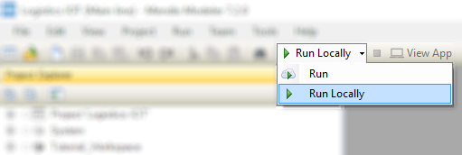

## 1 Introduction

One of the critical issues facing manufacturers, suppliers, carriers and ultimately customers across the supply chain is ensuring that transported goods arrive at their target destination, safe and fit for their purpose. Whilst in transit, there are many factors that can adversely affect cargo, such as exposure to light, temperature increases and decreases, movement, and humidity to name a few.

Ensuring the correct conditions are continually met while many different handlers and carriers are involved across the global supply chain can be challenging. In this Logistics App information about the environment conditions provided by sensors will be opened up to its end users.

**This how-to will teach you how to do the following:**

* Start a new App and instantly run it
* Apply some basic changes to the User Interface (UI)
* Connect to an IoT platform using drag and drop business logic to handle the data from the sensors, provided by the IoT platform.

This app obtains and measures data from various sensors in individual cargo shipments on a ship. In this scenario, a shipment of bananas needs to be monitored for the temperature inside the shipping container, and an alert needs to be sent whenever this temperature gets too high. The temperature sensor is connected to a cloud IoT platform (AWS), and its data is published via a channel that is called a topic. Subscribing to a topic makes it possible to use the data, generated by the various sensor indicators, in the app.

## 2 Prerequisites

Before starting this how-to, create a new instance of the **Logistics IoT** app using the [Mendix Platform Portal](https://home.mendix.com/link/startnewproject). After the Logistics IOT app has been created, you can open the app in the Modeler ([download](https://appstore.mendix.com/link/modelers) and install the Modeler in case you haven't done so already).

* **Tutorial_Workspace** is the module in which you will be making the changes
* **Tutorial_Completed** has the full final version of the app model to use as an example

## 3 How to Build an IoT App

Start by running the application so that you can experience how this app looks. You will see how you can switch between your workspace and the completed example app.

To deploy and view the app, follow these steps:

1. In the Modeler, click **Run Locally** and then click **View App** to see the app in your browser.
2. The app starts on the homepage in the workspace section of the app, which is an overview of all the shipments are listed.
3. Click the menu button in the top-right corner of the app to open the side menu. From here, you can navigate to other pages in the app where you can edit the data in this app. 
4. Select **Shipments** and click **Edit** on the preconfigured shipment, which will bring you to the **Shipment** form. Here you can edit the details about the shipment.
5. On the right-side of the screen, click the toggle with the user icon (located above the **Feedback** button). Switch to the **Tutorial_completed** section of the app, which contains the completed pages for you to use as a reference. **Tutorial_completed** and **Tutorial_workspace** both have their own data set. 
6. Click a container from the shipment overview to inspect the page with the container sensor details. This is the page that you are going to build in this tutorial.
