## 1 Introduction

Mendix applications frequently need to communicate with existing systems. Whether replacing an older platform entirely or leveraging an existing database to enhance your app, the ability to integrate with legacy systems is key to your success. This how-to introduces a range of options that exist within the Mendix platform to integrate with legacy systems.

**This how-to will teach you how to do the following:**

* Assess potential options for integrating an existing system with a Mendix app
* Import data from a flat file or an Excel file using Mendix App Store modules
* Integrate with a legacy system using REST

## 2 Prerequisites

Before starting this how-to, make sure you have completed the following prerequisites:

* Download the [flat & delimited file importer module](https://appstore.home.mendix.com/link/app/429/Erwin-'t-Hoen/Flat-&-delimited-file-import) in the App Store and all prerequisites 
* Know how to create domain models (for details, see [How to Create a Basic Data Layer](create-a-basic-data-layer))
* Know how to create overview and detail pages (for details, see [How to Create Your First Two Overview and Detail Pages](create-your-first-two-overview-and-detail-pages))
* Know how to create microflows (for details, see [How to Build Your First Microflow: Hello world!](create-your-first-microflow-hello-world))
* Save sample data file to your computer for use in this exercise ([SampleFlatfile.txt](attachments/18448737/18582047.txt))
* Understand the concepts behind REST and web services (for more information, see [Consuming Your First REST Service](http://www.mendix.com/blog/consuming-first-rest-service/) and [How to Consume a Complex Web Service](consume-a-complex-web-service))
    * Creating an exposed REST service on top of your legacy system is beyond the scope of this tutorial; for instructions on how to accomplish this, refer to the configuration of your non-Mendix platform

## 3 Importing Legacy Data Using a Flat File

Consider the following situation: you have a legacy system with valuable data that needs to be translated into Mendix. This system can produce a flat or delimeted extract of data . In this section, you will learn how to use the **Flat & Delimited Import Module** to import this data directly into Mendix. This process can be used for a one-time data transfer or for a regular dump of data from one system to another thanks to the scheduling feature. This approach is especially useful for older data systems that cannot accommodate more modern web service integrations.

To import legacy data using a flat file, follow these steps:

1. Create a Mendix object that matches the data you want to input. For the example provided, this entity is named **Product** has two attributes named **Value 1** and **Value 2**:

    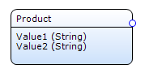

2. By means of the instructions in the Flat & Delimited Importer Module release notes, add the page **FlatFileInterface.InterfaceDefinition_Overview** to your project **Navigation**.
3. Start the app and navigate to the **Interface Definition Overview** page.
4. Select **New** to create the interface definition:

    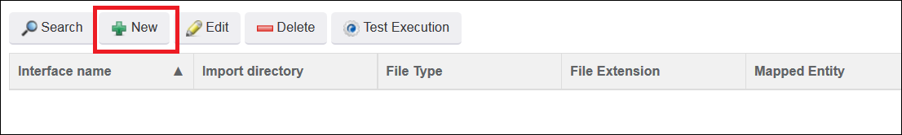

5. Select the product entity from the drop-down menu. If this drop-down menu is empty, then it is likely that the model reflection has not been synced yet. If you do not know how to execute this, see [How to Import Excel Documents](importing-excel-documents).

    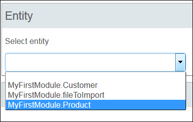

6. Fill out the rest of the interface definition as follows:

    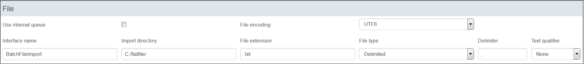

    * The **Import directory** is the location where the flat files will be landing
        * In this example, it has been set to *C://flatfile*
        * Select a directory for which you have read access
    * **Text qualifier** is set to **None**, which means the data is encapsulated
        * In this example that is sufficient, but make sure all the data is properly encapsulated and escaped if using more complex data sources
7. Click **Save** and the **Columns** section will become visible. Click **New** to add columns.
8. Add both columns for the **Product** entity. Once completed, it will look like this:

    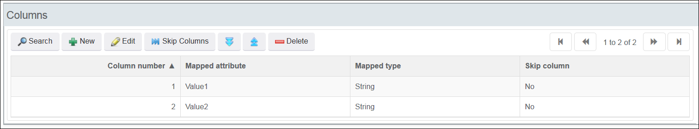

9. To test the connection, click **Test Execution** on the **InterfaceDefinition_Overview** page:

    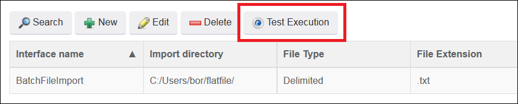

10. Data in the sample file will now be imported into your application. The logs for this operation are available in the **Logging** tab of the **InterfaceDefinition_NewEdit** page:

    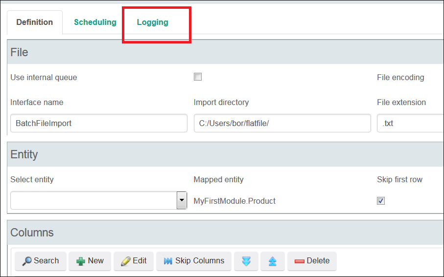

11. To schedule the regular ingestion of a flat file, you can use the **Scheduling** tab of the **InterfaceDefinition_NewEdit** page:

    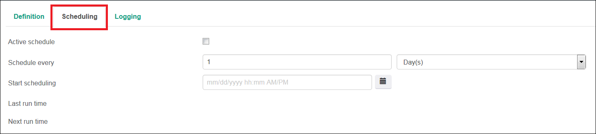

    Scheduling your file for regular ingestion will allow you to ingest the files dropped by your legacy system at regular intervals. If the existing system receives data updates during the day and produces a batch export at night, the Mendix app can ingest this file every evening as scheduled and the data will be ready for users the following morning.

### 3.1 Considerations for Extending

These are some considerations for extending: 

* See the wide range of configurable settings
* Utilize the queuing function to enhance your imports 
* Documentation for this module is included in the App Store release and can be accessed here:

    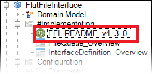

### 3.2 Importing Legacy Data Using an Excel File

If your legacy system produces data in an Excel file format, integration can be accomplished using the Excel Imported App Store Module. For detailed instructions on how to import data to Mendix with Excel, see [How to Import Excel Documents](importing-excel-documents).

## 4 Interacting with a Legacy System Using REST

If the legacy system has the ability to expose its data to web services, integration can be accomplished using the Mendix REST module. This technique will allow your to preserve a system of record while accessing data only as you need it.

These are some situations in which to consider using this technique:

* SAP architecture with RFC calls exposing JSON
* CRM systems or databases with a web-service layer

In this section, you will learn how to retrieve data from a legacy system using REST and integrate the data into your application.

For this how-to, we will use the publicly available Google Books API (for details, see [Google Books APIs Getting Started](https://developers.google.com/books/docs/v1/getting_started). We will construct our example around this data model. Each legacy system will have a different JSON structure based on internal data models. This example will return a collection of books using a given author search parameter. To use this API, users must collect an API key (as outlined in [Google Books APIs Acquiring and Using an API Key](https://developers.google.com/books/docs/v1/using?csw=1#APIKey)). The response structure of this particular API is as follows:

1. The API we will use has a JSON structure.
2. Construct the appropriate data model for this JSON.

    

    Every REST service will have a different specific JSON structure. For details on how to build JSON data structures in Mendix, see [JSON Structures](refguide6/json-structures).

    

3. Create a non-persistable search entity called **BookSearch** that allows the user to enter an author and title. This should be linked to a second object:

    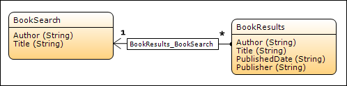

4. Create a page that contains a data view that will allow users to enter search terms. The data source for this data view should be a new microflow that generates a new search object and returns it:

    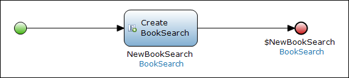

5. Create a microflow button and a corresponding microflow that will perform your search. This microflow will use the REST GET Java Action included in the App Store REST module:

    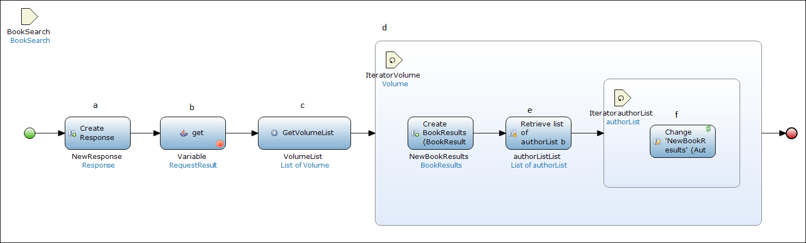

    The microflow activities for this flow are the following:

    a. Creates a new response object. 
    b. Makes the REST call to the API using the following target: 

    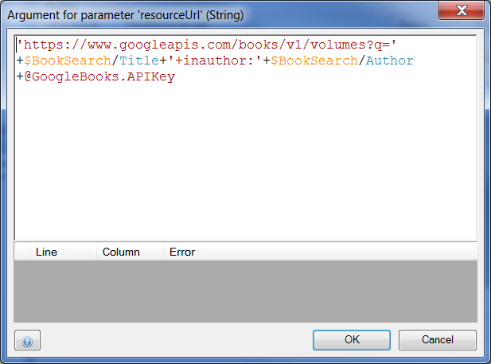 

    c. Calls a sub microflow that retrieves all the items associated with the response. Each item then has all the associated volumes retrieved:

    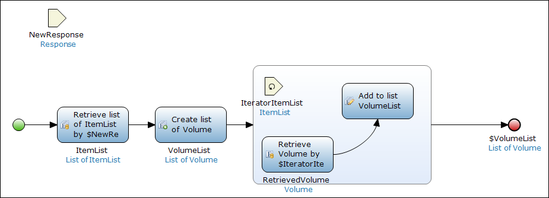 

    d. Iterates through the **VolumeList** and makes a new **BookResult** object to display the search results:

    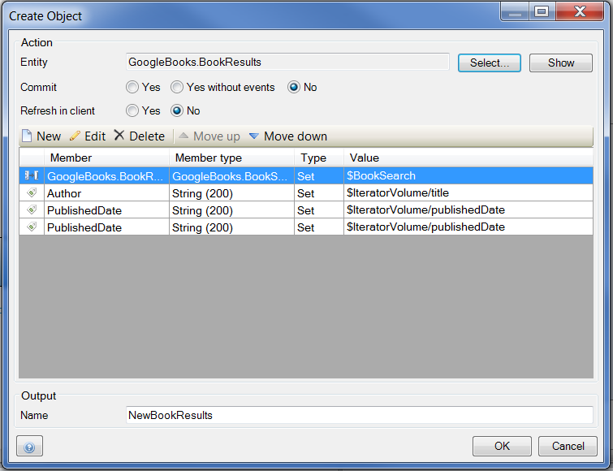 

    e. Retrieves the author list **Over Association** for each volume.  
    f. Iterates through the list of author names and uses a **Change** activity to add the author name. This is done to accommodate this situation:

    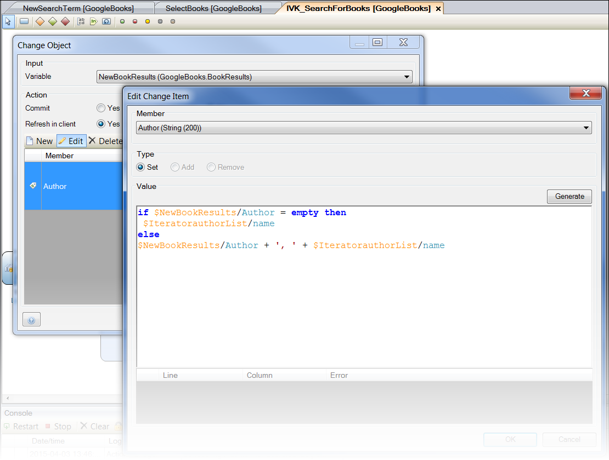

6. When a user logs into the application and enters a search term, the results are successfully populated via the REST calls.

The above example demonstrates how a Mendix application can quickly integrate data systems using REST. This basic framework can be built upon to incorporate a wide range of activities. Possible ways to extend this framework include the following: 

* Adding additional microflow processing logic to leverage data in Mendix
* Using the REST POST actions to push values from Mendix
* Updating Mendix app data from a different source

For further documentation and to see the GitHub project for REST services, see the [Mendix RestServices GitHub page](https://github.com/mendix/RestServices).

## 5 Related Content

* [How to Consume a Complex Web Service](consume-a-complex-web-service)
* [How to Consume a Simple Web Service](consume-a-simple-web-service)
* [How to Export XML Documents](export-xml-documents)
* [How to Import Excel Documents](importing-excel-documents)
* [How to Expose a Web Service](expose-a-web-service)
* [How to Configure Selenium Support](selenium-support)
* [How to Synchronize User Accounts Using the LDAP Module](synchronizing-user-accounts-using-the-ldap-module)
* [How to Import XML Documents](importing-xml-documents)
* [How to Consume a REST Service](consume-a-rest-service)
* [How to Expose Data to BI Tools Using OData](exposing-data-to-bi-tools-using-odata)
* [Extending Salesforce with Mendix, an Alternative to Force.com](https://www.mendix.com/blog/extending-salesforce-mendix-alternative-force-com/)
