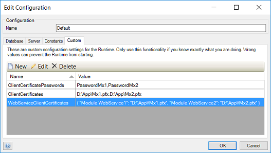

## 1 Introduction

Some web services require you to authenticate using a client certificate. This how-to describes how to configure your app to do this.

Let's assume that you already have an app that calls a web service. For details on how to configure this, have a look at [How to Consume a Simple Web Service](consume-a-simple-web-service).

This how-to will teach you how to do the following:

* Configure to run locally
* Configure in the Mendix Cloud

## 2 Prerequisites

* A PKCS12 certificate file that contains a private key — these files typically have the _.pfx_ or _.p12_ file extension
* The password to open that file

## 3 Running Locally

To configure the custom settings that are only used when you run your app locally, follow these steps:

1. Open your app in the Modele and go to **Project** > **Settings**.
2. Click **Edit** to open the **Edit Configuration** dialog box, and select the **Custom** tab.
3. Add these three custom settings:

    Name | Value | Notes
    --- | --- | ---
    ClientCertificates | The full paths to the certificate files. | Separate with commas if you have more than one file. Backslashes in the paths should not be doubled.
    ClientCertificatePasswords | The password for each certificate file.  | In the same order as the **ClientCertificates**.
    WebServiceClientCertificates | The description of which files to use for which service, in the format of `"ModuleName.WebserviceName": "full path"`. | If you have more than one web service to configure, you can separate them with commas. The whole setting value needs to be enclosed in curly brackets ["{ }"]. Backslashes in the paths must be doubled. In addition, the paths you specify here should all appear in **ClientCertificates**.

This is an example:

```
{ "Module.WebService1": "D:\\App\\Mx1.pfx", "Module.WebService2": "D:\\App\\Mx2.pfx" }
```

A complete configuration can look like this:



## 4 Running in the Cloud

<div class="alert alert-info">

You will only be able to follow the steps below if you have the correct access rights for the client certificates.

</div>

To configure client certificates in the Mendix Cloud, follow these steps:

1. Go to the [Mendix Cloud Portal](https://cloud.home.mendix.com/) and click **Details** next to your app.
2. Each environment has its own configuration. Click **Details** next one of the environments.
3. Click **Network** and scroll down to **Certificates for outgoing connections**.
4. Click **Add client certificate**. Upload the certificate files.
5. After the files have been uploaded, they appear in the list. Double-click an item in the list.
6. In the **Pin Client Certificate to Web Services** section of the **Details** screen, add the names of the web services for which you want to use this certificate.
7. Enter these names in the **ModuleName.WebServiceName** form.
8. Close the **Details** screen.
9. Click **Stop application** and then **Start application**.
