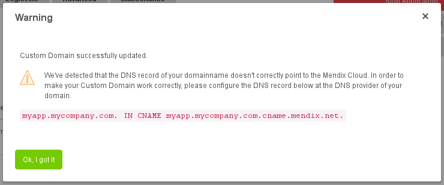
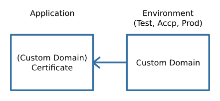
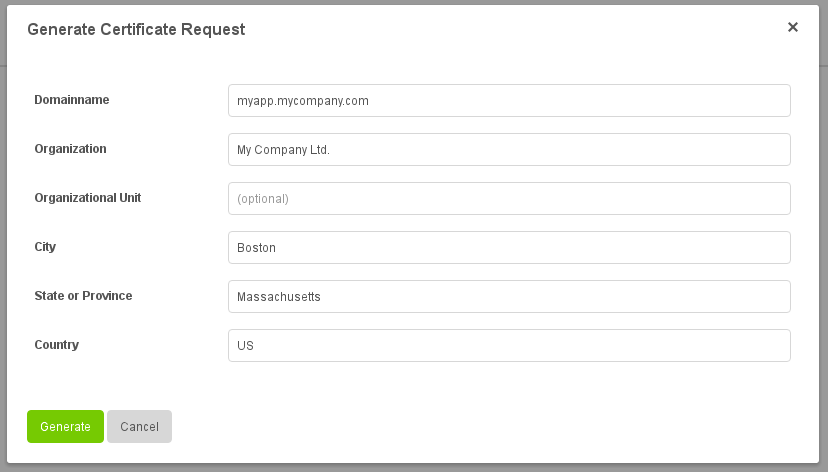
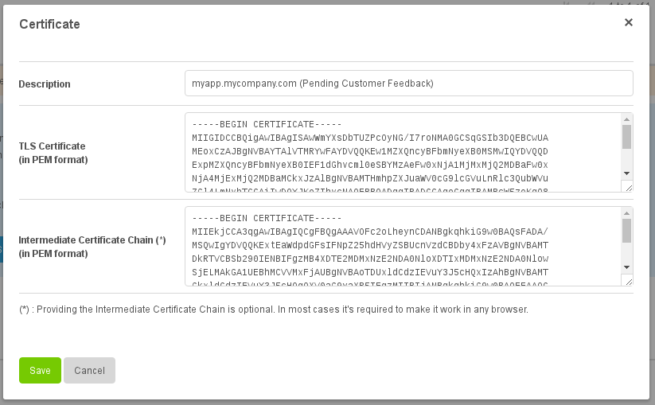
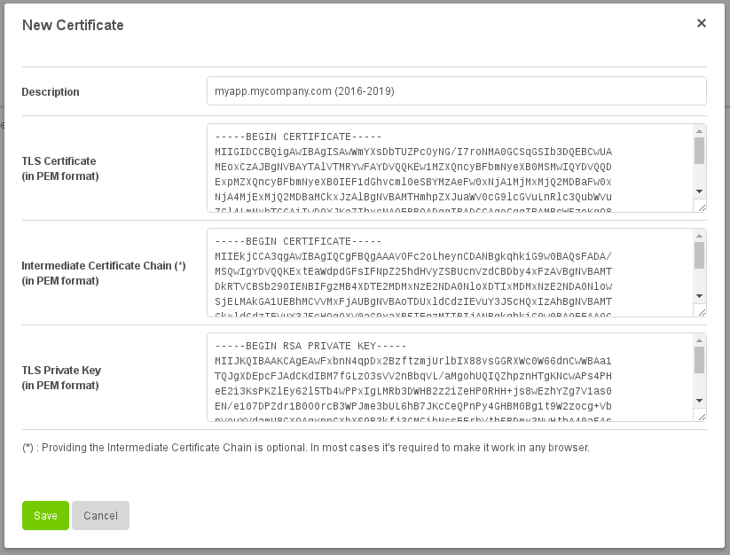
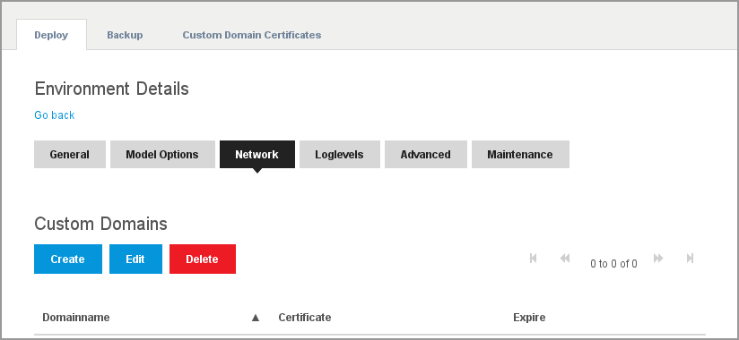
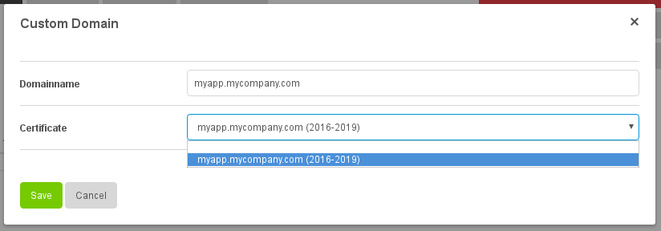

# How to configure Custom Domains

When your Mendix App needs to be accessible via your own URL, for example https://myapp.mycompany.com/, you have to provide a Custom Domain Certificate (a SSL/TLS Certificate) so we can keep serving your Mendix App via a secure connection.

**Before you start configuring Custom Domains we assume:**

*   You have basic knowledge about DNS
*   You have basic knowledge about SSL/TLS certificates
    *   You know what a "SSL/TLS Certificate" is and what it is used for
    *   You know what a "Intermediate Certificate Chain" is and what it is used for
    *   You know what a "SSL/TLS Private Key" is and what it is used for
    *   You know what a "Certificate Request" is and what it is used for
*   You have basic knowledge about Certificate Authorities (like GeoTrust, Thawte, Verisign, RapidSSL, GoDaddy, Comodo)

**After completing this how-to you will know:**

*   How to generate a Certificate Request for your Custom Domain
*   How to upload a Custom Domain Certificate to the Mendix Cloud Platform
*   How to renew a Custom Domain Certificate
*   How to configure a Custom Domain for your Environment

## 1. Preparation

Before configuring your Custom Domain in the Mendix Cloud Platform you will need to configure a DNS record for your Custom Domain at your Domain Registrar / DNS provider.

Please create a CNAME record and point it to "[YOUR-CUSTOM-DOMAIN].cname.mendix.net.". So when your Custom Domain is for example "myapp.mycompany.com", create a CNAME record to "myapp.mycompany.com.cname.mendix.net.". This way we are able to point your Custom Domain to your Mendix App.

> Note: It's not possible to create a CNAME record for an Apex/Naked domain (domain without a subdomain, like mycompany.com). Custom Apex/Naked Domains are currently not supported.

## 2\. Managing Custom Domains in the Mendix Cloud Platform

Custom Domain Certificates (or just "Certificates") and Custom Domains are managed in separate locations in the Mendix Cloud Platform. Certificates are currently managed on Application level. You can have a collection of Certificates. For example when your Certificate expires, you can upload a new Certificate next to your old Certificate. Those can be chosen when you configure a Custom Domain. This is done on Environment level (Test, Acceptance, Production).

## 3\. Generating a Certificate Request for your Custom Domain

When you do not have a SSL/TLS Certificate or SSL/TLS Private Key for your Custom Domain yet, you have to order one at a Certificate Authority (like GeoTrust, Thawte, Verisign, RapidSSL, GoDaddy, Comodo). In order to get a Signed SSL/TLS Certificate from a Certificate Authority, you need to provide a Certificate Request. A Certificate Request can be created in the Mendix Cloud Platform.

To create a Certificate Request:

1.  Go to the Application you want to configure a Custom Domain for
2.  Go to the Custom Domain Certificate tab
3.  Click "New"
4.  Choose "Create a Certificate Request"
5.  Fill in and submit the provided fields

A SSL/TLS Private Key and a Certificate Request is generated. The Certificate Request will be shown in PEM format.

> The "SSL/TLS Private Key" will be stored in our Secure Keystore. It will not be available for download to keep it secure.

Please head to your Certificate Authority to get a Signed SSL/TLS Certificate.

When you have received the Signed SSL/TLS Certificate from your Certificate Authority you can upload it by selecting the Custom Domain Certificate, then click "Upload Signed Certificate". Here you can change the description of your Certificate and upload the Signed SSL/TLS Certificate. You can also upload an Intermediate Certificate Chain. The Intermediate Certificate Chain is often provided by your Certificate Authority as well.

## 4\. Uploading your own Custom Domain Certificate

To upload a Custom Domain Certificate you need to have some things prepared:

*   A "SSL/TLS Certificate" that is signed by your Certificate Authority
*   A "Intermediate Certificate Chain" provided by your Certificate Authority
*   A "SSL/TLS Private Key"

Upload the Custom Domain Certificate by entering the "SSL/TLS Certificate", "Intermediate Certificate Chain" and "SSL/TLS Private Key" in the provided fields. Optionally you can give your Custom Domain Certificate a description. The description is used when selecting the Custom Domain Certificate when configuring a Custom Domain later on.

Save your new Custom Domain Certificate and it will be uploaded to the Mendix Cloud Platform.

> The "SSL/TLS Private Key" will be hidden after uploading it. It will be stored in our Secure Keystore and will not be available for download to keep it secure.

## 5\. Renewing a Custom Domain Certificate

There are 2 ways to renew a Custom Domain Certificate

### 5.1 Renew by creating a new Custom Domain Certificate (recommended)

When a Custom Domain Certificate is about to expire, you can renew it by generating a new Certificate Request (See: "3\. Generating a Certificate Request for your Custom Domain") or by uploading a new Custom Domain Certificate (See: "4\. Uploading your own Custom Domain Certificate").

Now select the new Certificate for your Custom Domain (See: "6\. Configuring a Custom Domain").

### 5.2 Renew by updating an existing Custom Domain Certificate

You can also renew your Custom Domain Certificate by editing an existing Custom Domain Certificate. Please be aware that the Certificate Request that you created in the past is required for that.

## 6\. Configuring a Custom Domain

After a Custom Domain Certificate has been uploaded, you can start configuring a Custom Domain for one of your Application Environments. For this go to one of your Environments and to the "Network" tab. Under "Custom Domains" you can manage your Custom Domains.

Configure a Custom Domain by:

*   Providing a Domainname (like "myapp.mycompany.com" from the example at the top of this page)
*   Selecting a Custom Domain Certificate you have uploaded above

Save your Custom Domain and it will be configured for your Application Environment.

> Please make sure you've configured a CNAME record for your Custom Domain at your Domain Registrar / DNS provider (See: 1\. Preparation).

## 7\. Frequently Asked Questions

### 7.1 Can I create a wildcard certificate _*.mycompany.com_?

Yes. However, when you create the Certificate Request via the Mendix Cloud Platform you will only be able to use the wildcard certificate for all environments of only 1 application. When you have your own Custom Domain Certificate, you can upload it to all of your applications and use it for all environments of all of your applications. You can select the same wildcard certificate per environment by specifying different subdomains. Example _test.mycompany.com_ _accp.mycompany.com_ and _app.mycompany.com._

### 7.2 How do I properly construct a Intermediate Certificate Chain?

Your Certificate is signed by the Certificate Authority. They sign your certificate with their intermediate certificate. They also sign their Intermediate Certificate with their own root certificate. Almost always the Intermediate Certficate Chain that you will need is just one Intermediate Certificate. Sometimes there are is more then one Intermediate Certificate, this depends on the CA you use. You do not need to provide the Root Certificate as every Internet browser has it in it's trusted keystore.

An Intermediate Certificate Chain chain could look like this from top to bottom:

*   Intermediate Certificate 2
*   Intermediate Certificate 1
*   Root Certificate (optional)

**Content by label**

There is no content with the specified labels
