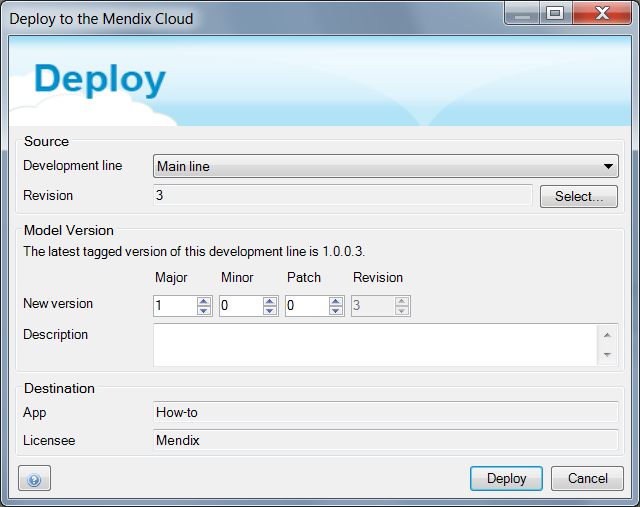
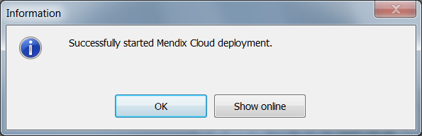
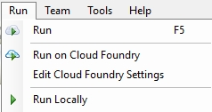
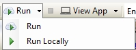

## 1 Introduction

It has never been easier to deploy a Mendix application to the cloud. This how-to will explain the options a developer has to deploy applications to a connected cloud node.

## 2 Prerequisites

Before starting this how-to, make sure you have completed the following prerequisites:

### 2.1 Prerequisites for a Licensed App
*   Your app is linked to a licensed Cloud Node
*   You have deployment permissions
*   Your Google Authenticator is enabled

### 2.1 Prerequisites for a Free App
*   

## 3 Deploying a Licensed App to the Mendix Cloud

There are two methods of deploying your app to the Mendix Cloud. The first option is directly via the **Mendix Modeler**, and the second  is through the **Developer Portal**.

### 3.1 Deploy via the Mendix Modeler

1.  Open the **[Mendix Modeler](http://appstore.home.mendix.com/link/modeler/)**.
2.  Open the licensed app.
3.  Click **Project** in the menu and select **Deploy to licensed cloud node** (Ctrl+F5).

    

4.  Click **Deploy**.

    

5.  The deployment is now in progress. Click **Show online**, to see the uploaded package.

    

### 3.2 Create a Package from Team Server in the Developer Portal

An app can also be deployed without using the Mendix Modeler. Take the following steps to do this:

1.  Go to the [Developer Portal](http://home.mendix.com).
2.  Click **Apps** in the top navigation panel.
3.  Select your app.
4.  Go to **Environments**.
5.  Click **Create package from teamserver**.
6.  Select the preferred branch and revision and click **Next**.
7.  Give the build a version number and click **Build this revision**.

The package is now being deployed to the cloud.

## 4 Deploy the App to an Environment

Previous steps explained how to deploy a Deployment Package to the Mendix Cloud. The actual app is not running yet. Follow these steps to deploy a Deployment Package to a node environment:

1.  Open the [Developer Portal](http://home.mendix.com).
2.  Open your app.
2.  Go to **Environments**.
3.  In the **Deployment Package Repository**, choose the preferred Deployment Package and click **Deploy**.
4.  Select the preferred environment and click **Continue**.
5.  Click **Transport**. If asked for, clean the environment.
6.  Configure the Constants if needed, by clicking **Constants** and **Edit constants value**. This can also be done in a later stage in the settings. 
7. Click **Continue**.
8. Click **Start application**. If asked for, click **Synchronize database**.

The app is now deployed and the administrative account can be configured.

## 5 Deploying a Free App to the Mendix Cloud

With a Free App it's only possible to deploy your App to a sandbox environment using a Mendix Modeler. There are two methods to do that.

### Method 1

Once you have created and worked on your App, you will want to share it with others in the Free App. You can deploy your Free App to a sandbox environment by clicking **Run** at the top of your Mendix Modeler. It will automatically deploy your app to a sandbox.

### Method 2

If you want to choose whether you want to run your app locally or in the sandbox, you can enable the sandbox option by clicking **Run**.

## 6 Related content
*   [How to Link Your Free App to a Licensed Cloud Node](how-to-link-app-to-node)
*   [How to Set Up Two-Factor Authentication With Google Authenticator](/howtogeneral/support/how-to-set-up-two-factor-authentication-with-google-authenticator)
*   [How to Upgrade Your Free App to a Licensed App](how-to-upgrade-free-app)
