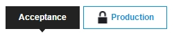

## 1 Introduction

This how-to describes how to create backup of a licensed cloud node. This option is not available for Free Apps.

**This how-to will teach you how to do the following:**

*   Create a backup of a licensed cloud node

## 2 Prerequisites

Before starting this how-to, make sure you have completed the following prerequisite:

*   You have licensed cloud node

## 3 Creating a Backup

To create a backup of a licensed app, follow these steps:

1. Go to the [Developer Portal](http://home.mendix.com) and click **Apps** in the top navigation panel.
2. Click **My Apps** and select **Nodes**.
3. Select the node from which you want to download the backup.
4. Click **Backups** under the **Operate** category.
5. Select the environment from which you want to download the backup.

    

6. Click **Create Backup**.

    

## 4 Related Content

* [How to Deploy to the Mendix Cloud](deploying-to-the-cloud)
* [How to Link an App to a Licensed Cloud Node](how-to-link-app-to-node)
* [How to Restore a Backup](how-to-restore-a-backup)
* [How to Unlink Your Sandbox](how-to-unlink-sandbox)
