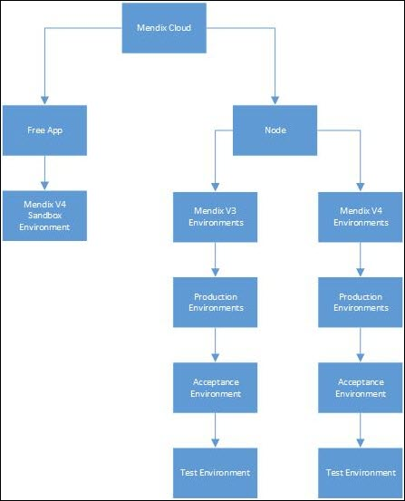

The Mendix Cloud is the public cloud service and the default deployment option for Mendix applications.

Learn how to deploy your app, either in a Sandbox or to the Cloud. And go check out our AppCloudServices.

## Free App

Every app that you create from the Mendix Modeler or the Developer Portal will always get a Free App with one environment in the Mendix Cloud. This environment is called a Sandbox. 

## Node

A Free App can be upgraded to a licensed app with a node in the Mendix Cloud. A node has several environments and is hosted on Mendix Cloud V3 or Mendix Cloud V4. 

## Environment

A node has a minimum of two environments: production and acceptance. A test environment is the third optional environment. You can deploy your licensed app (that is linked to a node) to its environments.

## Documents in This Category

*   [Custom Domains](custom-domains)
*   [Deploying to a Free App](deploying-to-a-free-app)
*   [Deploying to the cloud](deploying-to-the-cloud)
*   [Different user logins when integrated with Mendix SSO](different-user-logins-when-integrated-with-mendix-sso)
*   [How to deploy a Mendix app on Amazon Web Services](how-to-deploy-a-mendix-app-on-amazon-web-services)
*   [How to deploy a Mendix app on Azure](how-to-deploy-a-mendix-app-on-azure)
*   [Integrate your app with Mendix SSO](integrate-your-app-with-mendix-sso)
*   [Java in the Cloud](java-in-the-cloud)
*   [Maintenance Windows](maintenance-windows)
*   [Migrating to Mendix Cloud V4](migrating-to-v4)
*   [Monitoring application health](monitoring-application-health)
*   [Securing Outgoing Connections from your Application](securing-outgoing-connections-from-your-application)
*   [Security constraints in the Mendix Cloud](security-constraints-in-the-mendix-cloud)
*   [Sending Email](sending-email)
*   [Trends](trends)
