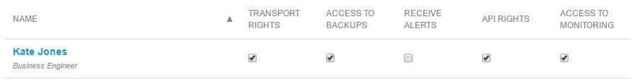

--
title: "Node Permissions of Your Licensed App"
space: ""
category: ""
description: "Set a description with a maximum of 140 characters; this should describe what the goal of the document is, and it can be different from the document introduction; this is optional, and it can be removed"
tags: "[Add a maximum of 5-7 tags/keywords; keep them focused on the most important topics of the document;each tag should have quotation marks and be separated by a comma, for example: "Samba", "MxCloud", "cloud", "share"; the tags should be enclosed with brackets and quotation marks]"
---

# 1 Introduction

Access Management for your Mendix Cloud environments is handled in the **Node Security** tab. Each team member can subscribe or unsubscribe to the alerts, and the **Technical Contact** can manage the permissions of each team member.



Note that you need to have a **MxID** to get access to the [Developer Portal](http://home.mendix.com). To create a MxID, click [here.](https://developers.mendix.com/start-for-free/)



# 2 Node settings

In this section you will learn about configuring the user roles and permissions of the cloud node.

1.  Go to the [Developer Portal](http://home.mendix.com)
2.  Click **'Apps'** in the top navigation panel
3.  Click **'My Apps'** and select **'Nodes'**
4.  Select the node
5.  Click **'Security'** in the left navigation panel
6.  Click on the tab **'Node Permissions'** 

## 2.1 User Roles

There is one user role to manage the cloud node; it is the technical contact. 
A cloud node has always:
*   only one technical contact
*   zero or more App team members with 'View Deploy and Monitor' permissions



Note that only App team members with the 'View Deploy and Monitor' permissions show up in the list of **'Node Permissions'**. These permissions are available in **'App team'**. It can be assigned by a SCRUM Master of the App to any team member by selecting one of the following App team user roles: 'Application Operator', 'Business Engineer' , 'Performance Engineer/Tester' , 'SCRUM Master'. 



### Technical contact

The technical contact manages the cloud node and can edit the privileges of regular App team members with the **'View Deploy and Monitor'** permissions. Only the technical contact is able to give his user role to another App team member by clicking on **'Change to Technical Contact'**.

The technical contact of the App is the first point of contact for [Mendix Support](www.support.mendix.com) and will receive alerts regarding the cloud node:

#### Alerts

The technical contact will receive the following alerts of the cloud node:
*   Notifications for maintenance from **Mendix Support**
*   Alerts of the node when problems arise (CPU Load is high/running out of disk space). The technical contact will not be able to them turn off.

#### Mendix Support

The technical contact is the first point of contact for the App at [Mendix Support](www.support.mendix.com). Only the Technical Contact is allowed to submit requests for the cloud node with the following request types:

*   Incidents: If incidents arise (for example, when the App is down) you have to submit a request at 
*   Standard changes: 'Add App engine/file storage', 'custom url', 'change mendix url', 'new App'



Note that any changes that are influencing the license, must be discussed firest with the **Customer Success Manager (CSM)** before contacting Mendix Support. 
For example: expanding the existing license or a new license for a node, additional file storage or upgrade of the App container.



## 2.2 Node Permissions 

The node permissions can be:

*   managed only by the technical contact
*   accessed by regular team members who have the permission to 'view deploy and monitor'

### Transport rights

With transport rights you are able to deploy new versions of the application to the node. You can create new deployment packages, stop and start the environment and change the configuration, such as constants and scheduled events.

### Access to Backups

This permission grants access to the backups of the environment. You can view, create, download and restore a backup.

### Receive Alerts

When "Receives alerts via e-mail" is checked in **Alerts**, this person will receive an e-mail when an alert is triggered. Alerts are triggered when the App went offline unexpected, the application logged a message on level "Critical", the health check failed or various infrastructure problems occurred.

### API Permissions

With this permission you are able to use the **Deploy API** to get programmatic access to the environment. Naturally the API does not require two factor authentication, so API access is disabled in production by default. The **Technical Contact** can assign API access. Note that the **API Permissions** are needed in addition to the other permissions, so in order to access Backups via the API, you will need both **Access to Backups** and **API Permissions**.

### Access to Monitoring

With this permission you are able to view the application metrics, logs and alerts. These allow you to successfully operate your Mendix Cloud environments.

# 4 Related Content
*   [How to Deploy to the Mendix Cloud](deploying-to-the-cloud)
*   [Trends](/mendixcloud/trends)
