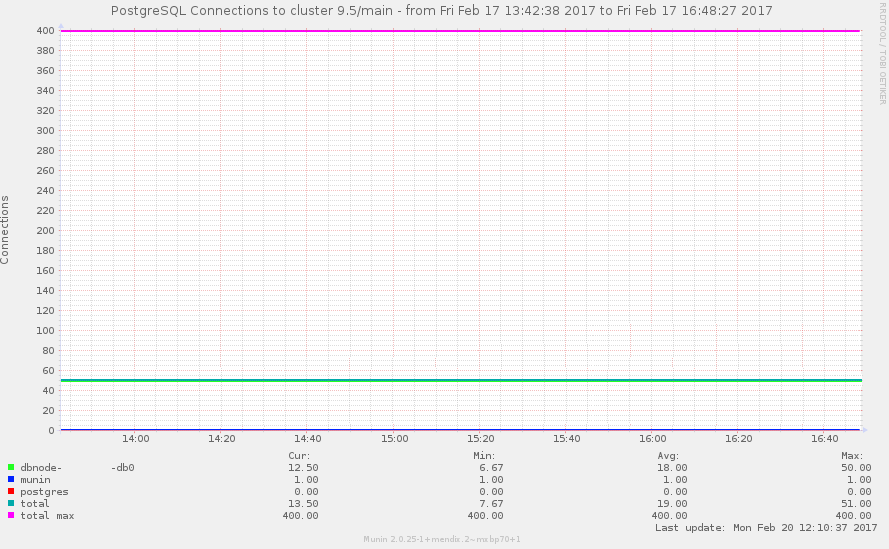

## 1 Introduction

There are many custom settings and most of them are self-explanatory after reading the description in our documentation [here](https://docs.mendix.com/refguide/custom-settings).

However a few of the more commonly used custom settings can be misunderstood or have effects one might not necessarily expect. That is why we would like to give these a bit of special attention and more thoroughly explain the consequences of changing these settings so it becomes easier to understand what should be taken into consideration when making changes to the values of these custom settings.

## 2 Tricky custom settings

## 2.1 Session Duration

### Web client settings

The following settings influence the behavior of the Mendix web client.

| Name | Description | Default value |
| --- | --- | --- |
| EnableKeepAlive | Defines whether the web client sends a keep alive request every SessionTimeout/2 milliseconds, to prevent a session timeout. Each click in the browser also acts as KeepAlive. Disabling this property will result in a user being logged out automatically after 10 minutes of inactivity, even if the browser remains open. | true |

### General settings

The following custom settings can be configured:

| Name | Description | Default value |
| --- | --- | --- |
| SessionTimeout | Defines after how much time session becomes invalid (in milliseconds). After that timeout a session becomes applicable for removal. The session won't be destroyed until the next time the cluster manager evaluates the active sessions. | 600000 |
| ClusterManagerActionInterval | The interval (in milliseconds) used for performing all cluster manager actions. These actions include, unblocking users, and removing invalid sessions. If nothing is specified the interval is half the SessionTimeout. | 300000 |

Increasing the session timeout can make for an improvement user experience, especially on mobile devices. It is important to keep in mind that entities, used to present data to the user or that are created or retrieved when a user executes a microflow, are tied to the session of that user and can remain in memory for long periods of time. When a user logs out these entities will be removed from memory, but in case the user idles but does not log out (e.g. leaves the browser tab open while executing other tasks or simply closes the browser without logging out) the session timeout can act as a safeguard that prevents memory usage being tied up by idle sessions. The first case can also be mitigated by setting the custom setting KeepAliveEnabled to false. On most browsers this setting will ensure that any idle browser tab will be affected by the session timeout as well.

Since the frequency of the sessions timeout checks, and other important events, is tied to the ClusterManagerActionInterval it makes sense to not use the default of half the session timeout when the value is increased by a lot, say to 24 hours or more. It might make sense to put a max value on the ClusterManagerActionInterval regardless of how high the value of the SessionTimeout is set. A ballpark figure would be something like 15 minutes but of course, ultimately this will depend on the functional requirements of the application.

With the introduction of the stateless runtime in Mendix 7 the potential of this memory usage to lead to problems has been reduced for two reasons. The first reason is the ability to run in a horizontally scaled environment. Multiple runtimes will mean the unintended memory usage is also divided over those runtimes, reducing the impact of any one idle user session. But the main, and second, reason is that most of the memory usage has been moved to the client. So instead of all entities in memory ending up on the application node, a large share of them will end up in the browser of the client. This should significantly reduce the potential strain on the application node that can be caused by increasing the SessionTimeout default value to a much higher value. If setting the timeout value to a very high value in Mendix 6 it might be a good idea to consider using one node size larger than one would use otherwise.

Another important matter that can be affected by increasing the session timeout are the user restrictions imposed by your Mendix license. Longer sessions might mean more concurrent users at any given time. This is something to keep in mind when deciding on the specifics of the license you will need to run your application.

And finally, there is a security consideration to be made. An idle session means that there is a potential for a session to be hijacked in case the user does not follow standard security procedures. If he leaves his computer unlocked at any given time and does not remain present at the location of said computer afterwards, any other person with physical access to the user’s computer (e.g. steal it or use it while the the user is in a two-hour long meeting) would be able to make use of this session for his own gain. With the default session timeout value this risk is reduced as the window in which the physical access is possible is much more limited (i.e. a session timeout of 24 hours is riskier in this regard than a session timeout of 10 minutes). How much of a concern this is will be highly dependent on the application’s core business goal and the type of people working with the application. For example IT professionals should be more likely to follow standard security procedures than most other user groups.

So make sure to keep in mind all of the above when changing these values and make sure your decision to alter any of these values is made with the right considerations.

## 2.2 Query logging

### Database Settings: Common settings

| Name | Description | Default value |
| --- | --- | --- |
| LogMinDurationQuery | Defines whether database queries are logged via the ConnectionBus_Queries log node if they finished after the amount of milliseconds specified here. By default, only the concerning SQL query will be logged. Set the log level of the ConnectionBus_Queries log node to TRACE to show more information about the form or the microflow which leads to this query. |   |

LogMinDurationQuery can be a very helpful tool in detecting queries that are taking longer than expected. Especially those queries that only take longer than expected after the data, used in and by the application, grows larger and larger because this might mean the queries will only become slower after a few months of usage and might not have turned up in pre-release performance tests. What can be considered a slow query is very dependent on the type of application you are running. But in general any query that will directly affect a user while using the application (i.e. not a background process) will have a lower threshold before it is deemed a slow query than any query running in the background. For example a dropdown taking 5 seconds to load before anything can be selected is many times worse than a PDF that is being generated in the background taking 8 instead of 4 seconds because of a “slow” query taking 5 seconds instead of 1 second. In the Mendix Cloud we have chosen a default value of 10000, i.e. 10 seconds. As any such query would be noticeable on the front-end of the application. If your application has no background processes this value might be too high, on the other hand if your application is running lots of background processes with minimal user interaction this value might be too low. In the end, the right value to set will depend on the functional requirements of your application and needs to be set accordingly.

The most important part of this setting however is following-up on it. What is meant by that is to regularly check the application log for any queries exceeding this value. And by resolving them if they are deemed problematic. Setting this value without following-up on it is as useful as not setting the value at all. Slow running queries can negatively affect the user experience, the throughput of any action affected by them, the memory usage of the application, the CPU usage of the application and can even lead to outages in extreme cases. Given all that, it is strongly advised to set this value to a number that makes sense for your application and to follow-up on any query that is logged. You can find these log entries by looking for the following phrase in your application log “Query executed in”. It will show up looking like this:

Jan 01 02:03:04.567 - WARNING - ConnectionBus_Queries: (1/4) Query executed in 642 seconds and 694 milliseconds: UPDATE "somemodule$someentity” 
…

## 2.3 The number of database connections

### Connection pooling

The settings below are used to define the database connection pooling behavior. The Runtime uses a pool of reusable database connections. You can for example define how many connections can be used. Connection pooling is implemented using the [Apache Commons Object-pooling API](http://commons.apache.org/pool/) .

| Name | Value | Default value |
| --- | --- | --- |
| ConnectionPoolingMaxActive | Sets the cap on the total number of active instances from the pool. | 50 |
| ConnectionPoolingMaxIdle | Sets the cap on the number of "idle" instances in the pool. | 50 (since Mendix 3.3, 20 before Mendix 3.3) |
| ConnectionPoolingMinIdle | Sets the minimum number of objects allowed in the pool before the evictor thread (if active) spawns new objects. Note that no objects are created when numActive + numIdle >= maxActive.  This setting has no effect if the idle object evictor is disabled (i.e. if timeBetweenEvictionRunsMillis <= 0). | 0 |

When changing the ConnectionPoolingMaxIdle and -MinIdle settings the following points need to be taken into consideration:
-	More idle connections means more memory usage.
-	More idle connections means less overhead when starting a query as the connection itself does not need to be created.
-	Less idle connections means less memory usage.
-	Less idle connections means more overhead when starting a query as the connection itself needs to be created.

The most interesting setting is the ConnectionPoolingMaxActive setting as this caps the total number of queries that can run in parallel at any given point in time. The default setting for this value in a Mendix application is 50. This means that any given time a maximum of 50 queries can be running in parallel. For most applications this will be a very safe number as most queries only take milliseconds, so it takes many concurrent users to ever reach a point where 50 queries are running in parallel. When running into situations where the application is constantly at its connection pooling limit the story changes, i.e. when you get errors like this:

*WARNING - ConnectionBus: Database connections: 50 active, 0 idle.*
*ERROR - ConnectionBus: Opening JDBC connection to 1.2.3.4:5432 failed with SQLState: null Error code: 0 Message: Cannot get a connection, pool error Timeout waiting for idle object Retrying...(1/4)
And/or a DB connection pool graph that looks like this:*

It will be tempting to increase the ConnectionPoolingMaxActive value to a (much) higher number. This can be the right action to take but in most cases, it is not. 

It is usually not the right action to take when you have any one of the following be the case:
-	Long running queries that show up in the application log. It makes more sense to try and fix those first, as otherwise you will eventually run in to the same problem but it will take a bit longer to occur after a (re)start of the application.
-	A database that is running low on memory or even out of memory regularly. It makes more sense to upgrade the Database node size first. In this case it  will also be likely you can find long running queries in your application log.
-	Only a few active user sessions at any given time. Your application might need a refactoring unless you can explain why 3 users constantly use 50 parallel database connections.

It is usually the right action to take when you have all of the following be the case:
-	Large amounts of concurrent users, i.e. a few thousand.
-	No long running queries showing up in the application log, even with the LogMinDurationQuery set to a relatively low number like 3 seconds.
-	Plenty of database memory available at all times.

In general we see that it is very rare for it to be the right action to take, but regardless of that it is (unfortunately) usually the action taken when running into issues with the connection pooling. 

Also keep in mind that changing this value for an application running in the Mendix Cloud will also need an adjustment on the database node that only we can make. So before changing the value please file a ticket in our Support portal stating the number you intend to change the value to.

## 3 Related Content

[Custom settings](https://docs.mendix.com/refguide/custom-settings)