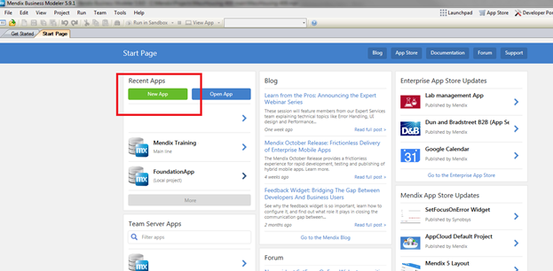
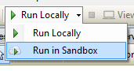

If you are new to the Mendix community and would like to deploy and share your own app, you can use the free tier of our public cloud offering. The free app environment (previously called sandbox) is set up to allow any Mendix engineer to create and share their applications with the end users. It is not the same as a cloud environment and it does not support complex or large applications.



If you would like to be a client and use a licensed cloud node you can contact our team **[HERE](http://ww2.mendix.com/BuyNow.html)** . If you are an existing customer, then you should deploy into your licensed cloud node. Free apps are part of our community edition and require Mendix 5.18 or higher.



In our free tier, your app will go to sleep if it is not active for a couple of minutes. When it is inactive, you will see the image below. If you wait for a couple of minutes and the app does not come up, then contact our support team at [support.mendix.com](http://support.mendix.com).

There are two ways to connect your application to the free app. The first is to start with the free app set up when you open your project for the first time.

The second method covers what happens if you have not started your project with the free app option but would like to connect your project to the free app. The second method will be covered in a separate article.

## 1\. Free app start up

The following instructions will cover the basics of how to start your project with the free app feature included. You can create a new app from the modeler, or open an existing app that was created in the team server through [home.mendix.com](http://home.mendix.com/). The following steps will cover both examples.

### 1.1 Creating a new app from the modeler with the free app option

1.  Click on the new app button
    
2.  Your default option is blank and for general development you want to create your project with a blank template. However, to add the free app you need to select the back button highlighted below.
    
3.  Once you click the arrow, it will move you to the first option.
    
4.  Click on AppCloud Default Project and make sure it is highlighted in blue.
5.  Add a descriptive name to your application, the default option is just App.
6.  Click on Create App and you are done.

### 1.2 Opening a new project for the first time with the free app option

1.  Click on the open App project.
    
2.  Search for your team server project through the options list.
3.  Select the project you are working on and Click Ok.
4.  The same pop up as in the previous step 2 will show up.
5.  Follow the same steps as above and you are done.

### 1.3 Deploy into your Free App

Once you have created and worked on your app, you will want to share it with others in the free app. You can deploy into the free app going to the Run option at the top of your project. If you have the sandbox option enabled, you can click on Run in Sandbox.

You can view your app in any browser and share the link with others.

## 2\. Related content

*   [Trends](/mendixcloud/Trends)
*   [Deploying to the cloud](/mendixcloud/Deploying+to+the+cloud)
*   [How to deploy a Mendix app on Azure](/mendixcloud/How+to+deploy+a+Mendix+app+on+Azure)
*   [Sending Email](/mendixcloud/Sending+Email)
*   [Different user logins when integrated with Mendix SSO](/mendixcloud/Different+user+logins+when+integrated+with+Mendix+SSO)
*   [Integrate your app with Mendix SSO](/mendixcloud/Integrate+your+app+with+Mendix+SSO)
*   [Deploying to a Free App](/mendixcloud/Deploying+to+a+Free+App)
*   [Blog: Creating your first AppCloud powered App](http://www.mendix.com/blog/create-first-mendix-appcloud-powered-app/)
