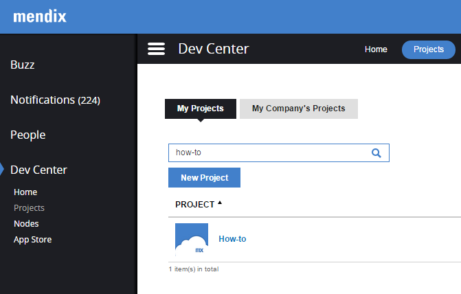
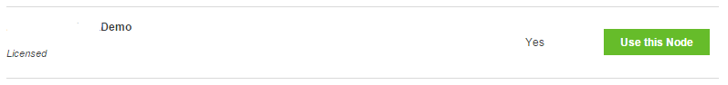
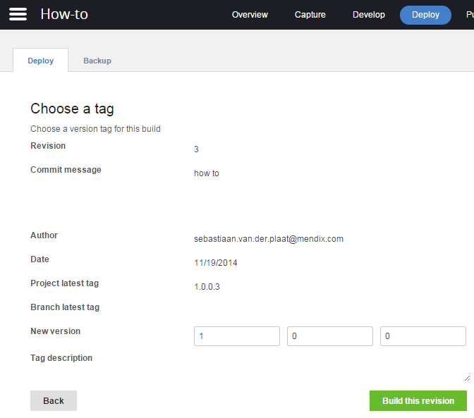
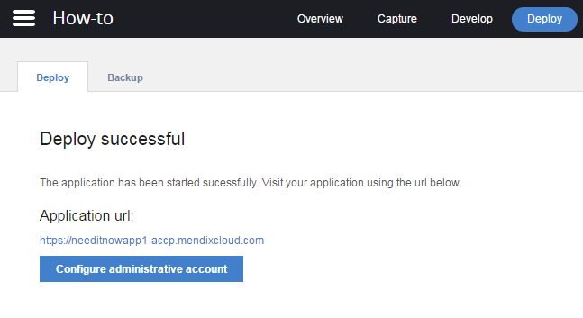

It has never been easier to deploy a Mendix application to the cloud. This How-to will explain the options a developer has to deploy applications to a connected cloud node.

## 1\. Preparation

Before you can deploy an app to the cloud, make sure you meet the following requirements:

1.  A working application.
2.  A cloud node licence.

## 2\. Connecting a project to a cloud node

1.  In the Dev Center, go to Nodes.
    
    Here the licensed node is placed. This node will need to be connected with the project.
2.  In the Dev Center, go to Projects.
    
3.  Click on the project and go to Deploy.
    
4.  Now link the project to the existing node.
    
5.  Click 'Use this Node'.

 The project is linked to the cloud node now, which makes it possible to deploy applications to the Mendix cloud.

## 3\. Deploying the application to the Mendix cloud

There are two ways to deploy the application to the Mendix Cloud. The first option is directly via the Business Modeler and the second option is to do it in the cloud portal.

### 3.1 Deploy via Business Modeler

1.  Go to Project and click "Deploy to licensed cloud node", or press Ctrl+F5

2\. Now press deploy

3\. The deployment is in progress now. Click on 'Show online, to see the uploaded package'

### 3.2 Deploy via the cloud portal

An application can also be deployed without using the Business modeler. Take the following steps to do this:

1\. Go to your Node and press 'Details'

2\. Here click on 'Create package from teamserver'

3\. Select the preferred branch and revision and click next

4\. Give the build a version number as preferred and click 'Build this revision'

The Package is being deployed to the cloud now.

## 4\. Making the application live in Production

The Acceptance and Production environments are two environments, for the application to be live in production and to test the application by a user acceptance team.

Previous steps explained how to deploy an application package to the Mendix Cloud. The actual application is not live yet. This chapter will explain how to bring the application live from Acceptance to Production.

The following steps will explain how to deploy a package to the live environments:

1\. Choose the preferred deployment package and press deploy

2\. Select the preferred environment to deploy, press continue and then press 'Transport'. If asked for, clean the environment

3\. Configure the constants if needed. This can also be done in a later stage in the settings. Now press continue and in the next screen press 'Start application'. If asked for, press 'Synchronize database'.

4\. The application is deployed now and the administrative account can be configured

## 4\. Related content

*   [Trends](/mendixcloud/Trends)
*   [Deploying to the cloud](/mendixcloud/Deploying+to+the+cloud)
*   [How to deploy a Mendix app on Azure](/mendixcloud/How+to+deploy+a+Mendix+app+on+Azure)
*   [Sending Email](/mendixcloud/Sending+Email)
*   [Different user logins when integrated with Mendix SSO](/mendixcloud/Different+user+logins+when+integrated+with+Mendix+SSO)
*   [Integrate your app with Mendix SSO](/mendixcloud/Integrate+your+app+with+Mendix+SSO)
*   [Deploying to a Free App](/mendixcloud/Deploying+to+a+Free+App)
