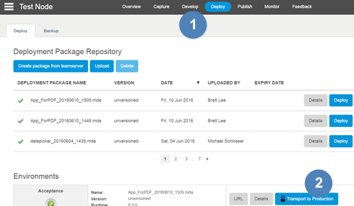
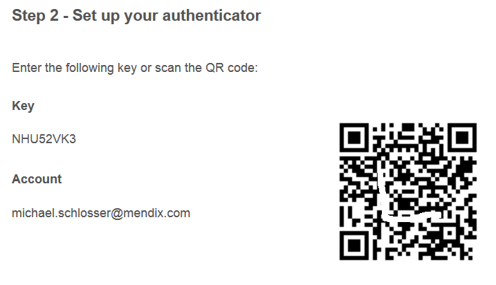
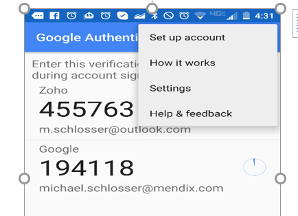
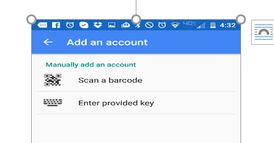

In this how-to you will learn how to set up the Google Authenticator and SMS to protect your Mendix account with a secret unique key. The Google Authenticator and SMS are two types of Two-Factor Authentication Mendix uses for Cloud Portal security.

Two-factor authentication validates your password and is required for cloud node activities done in production. Two-factor authentication ensures that  you are authenticated when performing with sensitive activities - such as but not limited to deployment of packages in the production environment and monitoring of production environment.

If you are the technical contact, it is required to use Two-Factor Authentication with your Mendix account when you access your licensed node details, specifically for transporting MDA files otherwise known as deployment packages into the production environment.

**After completing this how-to you will know:**

*   How to create....
*   How to build...
*   How to configure....

## 1. Preparation

Before you can utilize Two-Factor Authentication, please ensure that you have completed the following prerequisites:

*   Create an account with Mendix [here](http://www.mendix.com/try-now/)
*   Have two devices, a laptop/pc and mobile phone ready-at-hand
*   Google Authenticator and/or QR code reader downloaded into your phone

## 2\. Google Authenticator Setup

If youwant to transport your deployment package into the production environment, you need to do the following:

1.  Go to your project and go to the Deploy tab
2.  Click on the Deploy button underneath the package if you wish to deploy your deployment package to the cloud.
3.  In the _Environments_ section you can transport the deployment package from the test environment (_if applicable_) to acceptance and then to production by clicking on the 'Transport to Production' button (_marked with a locked icon_).

    

4.  When you click on the 'Transport to Production' button a pop window will appear asking you to set up two factor authentication.You will need to choose how you would like to receive your two-factor authentication key.
    
5.  If you choose to 'Use Google Authenticator', a pop window will open.

    

    The installation screens are different per mobile phone type. The following installation screenshots are based on an android phone.

6.  Select '_Set up Account_' option in the Google Authenticator main page on your Android phone.
    
7.  Choose to scan a barcode (_see step 6_) or to manually enter the provided key.
    
8.  Enter the 6-digit time-based code from step 6 into the Google Authenticator into your Mendix account or scan the barcode and it will activate your two factor authentication.
9.  Once Google Authenticator is setup, you will be asked to confirm by inserting your security key.
    

10.  Now your account is secure and ready to use. You will get a 6-digit number that expires every minute. You will need to enter that number to validate your account every time you access production.
