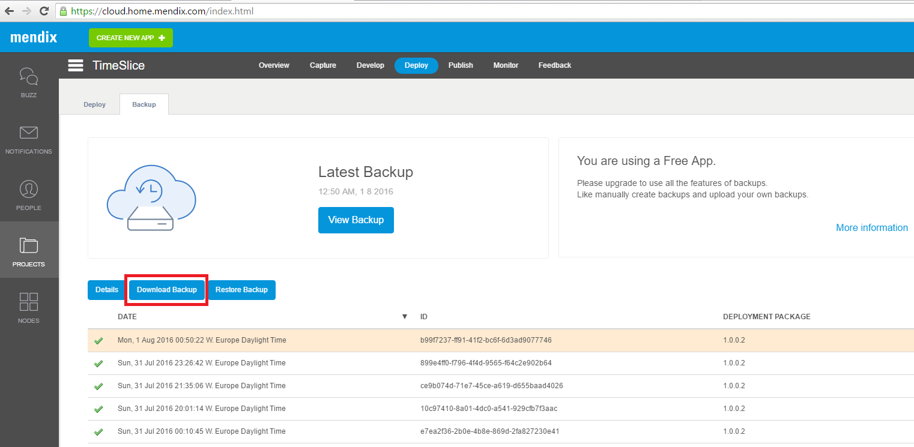
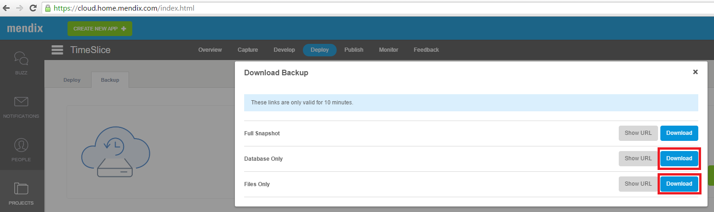

This how-to describes how to download a sandbox/free app backup and download a licensed node backup.

**After completing this how-to you will know:**

*   How to download a full back up of a sandbox/free app.
*   How to download a full back up of a licensed node.

## 1. Preparation

Before you can start with this how-to, please make sure you have the following prerequisites.

*   A sandbox/free app or licensed node with backups.

## 2\. Downloading a backup

There is a difference between downloading a backup from a sandbox/free app and a licensed node.

### 2.1 Downloading a backup from a sandbox/free app.

1.  Go to ‘[home.mendix.com](http://home.mendix.com)’
2.  Click on ‘Dev Portal’
    
3.  Go to the projects tab.
4.  Then select the project where you want to download the backup from.
    
5.  Go to the ‘deploy’ tab.
    
6.  Click on the ‘backup’ tab.
    
7.  Select backup and click on ‘download backup’.
    

8.  Click on the desired backup, for example download the ‘database only’ and ‘files only’.
    
9.  The backup has now been downloaded.

### 2.2 Downloading a backup from a licensed node.

1.  Go to ‘[home.mendix.com](http://home.mendix.com)’.
2.  Click on ‘Dev Portal’.
    
3.  Go to the projects tab.
4.  Then select the project where you want to download the backup from.
    
5.  Go to the ‘deploy’ tab.
    
6.  Click on the ‘backup’ tab.
    

7.  Select a backup and press on ‘download backup’.
    

8.  For examplet you can click on the 'download' here to download a full backup.
    
9.  The backup has now been downloaded.

## 3\. Restoring a backup

The documentation on how to restore a backup can be found [here.](How+to+restore+a+backup)
