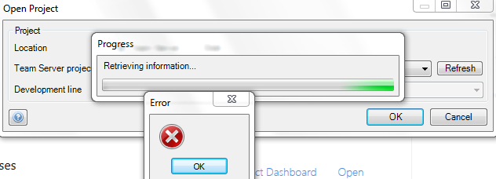

# Required Network Access for connecting to the Mendix Platform

In this how-to you will learn how to provide network access to the Mendix Modeler and Team Server. The Mendix Modeler needs to connect to the Team Server where all projects are saved. Before you continue with this how-to, make sure that you are logged in to Mendix via your browser. You can log in at [http://www.mendix.com/](http://www.mendix.com/). If you do not have an account, you can sign up here: [http://www.mendix.com/try-now/](http://www.mendix.com/try-now/).

**After completing this how-to you will know:**

*   How to provide network access to be able to download/upload to the Team Server

*   Which permissions/settings are required for a Team Server connectivity

## 1. Preparation

Before starting this how-to, please make sure you have completed the following steps:

*   Create an account with Mendix [here](http://www.mendix.com/try-now/)
*   Download the Mendix Modeler [here](https://appstore.home.mendix.com/index3.html)
*   Download or upload a Team Server project in the Mendix Modeler



**Download from Team Server:** When creating a new project it is possible to create a local or a Team Server project (see 'Enable Team server' [here](/refguide6/app-settings-dialog)). When creating a new Team Server project the Mendix Modeler will connect with [https://teamserver.sprintr.com/](https://teamserver.sprintr.com/). When other project team members want to access the Team Server project they will have to download the project from the Team Server in the Mendix Modeler (see [Open Project Dialog](/refguide6/open-project-dialog) and [Download From Team Server Dialog](/refguide6/download-from-team-server-dialog)).

**Upload to Team Server:** If a local project has been created it can be uploaded to the Team Server (see [Upload To Team Server Dialog](/refguide6/upload-to-team-server-dialog)).



## 2\. How to identify you have run into a blocking network issue

The Mendix Modeler is unable to connect to the Team Server and giving an error without any error message.



Mendix is aware that the error stated above does not provide any relevant information. We are currently working to improve this!



**Step 1: Try to download a Team Server project in the Mendix business modeler on a device (PC/laptop) outside your company network.**

If you are able to download the Team server project it would indicate that the security configuration of your company network is blocking access to [home.mendix.com](http://mendix.com) and [teamserver.sprintr.com](http://teamserver.sprintr.com). But if it still doesn't work please submit a ticket request on [support.mendix.com](https://support.mendixcloud.com/)?

**Step 2: Enter the URL [https://teamserver.sprintr.com/](https://teamserver.sprintr.com/) in your browser.**

If the same results are shown in your screen as in the screenshot below, then there are no security blockades for your browser. If you receive an error then this confirms that the IP address is probably blocked in your internal network, please contact your internal system administrator to enable access.

_
_

## 3\. How to enable firewall access to Team Server

The Team Server is implemented using Subversion and the Modeler uses the HTTPS (TCP) protocol to communicate with that server. To access the Team Server from within the Modeler, the network at your location needs the following settings:

*   The HTTPS port (TCP 443) needs to be open.
*   The HTTP port (TCP 80) needs to be open.
*   WebDAV - verbs within the HTTP protocol - needs to be enabled on the proxy server (if any).

You can look up the IP address of [https://teamserver.sprintr.com/](http://teamserver.sprintr.com), however, Mendix reserves the right, at any time, and without notification to customer, to change the IP address. This could happen if we move to different infrastructure for example.

If needed inform yourIT team that the business modeler connects to [https://teamserver.sprintr.com/](https://teamserver.sprintr.com/). This will enable them to determine the correct firewall/proxy settings.

The modeler connects with the domains stated below over HTTPS on port 443, these domains should be added to the firewall white list:

* [home.mendix.com](http://mendix.com): Enables you to login to and use the Mendix Modeler.

* [cloud.mendix.com / cloud.home.mendix.com:](http://mendix.com) Enables you to deploy your app to the Mendix Cloud.

* [teamserver.sprintr.com](http://teamserver.sprintr.com): Enables you to access the Team Server and download/upload/commit Team Server projects in the Mendix Modeler.
