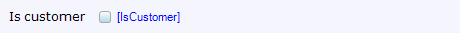

A check box is an [input widget](input-widgets) that can be used to display and edit boolean attributes. It will display a tick if the value is true and remain empty if it is false.



This checkbox might be used to indicate whether or not a user is a customer.



## Data source properties





## Editability properties







## Visibility properties





## Events properties







## Common properties









## Related articles

*   [Data view](data-view)
*   [Attribute](attributes)s
