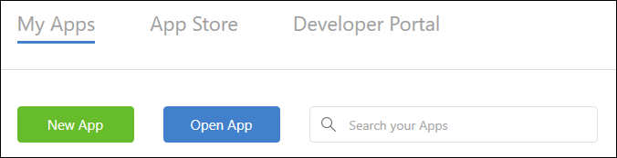
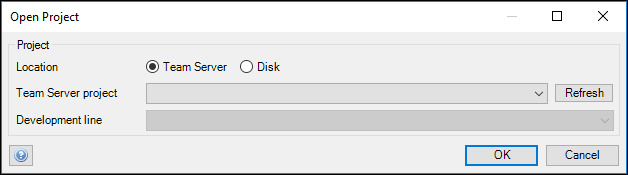

## 1 Introduction

If you have created your app in the **Web Modeler**, you can extend the functionalities of the app by building them in the **Desktop Modeler**.
To do that, you must sync the Web Modeler with the Desktop Modeler. This document will explain how to do that.

**This how-to will teach you how to do the following:**

* Download the Web Modeler app into the Desktop Modeler
* Sync the Desktop Modeler with the Web Modeler
* Commit changes from the Desktop Modeler to the Web Modeler
* Lock/Unlock the Web Modeler while the Desktop Modeler is working on the app

## 2 Prerequisites

Before starting this how-to, make sure you have completed the following prerequisites:

* Download the [Mendix Modeler 7.5](https://appstore.home.mendix.com)
* Create an app in the Web Modeler, see [How to Build an Event App in the Web Modeler](/howto/tutorials/webmodeler-event-app).



Remember to always update and publish your changes in the **Web Modeler** before opening the app in the **Desktop Modeler**.



## 3 Syncing the Web Modeler with the Desktop Modeler

1. Open your **Desktop Modeler 7.5**.
2. Click **Open App**.

  

3. In **Team Server project** select your event app and click **Ok**.

  

4. In the top navigation panel click **Team**.

  



  If you have uncommited changes in the **Dektop Modeler**, click **Commit** before syncing with the Web Modeler.



5. The latest updates will now be retrieved. When the progress is finished, you will receive an information dialog that the webmodeler has been locked for the time that you are reviewing the changes.

If someone is working in the **Web Modeler** at the same time that someone is reviewing the changes in the **Desktop Modeler**, the person that is working in the Web Modeler will get an popup dialog saying that the Web Modeler has been locked for the time that the changes are being reviewed in the **Desktop Modeler**.

  

6. You can now review the changes.

  

7. When you are done, click **Finish sync with Web Modeler**.
8. There will appear a **Commit** dialog to commit the changes you have made. Enter the changes and click **Ok**.

  



If you do not have anything to commit, you can also click **Cancel sync/Unlock Web Modeler** instead of **Finish sync with Web Modeler**.



## 4 Related Content

* [How to Build an Event App in the Web Modeler](/howto/tutorials/webmodeler-event-app)
