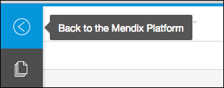
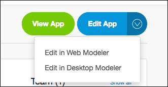
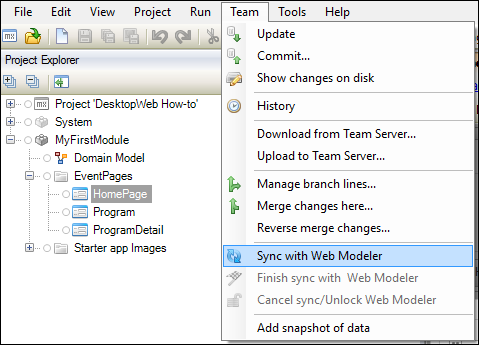
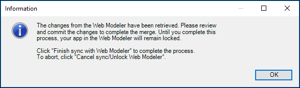
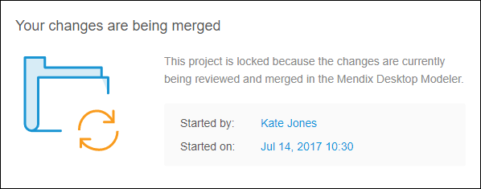
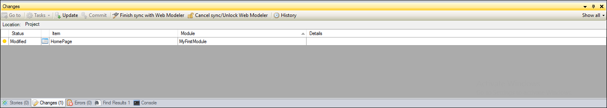
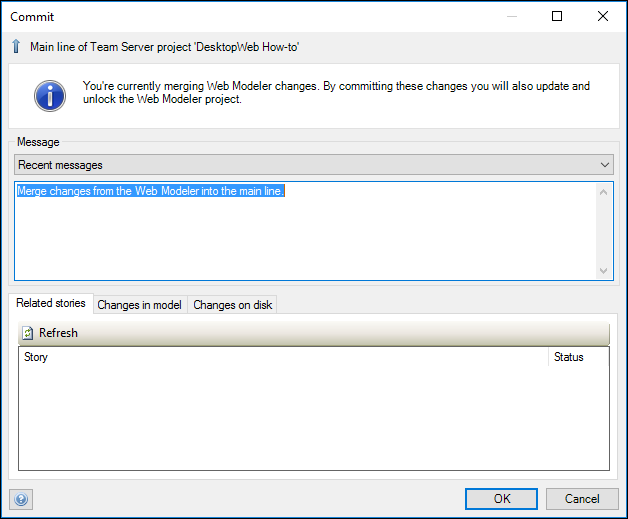

## 1 Introduction

If you have created your app in the **Web Modeler**, you can extend the functionalities of the app by modeling them in the **Desktop Modeler**.
To do that, you must sync the App from the Web Modeler with the Desktop Modeler. This document will explain how to do that.

**This how-to will teach you how to do the following:**

* Download the app from the Web Modeler into the Desktop Modeler
* Sync the Desktop Modeler with the Web Modeler
* Commit changes from the Desktop Modeler to the Web Modeler
* Lock/Unlock the Web Modeler while the Desktop Modeler is working on the app

## 2 Prerequisites

Before starting this how-to, make sure you have completed the following prerequisites:

* Download the [Mendix Desktop Modeler 7.5](https://appstore.home.mendix.com)
* Create an app in the Web Modeler, see [How to Build an Event App in the Web Modeler](/howto/tutorials/webmodeler-event-app).



Remember to always update and publish your changes in the **Web Modeler** before opening the app in the **Desktop Modeler**.



## 3 Syncing the Web Modeler with the Desktop Modeler

1. Go back from the **Web Modeler** to the **Developer Portal** by clicking the Mendix icon in the left corner.

  

2. Click on the arrow on **Edit App** to select **Edit in Desktop Modeler**.

  

3. In the top navigation panel click **Team** and click **Sync with Web Modeler**.

  



  If you have uncommited changes in the **Desktop Modeler**, click **Commit** before syncing with the Web Modeler.



4. The latest updates from the Web Modeler will now be retrieved and merged into your model. When there are no Web Modeler changes received, all changes from the Desktop Modeler will be synced to the Web Modeler. The sync process is then finished and both modelers are ready to continue modeling. 

When the progress is finished and there are changes received from the Web Modeler, you will receive an information dialog that the Web Modeler has been locked for the time that you are reviewing the changes.

If someone is working in the **Web Modeler** while someone is reviewing the changes in the **Desktop Modeler**, the person that is working in the Web Modeler will get a popup dialog saying that the Web Modeler has been locked for the time that the changes are being reviewed in the **Desktop Modeler**.

  

5. You can now review the changes and eventual merge conflicts, in the Changes Dock in the Desktop Modeler.

  

6. When you are done, click in the top naviagation panel **Team** and click **Finish sync with Web Modeler**.
7. There will appear a **Commit** dialog to commit the changes you have made. Enter the changes and click **Ok**.

  



If you do not have anything to commit, you can also click **Cancel sync/Unlock Web Modeler** instead of **Finish sync with Web Modeler**. The Web Modeler will be unlocked.



## 4 Related Content

* [How to Build an Event App in the Web Modeler](/howto/tutorials/webmodeler-event-app)
