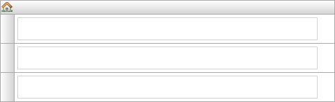

A navigation list can be used to attach an action to an entire row. Such a row is called a navigation list item.



A navigation list with three empty rows.



## Common

### Class

See [Widget Properties](Widget+Properties).

### Style

See [Widget Properties](Widget+Properties).

# Navigation List Item

Each row in the navigation list is a navigation list item. A navigation list item can be associated with an action.

## Common

### Class

See [Widget Properties](Widget+Properties).

### Style

See [Widget Properties](Widget+Properties).

## General

### Action

Action defines what action is performed when a navigation list item is 'clicked'. This can either be opening a form or calling a microflow. For opening a form see [Opening Forms](Opening+Forms) and for calling a microflow see [Starting Microflows](Starting+Microflows). Microflows attached to a navigation list item have no Confirmation or Advanced microflow settings.