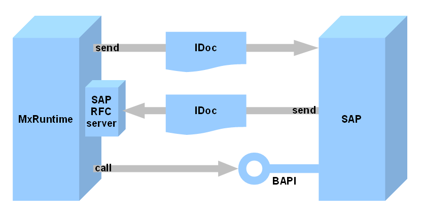

Applications, built with Mendix, can communicate with SAP by sending and receiving IDocs, or by calling BAPIs on SAP.

Details can be found in the [How To's](https://world.mendix.com/display/howto25/SAP+Integration).

IDoc = Intermediate Document. IDoc types are defined in SAP, and IDocs of these types can be sent to and from SAP.

BAPI = Business Application Programming Interface. SAP defines BAPIs which can be called from other systems (e.g. from Mendix).

Note 1: Calling a BAPI from Mendix is currently under construction.

Note 2: Mendix-SAP communication can also be done through webservices, which are described elsewhere in the Mendix documentation. Webservices are not available on all SAP systems.